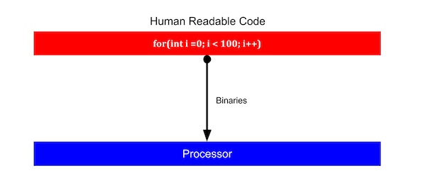

# Compiled vs. interpreted languages

## Why compiled languages are faster than interpreted languages?

> Processors understand binaries. Only 0 or 1.

Generally, when you build an application using Java or other JVM-based languages when you compile your project, it compiles the human readable code to byte-code which can be understood by JVM or other virtual machines that run on top of underlying OS. While execution, VM interprets those bytecodes and convert them to the binaries that processors can understand. It converts byte code one by one into machine code which make interpreted languages slow.

Interpreted languages make debugging easy and allow garabage collection at run time. Having garabage collection and other tools such as dynamic variable resolution that operate on bytecode at run time also make it slow.

While on the other side, C/C++ does not execute on VMs and that removes one step from the execution cycle and increases the performance. It directly compiles the human readable code to binaries.

Freeing and allocating variable in those languages is a huge pain which is done by programmer. But not having garabage collector or dynamic variable mechanism it make compiled languages run very fast. But it also make debugging very difficult for programmer.
