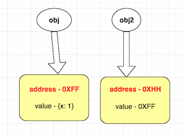

# How data types are handled in programming languages

Data types are the basic building block of any programming language. It tells about the type of the data, variable can hold. There are two types of data types every programming language support. One is called basic (**primitive**) data types such as integer, string etc which hold simple or single value and other is called complex (**non primitive**) data type such as object, array etc which hold compounded or mixed values.

In order to have good grasp of programming language you must understand how primitive types and non-primitive types are handled when:

* assign to another variable.
* return variable.
* passed as function parameter.

**There are different types of techniques used in programming language, describe below:**

> for Primitive types - by Default - most of the languages uses **by value** technique because they are simple and hold single value.
>
> for Non primitive types - by Default - most of the languages uses **by share** technique because they hold large data structure and making multiple copy of value may hit the memory and performance badly.

## By value

This technique make copy of variable value that means new memory is created and locate to target variable and value of source variable is then copied to target variable.

In most programming languages, primitive types are **by default** handled `by value` technique when assign to another variable and pass as function argument, unless explicitly specified using token `&`.

This is because primitive types are simple or basic type which does not hold much memory.

Changes made to target variable does not reflect change to source variable and vice versa.

## By reference

This technique does not create new memory location for target at all but target variable points or refers to same memory address of source variable. In other words, compiler creates an memory alias of source variable which is equal to the name of target variable.

**Lets understand memory alias?**

Like in humans, we have two names, one is official name that we uses formally and another is nickname which we uses informally. No matter what name is used, it always point to you.

Lets understand alias in by reference technique:

```php
<?php
// compiler locate memory address say, `0XFF`
// to $a and 1 value is stored in there
$a = 1;

// compiler encounter following statement with `&`
$b = & $a;

// now,
// 1. compiler does not create new memory location (address) for $b
// 2. but it creates an alias (another name, say nickname) of $a,
// which is equal to $b means as programmer you have two names
// now $a and $b to access same memory location (address)
// where $a say is a official name and $b is a nickname.
```


Most programming languages provide `&` token, which programmer can use explicitly to instruct compiler to use `by reference` technique.

No copy is made of actual value, so overhead of copying (time, storage) is saved and also saved a lot of memory allocation in copying process where actual value is copied to new memory address.

Changes made to target variable does reflect change to source variable and vice versa.

## By share

This technique is similar to `by reference` technique in a sense that it also uses memory address and not a actual value of variable, so no copy is made of actual data which saves time and storage. But in this technique, memory address of source variable is copied to target variable. That means new memory location is created for target variable and memory address of source variable is stored in it.

```js
// compiler locate memory address say, `0XFF`
let obj = {x: 1}

// compiler encounter following statement
let obj2 = obj;

// 1. compiler creates a new memory location say `0XHH` for obj2
// 2. copy memory address `0XFF` of obj as value to obj2
// there is no concept of alias here, but two different entities (names)
// which share same memory location
```



In most programming languages (Javascript, PHP,  Java and Python), **by default**,  non-primitive types such as `object` are handled using this technique.

Non-primitive types such as `object` are complex structure and may hold more memory than primitive type and if we handle them `by value` technique then there would be significant impact on memory and performance.
