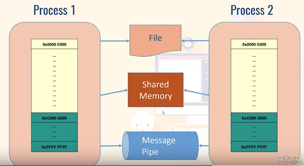
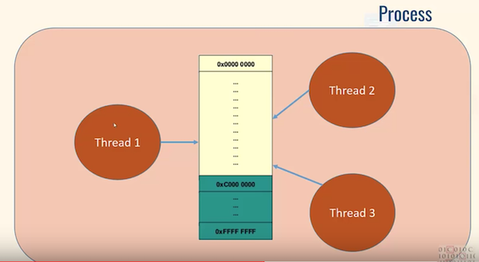

# Multi-processing vs multi-threading

Both are used to achieve multi-tasking.

* The key difference between multiprocessing and multithreading is that multiprocessing allows a system to have more than one CPU core added to the system whereas multithreading lets a process generate multiple threads to increase the computing speed of a system.

* Multiprocessing system executes multiple processes simultaneously whereas, the multithreading system let execute multiple threads of a process simultaneously.

* Creating a process can consume time and even exhaust the system resources. However creating threads is economical as threads belonging to the same process share the belongings/resources of that process.

