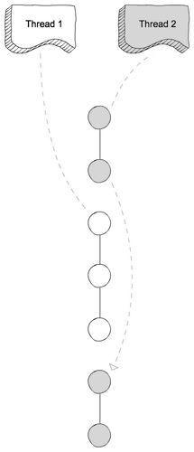
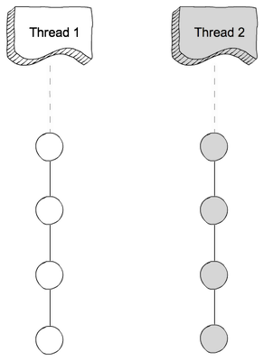

# Parallel vs concurrent

These terms are more applicable in multi-tasking and multi-threading relam. They do not fit in, if we are in single threaded realm.

## Concurrent

Let's say we have two threads and single core CPU. Then in single-core setup, the CPU might run few instructions from the one thread, then suspend it and switch over to the second and run few steps from it and so on. Like ping pong. This is also called **preemptive multithreading**.

_It may also be possible that there are two cores available in CPU that can be used to run both at the same time. This, in fact, is parallel computation._

## Parallel

Parallel operation means that two threads or processes are literally running simultaneously - at the same time. Naturally this is not possible with single-core CPU, but multiple-core architecture is required instead.
