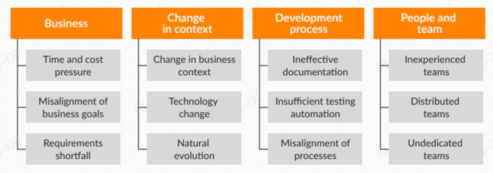

# Technical debt

It is a concept in software development that reflects the implied cost of additional rework caused by choosing an easy (limited) solution now instead of using a better approach that would take longer.

Technical debt is the coding you must do tomorrow because you took a shortcut in order to deliver the software today.

Technical debt is like cleaning by hiding everything under the couch—it is tidy for now, but nothing is in its correct spot. You will eventually have to spend time properly for cleaning and organizing it down the road.

- Architecture Debt
- Build Debt
- Code Debt
- Defect Debt
- Design Debt
- Documentation Debt
- Infrastructure Debt
- People Debt
- Process Debt
- Requirement Debt
- Service Debt
- Test Automation Debt
- Test Debt

## Types of technical debt

### Deliberate

Startups prototypes where we want to deliver for feedback and proof of concept. When the organization makes an informed decision to generate some technical debt with the full understanding of the consequences (risks and costs). An example could be: “In order to meet the new release deadline of November, we have decided to forego writing unit tests in the final three weeks of the project. We will write these tests after the release.”

### Accidental

When designing software systems, team tries to balance thinking ahead and future-proofing their designs with simplicity and quick delivery. This is a tricky balance, and nobody gets it right every time. As systems evolve and requirements change, you might come to the realize that your design is flawed, or that new functionality has become difficult and slow to implement.

### Unavoidable

It occurs due to changes in the business and the progress of technology over time that present better solutions. In short, technical debt is created when new business requirements make old code obsolete.

### Bit rot

Arises due to poor practices, bad design, poor code quality, no test cases, overlook design principles, lack of skills and inexperience with new coding techniques.

When develper mainly new one without understanding the undeline system design and module functionality, do the monkey patching, write the code at wrong place and with the time this keep on adding layer by layer which make adding new feature and changes hard later.It usually happens when developers make small, incremental changes to code that they don’t fully understand. These small changes eventually create enough complexity and problems that the whole software gets affected. Some engineers may even violate NFR (Non-functional requirement) or break the code entirely.

This is perhaps the only type of tech debt that you should try to avoid consistently by continuous refactoring. Strong teams will take the time to understand the design of the system they are working on (even if they didn’t design it originally), incrementally improve the design and clean up bad code along the way. The development team should be accountable for avoiding bit rot tech debt as it’s incurred by individual developers.

## What causes technical debt

1. Time pressures.
2. Poor alignment to standards.
3. Lack of skill and Lack of knowledge, when the developer doesn't know how to write elegant code
4. Delayed refactoring.
5. Insufficient testing which encourages quick and risky band-aid bug fixes.
6. Insufficient up-front definition, where requirements are still being defined during development, development starts before any design takes place. This is done to save time but often has to be reworked later.
7. Tightly-coupled components, where functions are not modular, the software is not flexible enough to adapt to changes in business needs.
8. Lack of software documentation, where code is created without supporting documentation.
9. Poor architecture choice.

## How to handle

1. Reframe software development strategy.
2. One simple way to recover from technical debt is to write and conduct unit tests more frequently to eliminate the problem of regression bugs.
3. It’s critically important to maintain documentation during the develpopment process. Such digital documentation is known as a knowledge base that encompasses various types of content (roadmaps, code documentation, checklists, attached files, etc.) that team members can exchange. One of the major benefits of maintaining a knowledge base is that at any stage of the development, software engineers can easily access any information related to the project and solve challenging situations more effectively.
4. Refactor your code continously.

## Should defects be considered technical debt?

Defects are problems - perhaps a problem in understanding the user needs and requirements, perhaps a problem in the design, perhaps missing or wrong testing. They are visible to users of the system, or at least can be visible to users. Technical debt doesn't affect features or functionality, except to the extent that it can slow the delivery of new or modified features or functionalities. I would argue, however, that the number of known defects can play a role in assessing the quantity of technical debt in that defects can also slow down the ability of people to understand the product and service and continue to develop it.

Another important aspect to consider here is choice! We choose design and architecture for our project. Technical debt is something that can be avoided by having a better workflow or better coding practices. Fundamentally bugs cannot be technical debts because that is not something we choose to have in our code. There may exist a relation between bugs and technical debt such that some bugs may belong to bad design choices.

In simple words, technical debt as a system disability and bug as illness, that can be handled more quickly, then disability.  Also disability is not always seen for users, but affects system quality and it's becomes hard to upgrade and maintain it.  Regarding to Value both affect system quality and product value.
