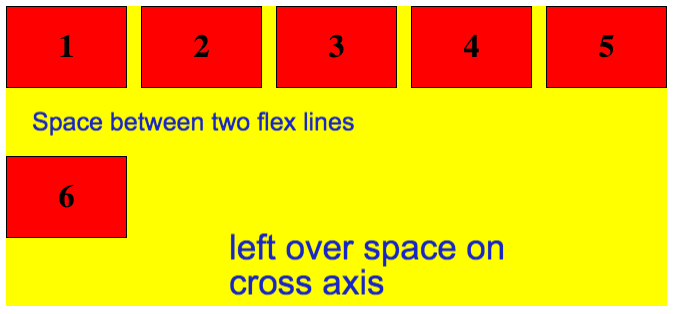
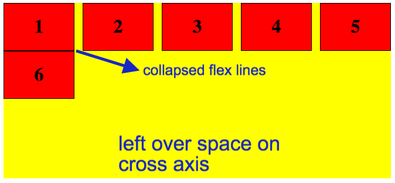
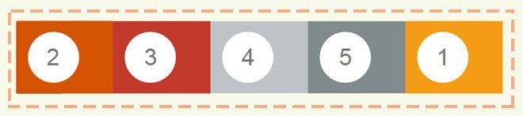

Title: Flexbox - Notebook

# Terminology


## Flex Container?

The parent element in which flex items are contained.

## Flex Items

Each child of a flex container becomes a flex item.

## Flex Axes

Every flexible box layout follows two axes. The **main axis** is the axis along which the flex items follow each other. The **cross axis** is the axis perpendicular to the **main axis**.

**IMPORTANT** -  Axis are interchangeable.

When `flex-direction: row` which is default then:

```
  Main Axis ==  Horizontal Line
  Cross Axis == Vertical Line
```

When `flex-direction: column` then:

```
  Main Axis ==  Veritcal Line
  Cross Axis == Horizontal Line
```

## Directions

The **main start/main end** and **cross start/cross end** sides of the flex container describe the origin and terminus of the flow of flex items. They follow the main axis and cross axis of the flex container in the vector established by the `writing-mode` (left-to-right, right-to-left, etc.).

### Writing Mode

The flex line follows the direction of the text which, in a left-to-right mode, is left to right, top to bottom. If the writing mode changes, the directions of both the main axis and cross axis will also change. For example, in a Japanese language layout, the main axis is vertical and the cross axis is horizontal.

## Flex Lines

Flex items in a flex container are laid out and aligned within _flex lines_, a hypothetical line used for grouping and alignment of flex items inside their container.  A flex container can be either single-line or multi-line, depending on the`flex-wrap` property:

* Flex lines follow the main axis.
* A **single-line** flex container lays out all of its children forcefully in a single line, even if that would cause its contents to overflow.
* A **multi-line** flex container breaks its flex items across multiple lines, similar to how text is broken onto a new line when it gets too wide to fit on the existing line.
<!-- markdownlint-disable MD025 -->
# Flexbox Container Properties
<!-- markdownlint-enable MD025 -->
First of all a flex container is created by setting the display property of an element to either `flex` or `inline-flex`.

```css
.flex-container {
    display: flex;
}
/* or */
.flex-container {
    display: inline-flex;
}
```

Children of a flex container, the flex items, are laid out using the Flexbox layout. Any element outside a flex container is not affected by the Flexbox layout defined on it, and will be rendered as it normally would in the page.

## flex-direction

```
flex-direction: row | row-reverse | column | column-reverse
```

The `flex-direction` property specifies how flex items are placed in the flex container, by setting the direction of the flex container’s main axis. This determines the direction that flex items are laid out in. The direction of the axes is affected by the writing mode.

1. When `flex-direction: row` which is default then:

```
  Main Axis ==  Horizontal Line
  Cross Axis == Vertical Line
```

When `flex-direction: column` then:

```
  Main Axis ==  Veritcal Line
  Cross Axis == Horizontal Line
```


## flex-wrap

> Default = nowrap

```
flex-wrap: nowrap | wrap | wrap-reverse
```

The `flex-wrap` property controls whether the flex container is single-line or multi-line.


## flex-flow (shorthand)

```
flex-flow: <'flex-direction'> <'flex-wrap'>
```

For setting the `flex-direction` and `flex-wrap` properties.

## justify-content

> Default = flex-start

```
justify-content: flex-start | flex-end | center | space-between | space-around
```

1. The `justify-content` property aligns flex items along the main axis of the current line of the flex container. This is done _after_ any flexible lengths and any auto margins have been resolved.
2. Apply to **main axis** only.
3. **Works only when there is space left on main axis after flex items are laid out.** For example, after flex items are laid out from left to right and we have still space left on the right then it will work. The property is used to tell css to **distribute left over, main axis space** among flex items. If there is no left over space on main axis then it will not work.


## align-items

> Default = stretch
>
> Think in terms of Flex items (SPACE between lines stay)

```
align-items: flex-start | flex-end | center | baseline | stretch
```

1. The `align-items` property is used to align flex items in the cross-axis (perpendicular to the main axis).
2. Apply to **cross axis** only.
3. Works for both **single line** and **multi line** flex items.
4. `align-self` property, which is a property of flex item, not flex container, can be used to override the alignment of one ore more flex items.


## align-content

> Default = stretch
>
> Think in terms of Flex lines (SPACE between lines collapses)

```
align-content: flex-start | flex-end | center | space-between | space-around | stretch
```

1. The `align-content` property aligns a flex container’s lines within the flex container when there is extra space in the cross-axis.
2. Apply for **cross axis** only.
3. Works when there are **multiple lines** on cross axis. Does not work if there is only single line on cross axis.
4. Works only when there is **free left over space left on cross axis**.


### align-items vs align-content

1. `align-items` works for both single line and multi line where as `align-content` works only for multi line.

2. In `align-items` , when flex items wrap to multi line and we still have space left on cross axis of parent container then the flex lines do not get packed or collapse which you can see in the figure below, there is a space between each flex line when value set to `align-items: flex-start`. This happens for values `flex-start`, `flex-end`, `center` , and `baseline` not in the case of value `stretch`.

   

   **Where as in the case of,**`align-content` all items in multi line treated as whole structure and flex lines are collapsed or packed to remove any space between lines, if we have free space left on cross axis. This applicable to all possible values of `align-content`. See the example figure below where value is set to `align-content: flex-start` and there is left over space on cross axis.

   
<!-- markdownlint-disable MD025 -->
# Flex Items Properties
<!-- markdownlint-enable MD025 -->

## order

```
order: <integer>
```

1. Flex items are, by default, displayed and laid out in the same order as they appear in the source document.
2. Items with the same ordinal group are laid out in the order they appear in the source document.
3. The initial order of all flex items is zero (0).
4. The `order` property can also take negative values.
5. Note that the order in which the flex item appears inside its container changes **only on screen, not in the source document**. This means that screen readers will read the flex items in the order they appear in the document source, not the order specified using the `order` property.

```css
.column:nth-of-type(1){
  order: 5;
}
.column:nth-of-type(2){
  order: 1;
}
.column:nth-of-type(3){
  order: 2;
}
.column:nth-of-type(4){
  order: 3;
}
.column:nth-of-type(5){
  order: 4;
}
```



## align-self

> Default = auto

```
align-self: auto | flex-start | flex-end | center | baseline | stretch
```

It can be used to override the alignment of one ore more flex items already set by `align-items` property of parent container.


## flex-grow

> Default = 0 (Do not grow automatically if container has extra space)

```
flex-grow: <number>
```

1. The `flex-grow` property sets the _flex grow factor_ of a flex item. A flex grow factor is a integer determines how much the flex item will grow relative to the rest of the flex items in the flex container when **positive free space** is distributed.
2. The initial value is zero (0), and negative numbers are invalid.
3. When the property is used then the whole space is consumed, leaving no free space.

If the flex items are laid out on the flex line such that they don’t take up the entire space on that line, you can “expand” the flex items so that they fill up the entire line. The amount of available space on the line can be distributed among the flex items following a specific proportion that you can specify using the `flex-grow` property. The higher the `flex-grow` value, the more the item will be allowed to grow relative to the other items. For example, An item with `flex-grow: 2` will grow twice as much as an item with `flex-grow: 1`—it gets twice as much space as the latter. So, for every one pixel that the second item gets, the first item grows by two pixels.


## flex-shrink

> Default = 1 (Shrink automatically if container space fall short)

```
flex-shrink: <number>
```

1. The `flex-shrink` property sets the _flex shrink factor_ of a flex item. A flex shrink factor is a integer which determines how much the flex item will shrink relative to the rest of the flex items in the flex container when **negative free space** is distributed.

An item with `flex-shrink: 2` will shrink twice as much as an item with `flex-shrink: 1`—it gets twice as much negative space as the latter. So, for every one pixel that the second item shrinks, the first item shrinks by two pixels. The higher the `flex-shrink` value, the more the item will shrink relative to the other items.

## flex-basis

> Initial width of item - which can be increased or decreased when item is finaaly laid out in container depending upon other flex properties.

```
flex-basis: auto | <'width'>
```


## flex (Shorthand)

```
flex: none | [ <'flex-grow'> <'flex-shrink'>  <'flex-basis'> ]
```

The flex property is a shorthand property for setting the `flex-grow`, `flex-shrink`, and `flex-basis` properties.
