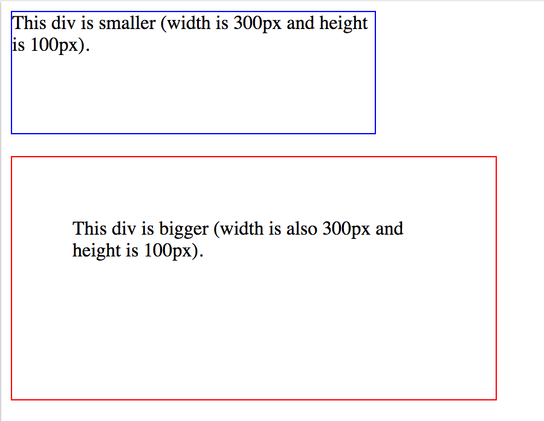
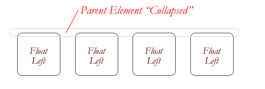

# Properties explained

## box-sizing


> **Actual element width** = width + left padding + right padding + left border + right border + left margin + right margin
>
> **Actual element height** = height + top padding + bottom padding + top border + bottom border + top margin + bottom margin

lets say, we have css rule:

```css
element {
 width: 100px; /* Width of content - blue area */
 height: 100px; /* height of content - blue area */
 padding: 10px; /* green area */
 border: 10px; /* yellow area */
 margin: 10px; /* orange area */
}

/*
Actual width: 100 + 20 + 20 + 20 = 160px
Actual height: 100 + 20 + 20 + 20 = 160px
*/
```

> **IMPORTANT** When we say `width` or `height` in css rule. It means the width and height of content area only.

By default, the content area of an element makes up its width. Box sizing allows you to change what makes up the width of the element. The box-sizing property is used to alter the default CSS box model used to calculate width and height of the elements.

```
box-sizing: content-box | border-box | padding-box
```

### content-box

The `width` and `height` properties are measured including only the content area, but not the padding, border or margin.

_width = width of the content only_
_height = height of the content only_

IF `.box {width: 350px;}` then you apply `{border: 10px solid black;}` the result {rendered in the browser} a `box of width: 370px.`

### border-box

The `width` and `height` properties include the content, the padding and border, but not the margin.

_width = border + padding + width of the content_
_height = border + padding + height of the content_.

Note that padding and border will be inside of the box. `.box {width: 350px; border: 10px solid black;}` leads to a box rendered in the browser of `width: 350px`.

**Simple words**, text inside the box is adjusted to accomodate border and padding in a width and height.

### padding-box

Not very well suported and experimental.

### How it is useful

The box-sizing property can make building CSS layouts easier and a lot more intuitive as you don't have to keep track of the measurements as much.

Say we have css rule without `box-sizing`

```css
.div1 {
 width: 300px;
 height: 100px;
 border: 1px solid blue;
}
.div2 {
 width: 300px;
 height: 100px;
 padding: 50px;
 border: 1px solid red;
}
```



Both the `div` above has same height and width but second one is bigger when rendered because it add up padding and border to width property. So in order to make both of them in equal width and height then you have to subtract padding and border from width property and reasign new value to `width`. And as designer, when you look at the `width` property you can't just tell that it would be the actual width of an element. So just by looking in to the `width` property value you cannot be clear just like that, you need to to do some calculation which is not very intuitive and easy because what you are trying to visualize the width of element by looking at `width` property may not be always the same when render actually on screen. So, for a long time web developers have specified a smaller width value than they wanted, because they had to subtract out the padding and borders.

But with CSS3, the `box-sizing` property solves this problem.

```css
.div1 {
 width: 300px;
 height: 100px;
 border: 1px solid blue;
 box-sizing: border-box;
}

.div2 {
 width: 300px;
 height: 100px;
 padding: 50px;
 border: 1px solid red;
 box-sizing: border-box;
}
```


### By default applying border-box to all elements

```css
*,
*::before,
*::after {
-webkit-box-sizing: border-box;
-moz-box-sizing: border-box;
box-sizing: border-box;
}
```

## Margin - auto

What does auto actually do?

The definition of auto varies with elements, element types and context. In margins, auto can mean one of two things: take up the available space or 0 px.

### Take up the available space

This is the most common use of margin `auto` we come across often. By assigning `auto` to the left and right margins of an element, they take up the available horizontal space in the element’s container equally – and thus the element gets centered.

> Works - For horizontal margin only and block must have width.

> Does not work - Vertical margin, Floated, Inline, Absolute and fixed elements.

1. `auto` in `both` right and left horizontal margins take up the "available" space equally. This tric is used to center the element.
2. A `left` margin with `auto` will take up all of the "available" space making the element look like it has been flushed to `right`.
3. A `right` margin with `auto` will take up all of the "available" space making the element look like it has been flushed to `left`.

> If you ever want to flush an element on your page to right or left without the following elements wrapping it (like whats happens with float), remember there’s the option to use auto for margins.

## Great collapse

One of the more bewildering things about working with floats is how they can affect the element that contains them (their "parent" element). If this parent element contained nothing but floated elements, the height of it would literally collapse to nothing. This isn't always obvious if the parent doesn't contain any visually noticeable background, but it is important to be aware of.



**The Easy Clearing Method** uses a clever CSS pseudo selector (`:after`) to clear floats. Rather than setting the overflow on the parent, you apply an additional class like "clearfix" to it. Then apply this CSS:

```css
.clearfix:after {
  content: ".";
  visibility: hidden;
  display: block;
  height: 0;
  clear: both;
}
```
