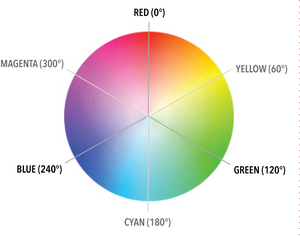

# SCSS

## Comment

### Normal

Normal comments are removed from scss file when css file is generated and compressed.

```scss
$color9: #FF00FF; // Magenta

/* Here is a normal CSS comment */
```

### Loud

Loud comments are not removed from scss file when css file is generated and compressed.

```scss
/*** SCSS ***/

/*! I am loud; hear me roar */
#main {
  color: #999;
  .content {
    color: #bfbfbf;
  }
}

/*** Compressed CSS ***/

/* I am loud; hear me roar */
#main{color:#999}#main .content{color:#bfbfbf}
```

## @import

```scss
@import "foo.scss";
// OR
@import "foo"; // without ext scss

@import "foo.css";
@import "foo" screen;
@import "http://foo.com/bar";
@import url(foo);
```

## Partials

1. File name must begin with `_` otherwise compiler create separate css file of partials.
2. `@import` partials then remove `_`.

```
--src
----partials
------ _variables.scss
------ _normalize.scss
------ _base.scss

## another file
@import "partials/variables";
@import "partials/normalize";
```

## SCSS Syntax

### Variables

Start variable name with `$`.

```scss
$color1: #FF0000; // Red
$color2: #FFBF00; // Orange
```

### Nesting

```scss
.nesting {
  .class {
    width: 100%;
  }
  #id {
    width: 100%;
  }
  &:hover {
    color: $color7;
  }
}

//compiled to
.nesting .class {
  width: 100%;
}
.nesting #id {
  width: 100%;
}
.nesting:hover {
  color: blue;
}
```

#### & - Parent Selector

```scss
a {
  color: blue;
  &:focus,
  &:hover {
    color: #007fff;
  }
  &:active,
  &:visited {
    color: chartreuse;
  }
}

// compile to
a {
  color: blue;
}
a:focus,
a:hover {
  color: #007fff;
}
a:active,
a:visited {
  color: chartreuse;
}
```

##### & does not create descendent selectors

> It creates separate class of its own.

```scss
.MyComponent {
  &-title {}

  &-content {}
}

// You might be thinking that it would
// compile to - NO.
.MyComponent .MyComponent-title {}
.MyComponent .MyComponent-content {}

// OK - Compiles to.
// Separate independent classes.
.MyComponent {}
.MyComponent-title {}
.MyComponent-content {}
```

If you rewrite above to create descendent selectors then:

```scss
.MyComponent {
  .title {
    padding:0;
  }

  .content {
    padding:0;
  }
}

// Compiles to.
// Descendent selector.
.MyComponent .title {
  padding: 0;
}

.MyComponent .content {
  padding: 0;
}
```

##### Chaining

```scss
.selector-one {
  &.selector-two {
    color: green;
  }
}

// compiles to
.selector-one.selector-two {
  color: green;
}

// That will only select an element that has both HTML
// classes, namely  selector-one and  selector-two.
```

##### What if & is added after the selector

```scss
body {
  font-size: 1em;
  line-height: 1.4;
  .no-fontface & { // in nesting, & is after the selector
    font-size: 1.05em;
  }
}

// compiles to
body {
  font-size: 1em;
  line-height: 1.4;
}
.no-fontface body {
  font-size: 1.05em;
}
```

##### Nesting Namespaces

Any CSS property that has a namespace reserved. For example, border has border-left, border-right, border-top, and border-bottom. Font has font-weight, font-family, and font-size. Margin has margin-left, margin-top, margin-right and margin-bottom. Padding etc.

```scss
.img {
  border: {
    top: 1px dashed blue;
    right: 1px dotted #007fff;
    bottom: 2px solid #7f00ff;
    left: 1px solid chartreuse;
  }
}

// compile to
.img {
  border-top: 1px dashed blue;
  border-right: 1px dotted #007fff;
  border-bottom: 2px solid #7f00ff;
  border-left: 1px solid chartreuse;
}
```

### @extend

To extend or add another style properties.

```scss
.box {
  padding: 2em;
  color: black;
  background-color: white;
}
// Warning Box
.warning-box {
  @extend .box;
  border: 2px dotted red;
}
// Success Box
.success-box {
  @extend .box;
  border: 2px dotted chartreuse;
}
// Information Box
.info-box {
  @extend .box;
  border: 2px dotted blue;
}

// compile to
.box,
.info-box,
.success-box,
.warning-box {
  padding: 2em;
  color: black;
  background-color: white;
}
.warning-box {
  border: 2px dotted red;
}
.success-box {
  border: 2px dotted chartreuse;
}
.info-box {
  border: 2px dotted blue;
}
```

SCSS is smart enough to group the shared styles under a single combined selector. Using the  @extend directive in this manner prevents endless repetition of code for similar elements.

#### Using % to extend style

Now, notice in the example above, our first rule for  `.box` class wouldn't actually be used. It's being declared for the sole purpose of extending. That may seem a little wasteful. In situations where we want to define rules purely to extend them elsewhere, we can use  placeholder selectors.

```scss
// Box
%box {
  padding: 2em;
  color: $color10;
  background-color: $color11;
}
// Warning Box
.warning-box {
  @extend %box;
  border: 2px dotted $color1;
}
// Success Box
.success-box {
  @extend %box;
  border: 2px dotted $color4;
}
// Information Box
.info-box {
  @extend %box;
  border: 2px dotted $color7;
}

// compile to
.info-box,
.success-box,
.warning-box {
  padding: 2em;
  color: black;
  background-color: white;
}
.warning-box {
  border: 2px dotted red;
}
.success-box {
  border: 2px dotted chartreuse;
}
.info-box {
  border: 2px dotted blue;
}
```

#### Chaining Extends

It’s possible for one selector to extend another selector that in turn extends a third. For example:

```scss
.error {
  border: 1px #f00;
  background-color: #fdd;
}
.seriousError {
  @extend .error;
  border-width: 3px;
}
.criticalError {
  @extend .seriousError;
  position: fixed;
  top: 10%;
  bottom: 10%;
  left: 10%;
  right: 10%;
}

// Now everything with class .seriousError also has class
// .error, and everything with class .criticalError has class
// .seriousError and class .error. compiled to.

.error, .seriousError, .criticalError {
  border: 1px #f00;
  background-color: #fdd;
}
.seriousError, .criticalError {
  border-width: 3px;
}
.criticalError {
  position: fixed;
  top: 10%;
  bottom: 10%;
  left: 10%;
  right: 10%;
}
```

### Mixins - Function to create style

```scss
// file - _mixins.scss
@mixin bs($bs-type) {
  -webkit-box-sizing: $bs-type;
  -moz-box-sizing: $bs-type;
  box-sizing: $bs-type;
}

// file - modules.scss, call mixin with directive '@include'
.box {
  @include bs(border-box);
}
// compile to
.box {
  -webkit-box-sizing: border-box;
  -moz-box-sizing: border-box;
  box-sizing: border-box;
}
```

#### Argument Default Value

```scss
// file - _mixins.scss
@mixin bs($bs-type: border-box) {
  -webkit-box-sizing: $bs-type;
  -moz-box-sizing: $bs-type;
  box-sizing: $bs-type;
}

// file - modules.scss
* {
  @include bs;  // if no value is provided then default will
                // be used otherwise the value provided.
}

// compile to
* {
  -webkit-box-sizing: border-box;
  -moz-box-sizing: border-box;
  box-sizing: border-box;
}
```

##### Another way to provide default value

It reduces the redundant code if default value is being used in more than one mixins.

```scss
// file - _mixins.scss
$defined-bs-type: border-box !default;

@mixin bs($bs-type: $defined-bs-type) {
  -webkit-box-sizing: $bs-type;
  -moz-box-sizing: $bs-type;
  box-sizing: $bs-type;
}

// file - modules.scss
* {
  @include bs;
}

// compile to
* {
  -webkit-box-sizing: border-box;
  -moz-box-sizing: border-box;
  box-sizing: border-box;
}
```

### Color

#### HSL



First, you need a new mental model for color. Forget sliders: instead, focus on the wheel above. You can see red, green and blue: red, at the top, is at 0 degrees, green is at 120 and blue at 240, dividing the color wheel into thirds**.**

> **Remember:**  *“Young Guys Can Be Messy Rascals”* – Yellow, Green, Cyan, Blue, Magenta and Red, starting at 60° and increasing in equal increments.

```scss
hsl(240,100%,50%);
```

##### [1]. Hue = Color

240 means blue color

##### [2]. Saturation = Intensity

How far away is the color from grey? Any HSL color with a saturation of 0% is the exact same shade of grey. 100% percent in the case of 240 means no grey shading pure blue color.

##### [3]. Brightness

How far away the color is from black or white. A brightness level of 50% means the color is perfectly balanced between light and dark. 0% means completely dark and 100% means complete brightness.

#### RGBa

```scss
background-color: rgba(255,0,0,.5);

// value 1, tells about the transperancy or opacity of color also called alpha channel.
// 0 means no transperancy and 1 means fully transparent.
```

#### Functions

```scss
// lighten the color
background-color: lighten($primary-color, 93.5%);

// darken the color
background-color: darken($primary-color, 93.5%);

// convert an existing color value defined as hex value to an RGBA value
// compiles to "background-color: rgba(255, 0, 0, 0.9);"
background-color: rgba($primary-color,.9);
```

### Media Query - @media

```scss
.style {
  width: 100%;
}
/* First breakpoint */
@media only screen and (min-width: 320px) {
  .styles {
    width: 80%;
  }
}
/* Second breakpoint */
@media only screen and (min-width: 480px) {
  .styles {
    width: 70%;
  }
}
/* Third breakpoint */
@media only screen and (min-width: 600px) {
  .styles {
    width: 60%;
  }
}

// compiles to
.style {
  color: red;
}
@media only screen and (min-width: 30em) {
  .style {
    width: 80%;
  }
}
@media only screen and (min-width: 47em) {
  .style {
    width: 70%;
  }
}
@media only screen and (min-width: 75em) {
  .style {
    width: 60%;
  }
}
```

#### Media Query using mixins

```scss
/* _variables.scss */
$XS: 18em; // roughly speaking, around 288px wide with 16px body font
$S: 30em; // roughly speaking, around 480px wide with 16px body font
$M: 43em; // roughly speaking, around 688px wide with 16px body font
$L: 57em; // roughly speaking, around 912px wide with 16px body font

/* _mixins.scss */
@mixin MQ($canvas) {
   @if $canvas == XS {
    @media only screen and (min-width: $XS) and (max-width: $S - 1) {
       @content;
    }
  }
  @else if $canvas == S {
     @media only screen and (min-width: $S) and (max-width: $M - 1){
      @ content;
    }
  }
  @else if $canvas == M {
     @media only screen and (min-width: $M) and (max-width: $L - 1){
      @ content;
    }
  }
  @else if $canvas == L {
     @media only screen and (min-width: $L) and (max-width: $XL - 1){
      @content;
    }
  }
  @else if $canvas == XL {
     @media only screen and (min-width: $XL) and (max-width: $XXL - 1){
      @content;
    }
  }
}

/* _modules.scss */
.headline {
  margin: 0;
  font-weight: 400;
  line-height: 4.1em;
  @include MQ(XS) {
    font-size: 1.76em;
  }
  @include MQ(S) {
    font-size: 2.5em;
  }
  @include MQ(M) {
    font-size: 2.8em;
  }
  @include MQ(L) {
    font-size: 3.7em;
  }
}
```

### Programmatic Logic

#### Data type

* numbers e.g. `1.2`, `13`, `10px`.
* strings of text, with and without quotes e.g. `"foo"`, `'bar'`, `baz`. SASS specifies two kinds of strings: those with double quotes, such as "Lucida Grande" or single quote 'Aerial', and those without quotes, such as sans-serif or bold.
* colors e.g. `blue`, `#04a3f9`, `rgba(255, 0, 0, 0.5)`
* booleans e.g. `true`, `false`
* nulls e.g. `null`
* lists of values, separated by spaces or commas e.g. `1.5em 1em 0 2em`, `Helvetica, Arial, sans-serif`
* maps from one value to another e.g. `(key1: value1, key2: value2)`

#### Calculations

**How SASS know, for example, if we are calculation width of container and want to have value in px?**

We have `10px` in SASS means number data type similarly `10em or 10rem`.  So when you do:

```scss
.addition {
  width: 20% + 80; // produces 100%
}
.addition {
  width: 20px + 80; // produces 100px
}

// calculations can also be done using variables.
// SASS supports Addition, Subtraction, Multiplication and Division
```

> So it is required to include unit like px, em or % to let SASS know about the unit the result going to have after calculation.

##### Add/Remove Unit

```scss
/*** ADD ***/

// The trick is to multiply the variable by  1 unit of the type of unit
// you would like the value to be. In that example we have used a percentage but
// it could also be em or px.
$variable-with-no-unit: 0;
$variable-with-unit-added: ($variable-with-no-unit * 1%);

/*** REMOVE ***/

// We add  0 and  1 (both without a unit) and then multiply our variable by it.
// This removes the unit as we are multiplying by a unit-less value.
$variable-with-unit: 0%;
$variable-without-unit: ($variable-with-unit * 0 + 1);
```

#### Interpolation - #{}

The process of inserting value of variable when SASS see `#{}`. It just print the variable value. See below for more clarification.

```scss
$font-size: 12px;
$line-height: 30px;

// 1. Just print the variable in plain text
p {
  font: #{$font-size}/#{$line-height};
}

// compile to
p {
  font: 12px/30px;
}

// 1. Do the calculation

p {
  font: $font-size / $line-height;
}

// compile to
p {
  font: 0.4px;
}
```

#### Control Directive

```scss
/******** 1. @if and @else if ********/
$color-theme: orange;

@if $color-theme == pink {
  $color-brand: pink;
}
@else if $color-theme == orange {
  $color-brand: #ff9900;
}

/******** 2. @for  ********/

// gives 2 iterations
@for $i from 1 through 2 {
  .buy_#{$i} {
    background-image: image-url("svg/buy_#{$i}.svg");
  }
}
// compile to
.buy_1 {
  background-image: url("../img/svg/buy_1.svg");
}
.buy_2 {
  background-image: url("../img/svg/buy_2.svg");
}

// gives 1 iteration
@for $i from 1 to 2 {
  .buy_#{$i} {
    background-image: image-url("svg/buy_#{$i}.svg");
  }
}
// compile to
.buy_1 {
  background-image: url("../img/svg/buy_1.svg");
}

/******** 3. @each ********/

// using <list>
$list: puma, sea-slug;

@each $animal in $list {
  .#{$animal}-icon {
    background-image: url("/images/#{$animal}.png");
  }
}
// compile to
puma-icon {
  background-image: url("/images/puma.png");
}
.sea-slug-icon {
  background-image: url("/images/sea-slug.png");
}

// using <map>
@each $header, $size in (h1: 2em, h2: 1.5em, h3: 1.2em) {
  #{$header} {
    font-size: $size;
  }
}
// compile to
h1 {
  font-size: 2em;
}
h2 {
  font-size: 1.5em;
}
h3 {
  font-size: 1.2em;
}

/******** 4. @while ********/

$i: 6;

@while $i > 0 {
  .item-#{$i} {
    width: 2em * $i;
  }
  $i: $i - 2;
}

// compile to
.item-6 {
  width: 12em;
}
.item-4 {
  width: 8em;
}
.item-2 {
  width: 4em;
}
```

#### Function

```scss
@function bb-opos($bb-flow) {
   @if $bb-flow == right{
    @return left;
  }
  @else {
     @return right;
  }
}

// using the function
$bb-flow: left !default;
$bb-opos: bb-opos($bb-flow); // assign retrun value to variable

div {
  float: #{$bb-opos($bb-flow)}; // print the return value in plain text
}
```

#### @debug

Prints the value of a SassScript expression to the standard error output stream.

```scss
// in a scss file if you do
@debug 10em + 12em;

// then in command line you will see
Line 1 DEBUG: 22em
```

#### @warn

Similar to `@debug`  but the warning can be universally suppressed by adding the following to config.rb file:

`sass_options = {:quiet => true}`

```scss
@mixin adjust-location($x, $y) {
  @if unitless($x) {
    @warn "Assuming #{$x} to be in pixels";
    $x: 1px * $x;
  }
  @if unitless($y) {
    @warn "Assuming #{$y} to be in pixels";
    $y: 1px * $y;
  }
  position: relative; left: $x; top: $y;
}
```

#### @error

Generate fatal error, including a nice stack trace.

```scss
@mixin adjust-location($x, $y) {
  @if unitless($x) {
    @error "$x may not be unitless, was #{$x}.";
  }
  @if unitless($y) {
    @error "$y may not be unitless, was #{$y}.";
  }
  position: relative; left: $x; top: $y;
}
```

#### Subtraction & Negative Number

* You always include spaces on both sides of `-` when subtracting. e.g: 5px - 3px
* You include a space before `-` but not after for a negative number. 5px -3px, this is a list with negative 3px.

#### String Concatenation (+)

```scss
p {
  cursor: e + -resize;
}
// compiled to
p {
  cursor: e-resize;
}

/*
Quoted string to the left of + = quoted string.
Unquoted string to the left of + = Unquoted string.
*/
p:before {
  content: "Foo " + Bar;
  font-family: sans- + "serif";
}
// compiled to
p:before {
  content: "Foo Bar";
  font-family: sans-serif;
}
```

#### Boolean Operation

Sass supports `and`, `or`, and `not` operators for boolean values.
