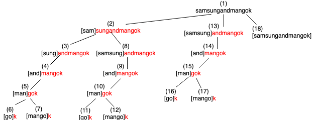

# Backtracking

Backtracking is an algorithmic-technique for solving problems recursively by trying to build a solution incrementally, one piece at a time, removing those solutions that fail to satisfy the constraints of the problem at any point of time.

!!! info "Idea"
    The idea is that we can build a solution step by step using recursion; if during the process we realise that is not going to be a valid solution, then we stop computing that solution and we return back to the step before (backtrack).

    Whenever the algorithm needs to decide between multiple alternatives to the next component of the solution, it recursively evaluates every alternative and then chooses the best one.

Imagine to have a maze and you want to find if it has an exit. A simple maze where we have labeled the junctions as 1, 2 and 3.


If we want to check every possible path in the maze, we can have a look at the tree of paths, split for every junctions stop:


## How to determine if a problem can be solved using backtracking?

Generally, every problem which has clear and well-defined **constraints** on any objective solution, that incrementally builds candidate to the solution and abandons a candidate (“backtracks”) as soon as it determines that the candidate cannot possibly be completed to a valid solution, can be solved by Backtracking. However, most of the problems can be solved using other known algorithms like Dynamic Programming or Greedy Algorithms in logarithmic, linear, linear-logarithmic time complexity and therefore, outshine the backtracking algorithm in every respect (since backtracking algorithms are generally exponential in both time and space). However, a few problems still remain, that only have backtracking algorithms to solve them until now.

## Word break problem

Given a string without space and a dictionary of words, find out if string can be segmented into a space-separated sequence of dictionary words.

```
Dictionary:
{"mobile", "samsung", "sam", "sung", "man", "mango",
"icecream", "and", "go", "i", "like","ice", "cream"}

Input: "ilikesamsung"
Output: Yes

Input: "iiiiiiii"
Output: Yes

Input: "samsungandmangok"
Output: No
```

!!! info "idea"
    **Constraint:** All separated words must be in dictionary. If the string is separated into three words then all those three words must be in dictionary. Although if we have 2 words in the dictionary and one word is not in dictionary then we say string cannot be segmented.

    The idea is, we start with the first letter which become prefix. Then check if the prefix is present in dictionary. If not, then we append next letter to the previous prefix and then check again its presence. If we found the prefix in dictionary then it means we found word which can be separated with space. Then we take a left over letters (suffix) and find out if it can be segmented too. This is going to be our subproblem. If leftover letters cannot be segmented then we **backtrack** to the prefix that we found before the recurring call to suffix. When failed, we actually **discard** the prefix as a result because with this prefix, the suffix that we get, cannot be segmented. So we need to form another prefix by appending letter one by one to the discarded prefix and check in dictionary again. If we have tried all prefixes and none of them resulted in a solution, we return false. But if any prefix result in solution then we do not check for other prefixes because we do not want all possible ways in which the string can be segmented. Once found a solution we stop.

    **Note:** We recur call only when prefix is found in the dictionary. Otherwise we keep building prefix and look for the prefix in the dictionary.

    **Base case:** When suffix is empty string because we reach at the last letter of the string while forming prefix and suffix cannot be formed.

!!! question "How come is this a bactracking problem?"
    Because if we cannot segment the suffix then we go back to the prefix and discard it. Then form another prefix and check if the new suffix can be segmented.

```js
var dict = new Map([
  ['mobile', 'mobile'],
  ['samsung', 'samsung'],
  ['sam', 'sam'],
  ['sung', 'sung'],
  ['man', 'man'],
  ['mango', 'mango'],
  ['icecream', 'icecream'],
  ['and', 'and'],
  ['go', 'go'],
  ['i', 'i'],
  ['like', 'like'],
  ['ice', 'ice'],
  ['cream', 'cream']
]);

function wb(word) {

  var size = word.length;

  // Base case
  if (size === 0) {
    return true;
  }

  for(var i=1; i<=size; i++) {
    var prefix = word.substr(0, i);
    if(dict.has(prefix) && wb(word.substr(i, size-i))) {
      return true;
    }
  }
  return false;
}

wb('ilikesamsung'); // true
wb('iiiiiiii'); // true
wb('ilikelikeimangoiii'); // true
wb('samsungandmango'); // true
wb('samsungandmangok'); // false
```



Leaf nodes, 6, 7, 11, 12, 16, 17 all have a `k` as input string and since `k` does not exist in dictionary, it (recursion function) returns false. Then the program backtrack and try to form another prefix. For example, leaf node 6. We have prefix `go`. `k` returns false so it backtrack and form another prefix `gok`, which again does not exist in dictionary. So it also returns false. Now control goes back to node 5. `man` as prefix failed to meet constraint because if we take `man` as a prefix then suffix `gok` cannot be segmented. So we need to try another prefix. So through backtracking we form another prefix `mango` and suffix `k`.

!!! note
    The tree has overlapping nodes (subproblems). Through memoization we can avoid recomputing.
