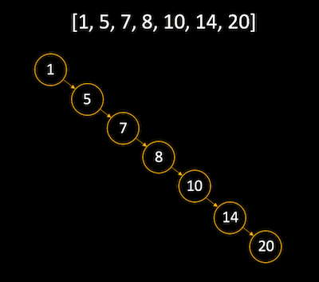
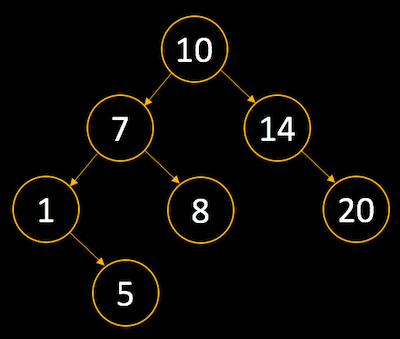

# Binary search tree

BST is a binary tree but it has a order. The nodes in BST are arranged in order.

## Order

For each node:

1. Left node must be less than the parent.
2. Right node must be greated than the parent.


## Why should we use this?

**Speed,** the BST is an ordered data structure. The inherent order makes searching fast. Similar to binary search (with an array that is sorted), we cut the amount of data to sort through by half on each pass.

## Why height of BST is important?

> In other words, why should BST be a balance binary tree?

Because basic operations (insert, delete and search) are directly proportional to the height of a tree.

Lets take an example, as we know in BST we add node to left if smaller than parent and to the right if larger than parent. Now if i give you an array in **descending order** and want you to create BST. Then it would look like following, **Right skewed** tree.



This is similar to linked list and we have O(n) time complexity for searching a node in linked list. This fails the whole purpose of BST tree which cut down the search into half like binary search in every step to give us a O(log n) time complexity.

If you want to look up node 20 then this will take 7 comparisons to get it.

!!! note "What if you have an array in increasing order?"
    Then tree is going to be **Left skewed** tree.

    

What if, each time we add node, we also balance it. Then the balance BST will look like following.



let’s search for the value 20 in our balanced tree. If you count the comparisons you’ll see that it would only take 3 hops. This means that our search performance increased by over 50% by having a balanced tree compared with a unbalanced tree.

!!! info "Fixing unbalance tree"
    There are a number of algorithms that you can use to remedy this issue. Some of the most popular algorithms are:

    - Red black tree
    - AVL tree

## Complexity

| Algo   | Average  | Worst |
|--------|----------|-------|
| Search | O(log n) | O(n)  |
| Insert | O(log n) | O(n)  |
| Delete | O(log n) | O(n)  |

- Average O(log n) for all operations, if BST is balance. Balance tree has height = log n. And BST has an order to follow. So to search a node we have to start from root and then follow the order which make us to traverse single path only _(not all paths from root need to traverse)_ and it is possible that the node we are looking for is a leaf node. For example, take an example above. If you want to find node 5 then you start from root 10-7-1-5. You do not have to traverse all paths of tree. So in our example tree of size n=7 we take log 7 = 2 comparisons to find 5.
- Worst O(n) for all operations, if BST is unbalanced. Let's take an example above of unbalance tree which look like linked list. So to find node 20 we have to run comparison with all nodes one by one.

## Code

### Node.js

```js
module.exports = class Node {
  constructor (data) {
    this.data = data;
    this.left = null;
    this.right = null;
  }
};
```

### BinarySearchTree.js

```js
const Node = require('./Node');

module.exports = class BinarySearchTree {
  constructor () {
    this.root = null;
    this.container = [];
  }

  getTree () {
    return this.root;
  }

  setTree (root) {
    this.root = root;
  }

  getContainer () {
    return this.container;
  }

  buildTree (arr, start = 0, end = arr.length - 1) {
    // arr is already sorted.
    if (start > end) {
      return null;
    }
    // Get the middle element and make it root
    let mid = parseInt((start + end) / 2);
    let root = new Node(arr[mid]);

    // Recursively construct the left subtree and make it left child of root
    root.left = this.buildTree(arr, start, mid - 1);
    // Recursively construct the right subtree and make it right child of root
    root.right = this.buildTree(arr, mid + 1, end);
    return root;
  }

  insert (element) {
    let node = new Node(element);
    if (this.root === null) {
      this.root = node;
      return;
    }
    let current = this.root;
    while (true) {
      if (node.data > current.data) {
        if (current.right === null) {
          current.right = node;
          break;
        }
        current = current.right;
      } else {
        if (current.left === null) {
          current.left = node;
          break;
        }
        current = current.left;
      }
    }
  }

  getMin () {
    let current = this.root;
    while (current.left !== null) {
      current = current.left;
    }
    return current.data;
  }

  getMax () {
    let current = this.root;
    while (current.right !== null) {
      current = current.right;
    }
    return current.data;
  }

  find (data) {
    let current = this.root;
    while (current) {
      if (data === current.data) return true;
      if (data < current.data) current = current.left;
      if (data > current.data) current = current.right;
    }
    return false;
  }
};
```
