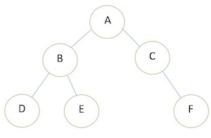
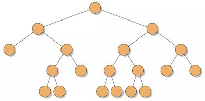
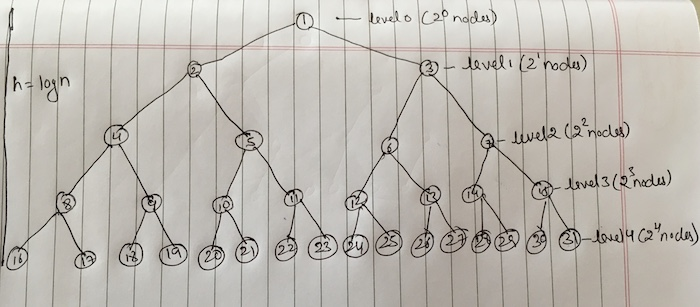

# Terminology

- **Root**: the topmost node of the tree.
- **Edge**: the link between 2 nodes.
- **Child**: a node that has a parent node.
- **Parent**: a node that has an edge to a child node.
- **Leaf**: a node that does not have a child node in the tree.
- **Height**: The height of a tree is the length of the longest path from root to leaf. `Root's height = 0.`
- **Depth**: The depth of a node is the length of the path to its root. `Root's depth 0.`
- **Level**: The number of rows in tree. It starts from **0, 1, 2...** so on. `Root's level = 0` and `Total levels = height + 1`.

!!! note "About height, depth and levels"
    - Height = 3 _[count edges of longest path]_
    - Depth = 2 _[count edges from node to root]_
    - Total levels = 3 + 1 = 4 _[0, 1, 2, 3]_

    

!!! info
    Height and depth of single node is 0.

## Binary Tree

A binary tree is a tree where every node has two or fewer children. The children are usually called left and right. There should not be more than 2 children. Thus, each node in a binary tree can have either 0, 1 or 2 children.



### Types of binary tree

#### Full binary tree

1. All nodes have either 0 or 2 children.
2. 1 child is not allowed.
3. There is no order in which the nodes are added to the tree. The 0 or 2 nodes can be anywhere in the tree.



#### Complete binary tree

1. All nodes have 2 children except the nodes at the second last levels.
2. Second last level can have 0, 1 or 2 nodes.
3. Order: Each level must be filled from left to right without leaving any gaps.


!!! info "Height"
    Complete binary tree can be perfect binary tree if last level filled totally. Even if it is partially filled you can roughly take a **height = log n**.

#### Perfect binary tree

1. Each non-leaf node has exactly 2 children.
2. All leaf nodes are at the same level.



##### Properties of perfect binary tree

| Property                   | Value                         |
|----------------------------|-------------------------------|
| Height                     | log n                         |
| Total levels               | h + 1, where h is height      |
| Total number of nodes      | 2^h+1^ - 1, where h is height |
| Total number of leaf nodes | 2^h^, where h is height       |

Let's say we know the height of tree, which is 4.

- Total level = 4 + 1 = 5 levels
- Total number of nodes = 2^4+1^ - 1 = 31 nodes
- Total number of leaf nodes = 2^4^ = 16 nodes
- Total number of nodes at level 3 = 2^3^ = 8 nodes

!!! info "Calculate height when we know total number of nodes"
    n = 31 _[number of nodes]_

    log 31 = 4

### Balance and unbalanced binary tree

> Binary tree in which the height of the two subtrees of every node never differ by more than 1.

Most operations on a binary tree take time directly proportional to the height of the tree _(if height increases then time to execute search, add, remove of node also increases)_, so it is desirable to keep the height small.

```
    3
   / \
  9  20
    /  \
   15   7
```

1. Take a node 3.
2. Height of left branch `3, 9` is 1.
3. Height of right branch `3, 20, 7` is 2.
4. 1 - 2 = -1, which is not more than 1.

```
       1
      / \
     2   2
    / \
   3   3
  / \
 4   4
```

1. Take a node 1.
2. Height of left branch `1, 2, 3, 4` is 3.
3. Height of right branch `1, 2` is 1.
4. 3 - 1 = 2, which is more than 1.

Therefore, it is unbalanced binary tree.

## Tree traversal

There are two main approaches to tree traversal:

1. Breadth-first traversal
2. Depth-first traversal
      1. Inorder
      2. Preorder
      3. postorder

### Breadth-first traversal **[Queue]**

> Level by level - It involves search through a tree one level at a time.


### Depth-first traversal **[Stack]**


#### Preorder

Visit the parent, then all the left children, and then all the right children.

> (Root, Left, Right) : 1 2 4 5 3

#### Inorder

Visit the left child, then the parent, and then the right child. This approach is useful for **BSTs as it traverses the nodes in sorted order.**

> (Left, Root, Right) : 4 2 5 1 3

#### Postorder

Visit the left child, then the right child, and then the parent.

> (Left, Right, Root) : 4 5 2 3 1

## Code

### Node.js

```js
module.exports = class Node {
  constructor (data) {
    this.data = data;
    this.left = null;
    this.right = null;
  }
};
```

### BinaryTree.js

```js
const Node = require('./Node');

module.exports = class BinaryTree {
  constructor () {
    this.root = null;
    this.container = [];
  }

  getTree () {
    return this.root;
  }

  getContainer () {
    return this.container;
  }

  insert (element) {
    // Insert element at first position available
    // in breadth first order.
    let node = new Node(element);
    if (this.root === null) {
      this.root = node;
      return;
    }
    let queue = [];
    let current = null;
    queue.push(this.root);
    while (queue.length > 0) {
      current = queue.shift();
      if (current.left === null) {
        current.left = node;
        break;
      } else {
        queue.push(current.left);
      }
      if (current.right === null) {
        current.right = node;
        break;
      } else {
        queue.push(current.right);
      }
    }
    queue.length = 0;
  }

  bfs () {
    let queue = [];
    let arr = [];
    let current = null;
    queue.push(this.root);
    while (queue.length > 0) {
      current = queue.shift();
      arr.push(current.data);
      if (current.left !== null) {
        queue.push(current.left);
      }
      if (current.right !== null) {
        queue.push(current.right);
      }
    }
    return arr;
  }

  preorder () {
    let stack = [];
    let arr = [];
    let current = null;
    stack.push(this.root);
    while (stack.length > 0) {
      current = stack.pop();
      arr.push(current.data);
      if (current.right !== null) {
        stack.push(current.right);
      }
      if (current.left !== null) {
        stack.push(current.left);
      }
    }
    return arr;
  }

  preorderRecursively (root = this.root) {
    if (root !== null) {
      this.container.push(root.data);
      this.preorderRecursively(root.left);
      this.preorderRecursively(root.right);
    }
    return null;
  }

  inorder () {
    let stack = [];
    let arr = [];
    let current = this.root;
    while (stack.length > 0 || current !== null) {
      if (current !== null) {
        stack.push(current);
        current = current.left;
      } else {
        current = stack.pop();
        arr.push(current.data);
        current = current.right;
      }
    }
    return arr;
  }

  inorderRecursively (root = this.root) {
    if (root !== null) {
      this.inorderRecursively(root.left);
      this.container.push(root.data);
      this.inorderRecursively(root.right);
    }
    return null;
  }

  postorder () {
    let stack = [];
    let anotherStack = [];
    let arr = [];
    let current = null;
    stack.push(this.root);
    while (stack.length > 0) {
      current = stack.pop();
      anotherStack.push(current.data);
      if (current.left !== null) {
        stack.push(current.left);
      }
      if (current.right !== null) {
        stack.push(current.right);
      }
    }
    while (anotherStack.length > 0) {
      arr.push(anotherStack.pop());
    }
    return arr;
  }

  postorderRecursively (root = this.root) {
    if (root !== null) {
      this.postorderRecursively(root.left);
      this.postorderRecursively(root.right);
      this.container.push(root.data);
    }
    return null;
  }
};
```
