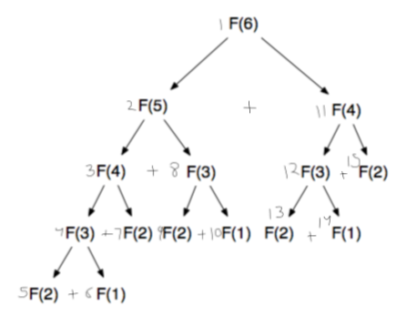

# Dynamic programming

Dynamic Programming is the way of solving complex problems by breaking them into subproblems such that the optimal solutions of the subproblems can be used to construct the optimal solution to the main problem.

- **Divide** the problem into subproblems of **same type**.
- **Memoize:** the overlapping subproblems. The same subproblem occur more than once. So we calculate only once and then save the result. The idea is to simply store the results of subproblems, so that we do not have to re-compute them when needed later. This simple **optimization** reduces time complexities from exponential to linear.

!!! question "How to achieve optimization?"
    Using memoization. This way we can reduce the time complexity from exponential to linear. For example:

    - Fibonnaci without memoization: O(2^n^)
    - Fibonnaci with memoization: O(n)
    - Fibonnaci with iteration: O(n)

!!! note
    Well, guess what? This technique is far from unique. In fact, it’s probably one of the most commonly-used approaches to problem solving in the world of computer science! Breaking down a problem into smaller, more bite-sized parts is something that computer scientists and programmers alike have been doing for decades. This method is tried, tested, and repeatedly been proven to be true. It’s so commonplace that it has its own name: dynamic programming. Even if you’ve never heard of this term before, there’s a good chance that you’ve either used dynamic programming or are already somewhat familiar with its core concepts.

## Dynamic programming vs divide and conquer

Both depend on the fact that dividing the main problem into sub problems. But, the sub problems in divide and conquer are not overlapping in nature, that is, sub problem does not reoccur more than once. Where as, in dynamic programming, the sub problems are overlapping and they often reoccur more than once. So to avoid the recomputation we use memoization technique.

## Two approaches

| Top down                                             | Bottom up                                                                         |
|------------------------------------------------------|-----------------------------------------------------------------------------------|
| Breaks the massive problem into smaller subproblems. | Solves the fundamental low-level problem and integrates them into a larger one.   |
| **Splitting:** Start big and split down.             | **Merging:** Start with the smallest and merge your way up to the final solution. |

## Lets understand better by taking fibonacci problem

> 1, 1, 2, 3, 5, 8, 13, 21...

$$ T(n) = \begin{cases} 1 & n = 1, n = 2 \\ T(n-1) + T(n-2) & n > 2 \end{cases} $$

### Recursive call tree



From recursive tree above, you can see that there are many nodes which are repeating. Overlapping of subproblems.

!!! question "Why repetition?"
    If you see the recurrence relation, there are two recursive calls, which creates two branches on tree. If you have one recursive call then there will not be any repetition or overlapping of subproblems.

Check the steps marked in figure above, the flow go all the way down towards left first untill hit the base case then after go towards right. When right node value is found, it add to left node value and return to parent node.

### Naive approach

- Time: O(2^n^) - Exponential because we are recomputing same subproblems more than once.

```js
function fib(n) {
  if(n <= 2) {
    return 1;
  }
  return fib(n-1) + fib(n-2);
}

console.log(fib(6)); // 8
```

### Top down appraoch (Memoization)

- Time: O(n) - Linear because now we compute each subproblem once.
- Space: O(n) - Extra n size of space is required to store the value in `memo` object.

```js
let memo = {};

function fib(n) {
  if(n <= 2) {
    return 1;
  }
  if(memo.hasOwnProperty(n)) {
    // Do not recompute and return already stored result.
    return memo[n];
  }
  // Store the result of each subproblem.
  memo[n] = fib(n-1) + fib(n-2);
  return memo[n];
}

console.log(fib(6)); // 8
```

!!! question "Can be bring down space complexity from O(n) to O(1)?"
    Yes, using bottom up approach.

### Bottom up approach (Iterative)

- Time: O(n)
- Space: O(1)

```js
function fib(n) {
  if(n <= 2) {
    return 1;
  }

  let twoBehind = 1;
  let oneBehind = 1;
  let result = 0;

  for(let i = 3; i <= n; i++) {
    result = twoBehind + oneBehind;
    twoBehind = oneBehind;
    oneBehind = result;
  }
  return result;
}

console.log(fib(6)); // 8
```

## Staircase problem

There are n stairs, a person standing at the bottom wants to reach the top. The person can climb either 1 stair or 2 stairs at a time. Count the number of ways, the person can reach the top.

```
Input: n = 1
Output: 1
There is only one way to climb 1 stair

Input: n = 2
Output: 2
There are two ways: (1, 1) and (2)

Input: n = 4
Output: 5
There are 5 ways: (1, 1, 1, 1), (1, 1, 2), (2, 1, 1), (1, 2, 1), (2, 2)
```

### [Step 1]: How to recognize a dynamic programming problem

Recognizing that a problem can be solved using DP is the first and often the most difficult step in solving it. What you want to ask yourself is whether problem's solution can be expressed as a function of solutions to similar smaller problems. In other words, **can problem be divided into similar subproblems?**

Lets draw a tree.

We have n=4 and there are two ways to move up to the stairs either by taking 1 step or by taking 2 steps. When drawing tree we go backward that is, start from 4^th^ step and reach all the way down to the bottom which is 0. As we go down, we can go either 1 step down or 2 step down. Since we have two ways to go from any step, so the left edge of tree represents the 1 step taken, so subtract 1 and right edge represents 2 steps taken, so subtract 2. We do it untill reach at the bottom which is 0.

> If we have 3 ways (1, 2, 4) to go to 4^th^ step then we will draw 3 edges.


If you count the number of leaf nodes (0) then you get the number of ways to reach to 4^th^ step from the bottom and which is 5.

If you go up towards 4^th^ step by picking leaf nodes (0) one by one and write down the number on the edges in a order as you go up separated by comma. Then you get the sequence of steps.

1^st^ step | 2^nd^ step | 3^rd^ step | 4^th^ step |
|--|--|--|--|
| 1 | 1, 1 | 1, 1, 1 | 1, 1, 1, 1 |
| | 2 | 2, 1 | 2, 1, 1 |
| | | 1, 2 | 1, 2, 1 |
| | | | 1, 1, 2 |
| | | | 2, 2 |

#### Important points that need to understand

**[1]** Here, we are talking about the total number of ways to reach 4^th^ step from the bottom and we are not interested in diffrent sequence of steps that can be followed to reach at the 4^th^ step from the bottom. For eaxmple, we do not want sequence of steps like `1, 1, 1, 1`, `2, 1, 1` etc. We did it above to figure out the pattern.

Now, understand this, which is very **important** to undestand the problem. Say you are standing at 3^rd^ step and you have figured out all the possible sequence of steps by taking either 1 step or 2 steps to get to 3^rd^ step, which came out to be 3 ways. To reach at the 4^th^ step from 3^rd^ step all you need is to add 1 to the all the possible sequence of steps which you have figured out previously for 3^rd^ step. In other words, **if there are 3 ways to reach to 3^rd^ step then to reach to the 4^th^ step there will also be 3 ways out of total ways to reach to the 4^th^ step.** Let take an example:

| 3^rd^ step | Add | 4^th^ step |
|------------|-----|------------|
| 1, 1, 1    | 1   | 1, 1, 1, 1 |
| 2, 1       | 1   | 2, 1, 1    |
| 1, 2       | 1   | 1, 2, 1    |

You are just adding 1 step to the sequence of steps.

Just think, you can take either 1 step or 2 step. So when you start from bottom and try all possible sequence of steps to reach to the 4^th^ step then out of those sequence of steps. There must be a few sequence of steps which take you to the 3^rd^ step first then to the 4^th^ step. Because 3^rd^ step comes before 4^th^ step. So when you know the number of ways to reach to 3^rd^ step then you also know that these ways of 3^rd^ step are also a ways to reach to 4^th^ step.

Lets understand this by taking an another example. Say i ask you add 1 three times, `1 + 1 + 1`. You answered 3. Now immediately i ask you add one more. You will immediately answer me 4. Because you just did `3 + 1`. You do not start from sctratch again like `(1 + 1 + 1) + 1`.

**[2]** As you know that you can take either 1 step or 2 step. And if we want to reach to the 4^th^ step then there are two steps before 4^th^ step from where you can go **directly** to the 4^th^ step, which are 2^nd^ step (we can take 2 steps) and 3^rd^ (we can take 1 step) step. **What does that mean?** It means that, if we know the number of ways to reach to the 3^rd^ step and number of ways to reach to the 2^nd^ step then we can know the number of ways to reach to the 4^th^ step by adding number of ways of 2^nd^ step and 3^rd^ step. See the point [1] above, where we have table for 3^rd^ step going to 4^th^ step. Below is the table for 2^nd^ step going to 4^th^ step.

| 2^nd^ step | Add | 4^th^ step |
|------------|-----|------------|
| 1, 1       | 2   | 1, 1, 2    |
| 2          | 2   | 2, 2       |

Therefore, we can say that:

number of ways to reach 4^th^ step = number of ways to reach 2^nd^ step + number of ways to reach 3^rd^ step

n = n - 1 + n - 2

> Therefore, we can divide the problem into subproblems.

### Step[2]: Clearly express the recurrence relation

If we can take either 1 step or 2 step at a time then we know that to climb 1 step there is only 1 way, and for 2 steps there are 2 ways. These are bases cases.

$$ T(n) = \begin{cases} 1 & n = 1 \\ 2 & n = 2 \\ T(n-1) + T(n-2) & n > 2 \end{cases} $$

> This is fibonacci series.

### Step[3]: Implementation

#### Top down approach (memoization)

```js
let memo = {};

function numWays(n) {
  if(n === 1) {
    return 1;
  }
  if(n === 2) {
    return 2;
  }
  if(memo.hasOwnProperty(n)) {
    return memo[n];
  }
  memo[n] = numWays(n-1) + numWays(n-2);
  return memo[n];
}

console.log(numWays(4)); // 5
```

#### Bottom up approach (iterative)

```js
function numWays(n) {
  if(n === 1) {
    return 1;
  }
  if(n === 2) {
    return 2;
  }

  let twoBehind = 1;
  let oneBehind = 2;
  let result = 0;

  for(let i = 3; i <= n; i++) {
    result = twoBehind + oneBehind;
    twoBehind = oneBehind;
    oneBehind = result;
  }
  return result;
}

console.log(numWays(4)); // 5
```

### Step[4]: Determine time complexity

This is fibonacci series and time complexity for fibonacci series with memoization and iteratively is O(n).
