# Graph

In computer science, a graph is an abstract data type that is meant to implement the undirected graph and directed graph concepts from mathematics; specifically, the field of graph theory.

Generally, a graph **G** is represented as **G = (V, E)**, where **V is set of vertices** and **E is set of edges**.

The following is a graph with 5 vertices and 6 edges.
This graph `G` can be defined as `G = (V, E)`
Where `V = {A,B,C,D,E}` and `E = {(A,B),(A,C)(A,D),(B,D),(C,D),(B,E),(E,D)}`.

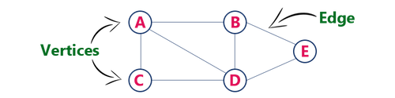

## Terminology

### Vertex

Individual data element of a graph is called as Vertex. Vertex is also known as node. In above example graph, `A, B, C, D & E` are known as vertices.

### Edge

An edge is a connecting link between two vertices. In above example graph, there are `7` edges (i.e., `(A,B), (A,C), (A,D), (B,D), (B,E), (C,D), (D,E))`.

#### Edges are three types

1. **Undirected Edge -** An undirected egde is a bidirectional edge. If there is undirected edge between vertices `A` and `B` then edge `(A, B)` is equal to edge `(B, A)`.
2. **Directed Edge -** A directed egde is a unidirectional edge. If there is directed edge between vertices `A` and `B` then edge `(A, B)` is not equal to edge `(B, A)`.
3. **Weighted Edge -** A weighted egde is a edge with value (cost) on it.

### Directed and Undirected graph

A graph with only directed edges is said to be directed graph.

A graph with only undirected edges is said to be undirected graph.

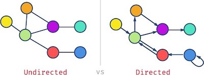

### Mixed graph

A graph with both undirected and directed edges is said to be mixed graph.

### Cyclic vs acyclic graph

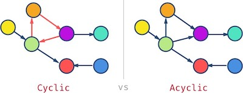

A graph can have cycles which means that if you traverse through the node, you could get to the same node more than once. The graph without cycles is called acyclic graph.

> Also, acyclic undirected graphs are called tree.

### Weighted graph

When edges have values/cost assigned to them, we say we have a weighted graph. If the weight is absent, we can assume it’s `1`.

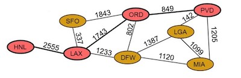

### Origin

If a edge is directed, its first endpoint is said to be the origin of it.

### Destination

If a edge is directed, its first endpoint is said to be the origin of it and the other endpoint is said to be the destination of that edge.

### Adjacent

If there is a edge between vertices `A` and `B` then both `A` and `B` are said to be adjacent. In other words, vertices `A` and `B` are said to be adjacent if there is a edge between them.

### Outgoing edge

A directed edge is said to be outgoing edge on its origin vertex.

### Incoming edge

A directed edge is said to be incoming edge on its destination vertex.

### Degree

Total number of edges connected to a vertex is said to be degree of that vertex.

### Indegree

Total number of incoming edges connected to a vertex is said to be indegree of that vertex.

### Outdegree

Total number of outgoing edges connected to a vertex is said to be outdegree of that vertex.

### Parallel edges or Multiple edges

If there are two undirected edges with same end vertices and two directed edges with same origin and destination, such edges are called parallel edges or multiple edges.

### Self-loop

Edge (undirected or directed) is a self-loop if its two endpoints coincide with each other.

### Simple Graph

A graph is said to be simple if there are no parallel and self-loop edges.

### Sparse vs dense graph

## Graph applications

- Airline Traffic
- GPS Navigation
- Networks routing
- Driving directions
- Social networks. E.g., Facebook uses a graph for suggesting friends
- Recommendations: Amazon/Netflix uses graphs to make suggestions products/movies

## Representation

Two ways.

1. Adjacency matrix
2. Adjacency list

### Adjacency matrix

In this representation, graph is represented using a matrix of size total number of vertices by total number of vertices. That means graph with `4` vertices is represented using a matrix of size `4X4`. In this matrix, both rows and columns represents vertices. This matrix is filled with either `1` or `0`. Here, `1` represents that there is a edge from row vertex to column vertex and `0` represents that there is no edge from row vertex to column vertex.

#### Undirected graph representation

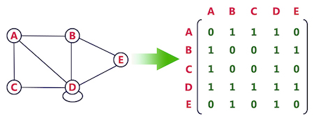

#### Directed graph representation

- Adjacency matrix representation of graph is very simple to implement.
- It consumes huge amount of memory for storing big graphs. **Therefore, not recommended for sparse graph but dense graph**.

### Adjacency list

#### Directed graph representation implemented using linked list

#### Directed graph representation implemented using array

- Adjacency list requires less amount of memory. **Therefore, not recommended for sparse graph**.
- It is not easy for adding or removing an edge to/from adjacent list.

## Complexity

## Spanning tree

A spanning tree is a subset of Graph, which has all the vertices covered with minimum possible number of edges. Hence, a spanning tree does not have cycles and it cannot be disconnected.

> By this definition, we can draw a conclusion that every undirected Graph has at least one spanning tree.

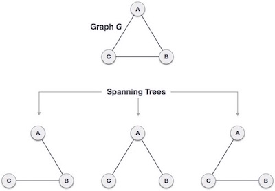

We found three spanning trees off one complete graph.

### Properties

1. Spanning tree has n-1 edges, where `n` is the number of vertices.
2. A complete graph can have maximum n^n-2^ number of spanning trees.

## What is a minimum spanning tree?

The cost of the spanning tree is the sum of the weights of all the edges in the tree. There can be many spanning trees. Minimum spanning tree is the spanning tree where the cost is minimum among all the spanning trees. There also can be many minimum spanning trees.

Minimum spanning tree has direct application in the design of networks. It is used in algorithms approximating the travelling salesman problem, multi-terminal minimum cut problem and minimum-cost weighted perfect matching. Other practical applications are: Cluster Analysis, Handwriting recognition and Image segmentation.

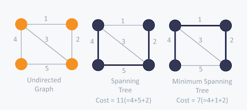

## Walks

A walk is a sequence of vertices and edges of a graph where **vertex can be repeated** and **Edges can be repeated**.

`1->2->3->4->2->1->3` is a walk

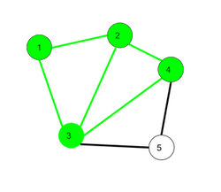

### Open walk

A walk is said to be open if the first and the last vertices are different i.e. the terminal vertices are different.

`a->b->c->d->b` is a open walk.

### Closed walk

A walk is said to be closed if the first and last vertices are the same. That means you start walking at a vertex and end up at the same.

`c->e->g->f->c` is a closed walk.

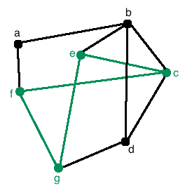

## Trails

A trails is a sequence of vertices and edges of a graph where **vertex can be repeated** and **Edges cannot be repeated**.

`1->3->8->6->3->2` is a open trail.

`1->3->8->6->3->2->1` is a closed trail.

## Path

A path is a sequence of vertices and edges of a graph where **vertex cannot be repeated** and **Edges cannot be repeated**.

> A Path is defined as an open trail with no repeated vertices.

`a->b->c->d->e` is a path.

## Circuit

A circuit is a sequence of vertices and edges of a graph where **vertex can be repeated**, **Edges cannot be repeated** and it is **Closed also**.

`1->2->4->3->6->8->3->1` is a circuit.

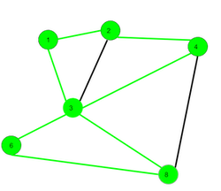

## Cycle

A cycle is a sequence of vertices and edges of a graph where **vertex cannot be repeated**, **Edges cannot be repeated** and **starting and ending vertex must be same** i.e. we can repeat starting and ending vertex only then we get a cycle (one repetition only).

`1->2->4->3->1` is a cycle.

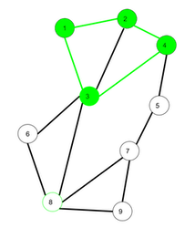
