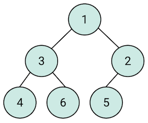
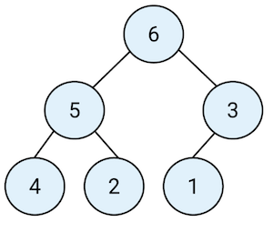

# Heap

Others: `Binary heap`

A heap is really nothing more than a binary tree with some additional rules that it has to follow.

1. **Order:** It must have all of its nodes in a specific order for example, **Max heap** (decreasing order) or **Min heap** (increasing order).
2. **Shape:** It must be **complete binary tree.**

## Types of heap

### Min heap _[parent <= child]_

A min heap is a heap where every single parent node, including the root, is less than or equal to the value of its children nodes.



### Max heap _[parent >= child]_

A max heap is effectively the converse of a min heap; in this format, every parent node, including the root, is greater than or equal to the value of its children nodes.



## Uses

- Priority queue implementation.
- Heap sort.

## Complexity

| Algo   | Average  | Worst    |
|--------|----------|----------|
| Insert | O(1)     | O(log n) |
| Delete | O(log n) | O(log n) |

!!! important "Height of heap"
    Since heap is a complete binary tree by rule. So roughly it's height is **log n**.

### Insert _[bubble up]_

1. Add the element to the bottom level of the heap at the most left.
2. Compare the added element with its parent; if they are in the correct order, stop.
3. If not, swap the element with its parent and return to the 2^nd^ step.

O(1) because after you add element at the bottom level and upon checking with parent if no swap is required _(element is already in correct order in the first step)_ then it stops right there.

O(log n) because after you add element at the bottom level and then you go all the way up to the root to satisfy heap property. This means, you travel the height of tree _(log n)_ from bottom to root.

### Delete _[bubble down]_

1. Replace the root of the heap with the last element on the last level.
2. Compare the new root with its children; if they are in the correct order, stop.
3. If not, swap the element with one of its children and return to the 2^nd^ step. (Swap with its smaller child in a min-heap and its larger child in a max-heap.)

In the worst case, the new root has to be swapped with its child on each level until it reaches the bottom level of the heap, meaning that the delete operation has a time complexity relative to the height of the tree O(log n).

## Implemantation

> Using array because it is super efficient.

There are some helpful formulae to help us figure out the location of a element in an array.

### [1] Find child's index

- Left child = **2i + 1**.
- Right child = **2i + 2**.

> i is a parent index.

### [2] Find parent's index

$\frac{i - 1}{2}$

> i is index of node whose parent's index you want to know.


## Code

### Node.js

```js
module.exports = class Node {
  constructor (data) {
    this.data = data;
    this.left = null;
    this.right = null;
  }
};
```

### MinHeap.js

```js
const Node = require('./Node');

module.exports = class MinHeap {
  constructor () {
    this.items = [];
  }

  getItems () {
    return this.items;
  }

  insert (element) {
    this.items.push(element);
    let index = this.items.length - 1;
    let temp = null;
    let parent = null;
    while (index > 0) {
      parent = Math.floor((index - 1) / 2);
      // if parent is greater than child
      if (this.items[parent] > this.items[index]) {
        // swap
        temp = this.items[parent];
        this.items[parent] = this.items[index];
        this.items[index] = temp;
      }
      index = parent;
    }
  }

  remove () {
    let min = this.items[0];
    // set first element to last element
    this.items[0] = this.items.pop();
    let index = 0;
    let leftChild = null;
    let rightChild = null;
    let swap = null;
    let temp = null;
    while (true) {
      leftChild = 2 * index;
      rightChild = 2 * index + 1;

      // if current is greater than left child
      if (leftChild < this.items.length && this.items[index] > this.items[leftChild]) {
        swap = leftChild;
      }

      // if right child is less than left child
      if (rightChild < this.items.length && this.items[leftChild] > this.items[rightChild]) {
        swap = rightChild;
      }

      if (swap === null) {
        break;
      }

      temp = this.items[swap];
      this.items[swap] = this.items[index];
      this.items[index] = temp;

      index = swap;
      swap = null; // loop breaking condition
    }

    return min;
  }
};
```

### Usage

```js
const MinHeap = require('./MinHeap');

module.exports.insert = function () {
  let arr = [5, 6, 2, 3, 1, 4];
  let minHeap = new MinHeap();
  arr.forEach((element) => {
    minHeap.insert(element);
  });

  console.dir(minHeap.getItems(), {depth: null});
};

module.exports.remove = function () {
  let arr = [5, 6, 2, 3, 1, 4];
  let minHeap = new MinHeap();
  arr.forEach((element) => {
    minHeap.insert(element);
  });

  minHeap.remove();

  console.dir(minHeap.getItems(), {depth: null});
};
```

## Heapify

It is a process to reaarange elements of an array to statisy heap property. You can also say that it is the process of **building** heap from an array.

### Williams method

> It is like creating heap using insert algorithm of heap (bubble up) one element at a time.

Building a heap from an array of n input elements can be done by starting with an empty heap, then successively inserting each element.

**Time complexity** = O(n log n), because you loop through all elements of a existed array of size `n` and then add it to new array one by one which is going to be our heap using insert alogorithm which has run time O(log n). Therefore, inserting all elements has run time O(n log n).
