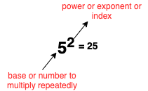

# Exponent

Exponent is a shorthand for repeated multiplication of the same number by itself.

!!! example
    5 x 5 = 5^2^ (_5 raise to the power 2_)

## Another way to look at the exponent

!!! Note "Note"
    $10^0 = 1$

## Logarithm is the inverse function of exponent

To understand "Logarithm is the inverse function of exponent" statement, you must first understand what an **inverse function** is.

!!! info "Subtraction is inverse function of addition"
    Addition is when you add one number with a second in order to get a third a + b = c. Subtraction is considered the inverse function of addition because the third minus the second gives you the first and minus the first gives you the second. c - b = a, c - a = b.

!!! info "Division is inverse function of multiplication"
    Multiplication is when you multiply one number by a second in order to get a third a x b = c. Division is considered the inverse function of multiplication because the third divided by the second gives you the first and divided by the first gives you the second. c / b = a, c / a = b

Similarly, logrithm is a inverse function of exponent. It is used when we do not know the power or index or exponent but base and end result. For example, given 5 and 25, what power we need to raise of 5 to get 25. Mathematically, wriiten as:

5^x^ = 25 What is x? This is when logarithm comes in, where we can isolate x from the equation, for example, $\log_{5}25 = x$

!!! info
    Logrithm = power or exponent or index. For example, logrithm of 100 is 2 because $\log_{10}100 = 2$ and 2 is a power or exponent of 10^2^ = 100

### Why do we need logrithm

#### [1] Find the power or exponent or index

As mentioned above, the logrithm is inverse function of exponent. So it is used when we do not know the power or index or exponent but base and end result. For example, given 5 and 25, what power we need to raise of 5 to get 25. 5^x^ = 25 What is x? 2, which is simple to find out just by lookig at the function. What if we have function 2^x^ = 5, we wouldn't be able to solve this by inspection. We can write it as $\log_{2}5 = x$. Now, we can use log table to find the x which is 2.3219.

#### [2] Multplication problem can be solved by rewritting into addition

Way back, when calculators were not invented. Multplication was done on paper which could easily be error prone, if numbers were complex. As we know that multplication can also be seen as addition, for example: 3 x 2 => 1 + 1 + 1 + 1 + 1 = 5, this is simple one, what if we have number:

$$x = 365.49 * 1474.3$$

It can be done on paper by typical multiplication method but it may easily be gone wrong. Therefore, logrithm was invented, so that complex multiplication can be converted in to addition and make it error free.

$$x = \log_{10}365.49 + \log_{10}1474.3$$

Now, that's cool, because you can look up the logarithms of the numbers 3.6549 and 1.4743 from a table; add them; and then look up the inverse logarithm of the result.

## Logarithm

If ab = c, then $\log_{a} c = b$, that is, log c to the base a is b.

!!! info "Another way to view logarithm"
    Since $2^3 = 8 \text{ then} \log_{2} 8 = 3$

    In exponent, we are saying 2 is **growing** 3 times to become 8. In same way, if we go down to road, logarithm is saying, 8 is **shrinking** 3 times to become 2.

### Farmulae

| Farmula                    | Example                    |
|----------------------------|----------------------------|
| log a + log b = log ab     | log 5 + log 2 = log 10     |
| log a - log b = log a/b    | log 15 - log 3 = log 5     |
| $log a^b = b \times log a$ | $log 2^3 = 3 \times log 2$ |

**Note:** a and b are different values.

!!! note
    Wrong: `log a + log a = log a x a`

    Right: `log a + log a = 2(log a)`

    Because adding log of same value which is a.
