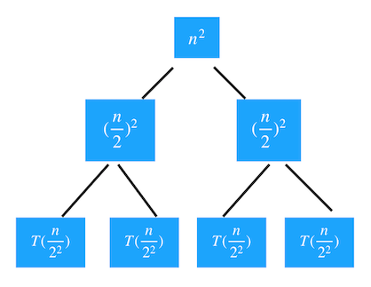
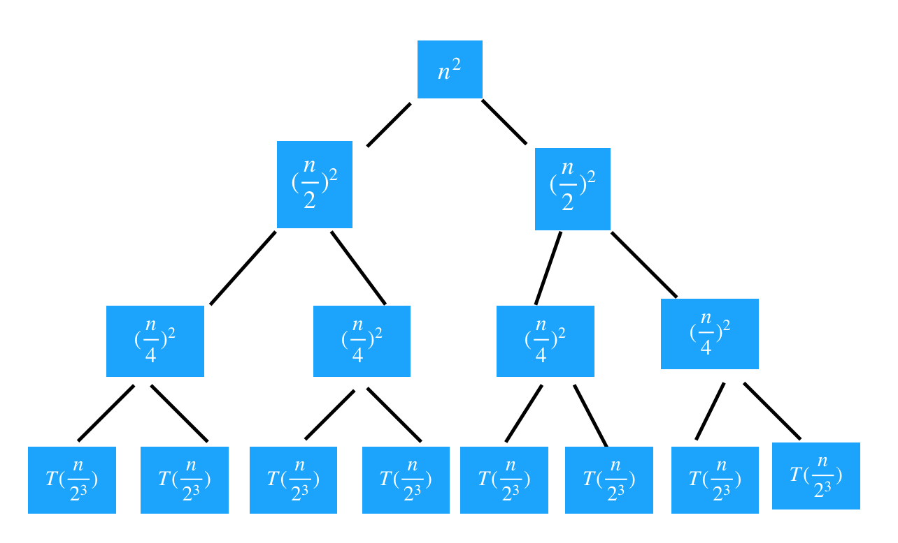
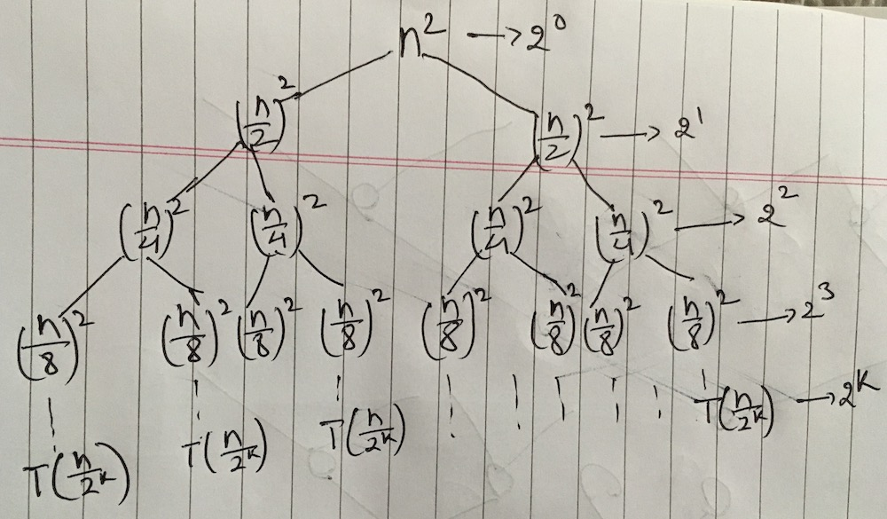

# Recursion

> Recursion uses the principle of last in first out and hence requires a stack.

!!! note "The secret to understanding recursion"
    Recursion is the process of solving a problem in terms of smaller versions of the same problem. Since the problem gets smaller each time, the process eventually terminates in a problem (the “base case”)  that can be solved directly. Be sure of three things:

    1. The problem gets smaller each time.
    2. You include a solution for the base case.

    > Remember, where there is a recursion there is a tree.

    In order to figure out the base case and repeated case. You can take a sample data and then draw a **stack** blocks or **tree** and understand the recursive process.

The trick is that each time a recursive function calls itself, it reduces the given problem into **subproblems**. The recursion call continues until it reaches a point where the subproblem can be solved without further recursion.

A recursive function should have the following properties so that it does not result in an infinite loop:

1. **Base case** — a terminating scenario.
2. **Recurrence relation or equation** that reduces all other cases towards the base case.

Once we figure out the above two elements, to implement a recursive function we simply call the function itself according to the recurrence relation until we reach the base case.

## From sequence, find out base case and recurrence relation

1, 5, 17, 53, 161, 485...

Remember, the recurrence relation tells you how to get from previous terms to future terms. What is going on here? Notice that these are growing by a factor of 3 and then added by 2. So the next term can be calculated as:

> Next term = (3 x previous term) + 2

If we have n terms:

T(1), T(2) ... T(n-2), T(n-1), T(n) then:

- Base case: T(1) = 1
- Recurrence relation: T(n) = 3 x T(n-1) + 2, where n > 1

Therefore:

$$ T(n) = \begin{cases} 1 & n = 1 \text{ (base case)} \\ 3 \times T(n-1) + 2 & n > 1 \text{ (repeated case)} \end{cases} $$

!!! note
    Recurrence relation may have two parts: recursive terms and non-recursive terms.

    For example: $T(n) = 2 \times T(\frac{n}{2}) + n$

    1. $2 \times T(\frac{n}{2})$ is recursive term. It breaks down into subproblems (recursion calls) until base case is reached.
    2. n is non-recursive term. It is a work done outside the recursive calls, which includes the cost of dividing the problem and the cost of merging the solutions to the subproblems.

## Three ways to find out time complexity of recurrence

### [1] Substitution method

We make a guess for the solution and then we use mathematical induction to prove the guess is correct or incorrect.

#### Example 1

$$ T(n) = \begin{cases} 1 & n = 1 \\ 3 \times T(n-1) + 2 & n > 1 \end{cases} $$

#### Guess the solution

**[Step 1]** We first encounter the $T(n) = 3 \times T(n-1) + 2$

!!! info "How to begin"
    In above equation, if we try to find the T(n), we get unsolved variable T(n-1) on the right side. So we must find the value of T(n-1) first.

**[Step 2]** Find T(n-1) by replacing n with n-1 from original equation $T(n) = 3 \times T(n-1) + 2$

- $T(n-1) = 3 \times T([n - 1] - 1) + 2$
- $= 3 \times T(n-2) + 2$

We have T(n-1) in our hand, now replace T(n-1) from $T(n) = 3 \times T(n-1) + 2$ with the equation that we have calculated above.

- $T(n) = 3 \times [3 \times T(n-2) + 2] + 2$
- $= 3^2 \times T(n-2) + 6 + 2$

**[Step 3]** Find T(n-2) by replacing n with n-2 from original equation $T(n) = 3 \times T(n-1) + 2$

- $T(n-2) = 3 \times T([n - 2] - 1) + 2$
- $= 3 \times T(n-3) + 2$

We have T(n-2) in our hand, now replace T(n-2) from $T(n) = 3^2 \times T(n-2) + 6 + 2$ with the equation that we have calculated above.

- $T(n) = 3^2 \times [3 \times T(n-3) + 2] + 6 + 2$
- $= 3^3 \times T(n-3) + 18 + 6 + 2$

**[Step 4]** Find T(n-3) by replacing n with n-3 from original equation $T(n) = 3 \times T(n-1) + 2$

- $T(n-3) = 3 \times T([n - 3] - 1) + 2$
- $= 3 \times T(n-4) + 2$

We have T(n-3) in our hand, now replace T(n-3) from $T(n) = 3^3 \times T(n-3) + 18 + 6 + 2$ with the equation that we have calculated above.

- $T(n) = 3^3 \times [3 \times T(n-4) + 2] + 18 + 6 + 2$
- $= 3^4 \times T(n-4) + 54 + 18 + 6 + 2$

Now we can identify the pattern.

- When $step=1$ then $T(n)=3^1 \times T(n-1) + 2$
- When $step=2$ then $T(n)=3^2 \times T(n-2) + 6 + 2$
- When $step=3$ then $T(n)=3^3 \times T(n-3) + 18 + 6 + 2$
- When $step=4$ then $T(n)=3^4 \times T(n-4) + 54 + 18 + 6 + 2$

Now lets say we go till k^th^ step. The equation is going to be:

$T(n)=3^k \times T(n-k) + 2\left(\frac{1 - 3^k}{1 - 3}\right)$

!!! note
    ...54 + 18 + 6 + 2

    Lets reverse sequence 2 + 6 + 18 + 54 ...

    This is a geometric progression whose sum is $a\left(\frac{1 - r^n}{1 - r}\right)$

**To check if the eqution** $T(n)=3^k \times T(n-k) + 2\left(\frac{1 - 3^k}{1 - 3}\right)$ is evaluated correctly then replace the k with 1 and see if you get the original equation $T(n) = 3 \times T(n-1) + 2$

- $T(n)=3^1 \times T(n-1) + 2\left(\frac{1 - 3^1}{1 - 3}\right)$
- $T(n) = 3 \times T(n-1) + 2$

When does our recurrence relation stop? Well it stops when T(n-k) hits the base case T(1). This implies that to hit the base case, both the terms below must be equal.

T(n-k) = T(1)

We know the value of n. Therefore:

- n-k = 1
- k = n - 1

#### Prove by mathematical induction

We know the value of k, so we can now replace it from equation $T(n)=3^k \times T(n-k) + 2\left(\frac{1 - 3^k}{1 - 3}\right)$ which would become.

- $T(n)=3^{n-1} \times T(n-(n-1)) + 2\left(\frac{1 - 3^{n-1}}{1 - 3}\right)$
- $T(n)=3^{n-1} \times T(1) + 2\left(\frac{1 - 3^{n-1}}{1 - 3}\right)$
- We know T(1) = 1. So $T(n)=3^{n-1} + 2\left(\frac{1 - 3^{n-1}}{1 - 3}\right)$
- $T(n)=3^{n-1} + 2\left(\frac{1 - 3^{n-1}}{-2}\right)$
- Cancelling 2 and then multiply by -1 gives $T(n)=3^{n-1} + 3^{n-1} - 1$
- $T(n)=2 \times 3^{n-1} - 1$
- $T(n)=\frac{2}{3}(3^n) - 1$
- Get rid of the constants and cofficients. $T(n) = 3^n$

Hence, the time complexity is O(3^n^).

#### Example 2

$$ T(n) = \begin{cases} 0 & n = 1 \\ 2 \times T(\frac{n}{2}) + 2 & n > 1 \end{cases} $$

#### Guess the solution

**[Step 1]**: We first encounter the $T(n) = 2 \times T(\frac{n}{2}) + 2$. To solve T(n), we encounter unknown variable $T(\frac{n}{2})$ on the right side of the equation. So lets solve it next.

**[Step 2]**:

| Find                                                     | Substitute                                     |
|----------------------------------------------------------|------------------------------------------------|
| $T(\frac{n}{2}) = 2 \times T[\frac{\frac{n}{2}}{2}] + 2$ | $2 \times [2 \times T[\frac{n}{2^2}] + 2] + 2$ |
| $= 2 \times T(\frac{n}{2^2}) + 2$                        | $2^2 \times T(\frac{n}{2^2}) + 4 + 2$          |

**[Step 3]**:

| Find                                                         | Substitute                                           |
|--------------------------------------------------------------|------------------------------------------------------|
| $T(\frac{n}{2^2}) = 2 \times T[\frac{\frac{n}{2^2}}{2}] + 2$ | $2^2 \times [2 \times T(\frac{n}{2^3}) + 2] + 4 + 2$ |
| $= 2 \times T(\frac{n}{2^3}) + 2$                            | $2^3 \times T(\frac{n}{2^3}) + 8 + 4 + 2$            |

**[Step 4]**:

| Find                                                         | Substitute                                               |
|--------------------------------------------------------------|----------------------------------------------------------|
| $T(\frac{n}{2^3}) = 2 \times T[\frac{\frac{n}{2^3}}{2}] + 2$ | $2^3 \times [2 \times T(\frac{n}{2^4}) + 2] + 8 + 4 + 2$ |
| $= 2 \times T(\frac{n}{2^4}) + 2$                            | $2^4 \times T(\frac{n}{2^4}) + 16 + 8 + 4 + 2$           |

Now we can identify the pattern.

- When $step=1$ then $T(n)=2^1 \times T(\frac{n}{2^1}) + 2$
- When $step=2$ then $T(n)=2^2 \times T(\frac{n}{2^2}) + 4 + 2$
- When $step=3$ then $T(n)=2^3 \times T(\frac{n}{2^3}) + 8 + 4 + 2$
- When $step=4$ then $T(n)=2^4 \times T(\frac{n}{2^4}) + 16 + 8 + 4 + 2$

Now lets say we go till k^th^ step. The equation is going to be:

$2^k \times T(\frac{n}{2^k}) + 2\left(\frac{1 - 2^k}{1 - 2}\right)$

When does our recurrence relation stop? Well it stops when $T(\frac{n}{2^k})$ hits the base case T(1). This implies that to hit the base case, both the terms below must be equal.

$T(\frac{n}{2^k})$ = $T(1)$

- $\frac{n}{2^k} = 1$
- $n = 2^k$
- $k = \log_2 n$

#### Prove by mathematical induction

We know the value of k, so we can now replace it from equation $2^k \times T(\frac{n}{2^k}) + 2\left(\frac{1 - 2^k}{1 - 2}\right)$ which would become.

- $T(n) = 2^{\log_2 n} \times T(\frac{n}{2^{\log_2 n}}) + 2\left(\frac{1 - 2^{\log_2 n}}{1 - 2}\right)$
- Since $a^{\log_a b} = b$. Therefore, $T(n) = n \times T(\frac{n}{n}) + 2\left(\frac{1 - n}{1 - 2}\right)$
- $T(n) = n \times T(1) + 2\left(\frac{1 - n}{1 - 2}\right)$
- We know T(1) = 0. So $T(n) = 2\left(\frac{1 - n}{1 - 2}\right)$
- $T(n) = \frac{2 - 2n}{-1}$. Multiply numimnator and denominator by -1.
- $T(n) = 2n - 2$
- Get rid of the constants and cofficients. $T(n) = n$

Hence, the time complexity is O(n).

### [2] Recurrence tree method

In this method, we draw a recurrence tree and calculate the time taken by every level of tree. Finally, we sum the work done at all levels. To draw the recurrence tree, we start from the given recurrence and keep drawing till we find a pattern among levels. The pattern is typically a arithmetic or geometric series.

$$ T(n) = 2 \times T(\frac{n}{2}) + n^2 $$

**[Step 1]**: Lets examine recurrence relation above. It has 2 parts:

1. $n^2$ is **root** because it does not have repeated term in the form T().
2. $T(\frac{n}{2})$ is a repeated term which repeats 2 times.

Now we make $n^2$ a root node and since $T(\frac{n}{2})$ is multiplied by 2, that is, it repeats twice. So our tree would look like.


**[Step 2]**: Now we get two unsolved terms (sub-problems). So lets solve them and then substitute in a tree.

- $T(\frac{n}{2}) = 2 \times T(\frac{\frac{n}{2}}{2}) + (\frac{n}{2})^2$
- $= 2 \times T(\frac{n}{2^2}) + (\frac{n}{2})^2$

Replace the $T(\frac{n}{2})$ from step1 tree with the $2 \times T(\frac{n}{2^2}) + (\frac{n}{2})^2$. If you examine the equation then you will see another tree which has root node $(\frac{n}{2})^2$ and two repeating terms $T(\frac{n}{2^2})$. So, after replacing the tree would look like following.



**[Step 3]**: Now we get 4 unsolved terms (sub-problems).

- $T(\frac{n}{2^2}) = 2 \times T(\frac{\frac{n}{2^2}}{2}) + (\frac{n}{2^2})^2$
- $= 2 \times T(\frac{n}{2^3}) + (\frac{n}{4})^2$

Now replace the $T(\frac{n}{2^2})$ from step2 tree with the $2 \times T(\frac{n}{2^3}) + (\frac{n}{4})^2$ equation.



If you solve term $T(\frac{n}{2^3})$, you get

- $T(\frac{n}{2^3}) = 2 \times T(\frac{\frac{n}{2^3}}{2}) + (\frac{n}{2^3})^2$
- $= 2 \times T(\frac{n}{2^4}) + (\frac{n}{8})^2$

At what level does our recurrence relation stop? Well it stops when all the nodes at the k^th^ level hits the base case. So let say at level k^th^ it stops.



The bottom layer, the k^th^ level in above figure, (base case) is special because each of them is equal to T(1) because no further divison into children nodes or sub-problems. Therefore, we can say that:

- $T(\frac{n}{2^k}) = T(1)$
- $\frac{n}{2^k} = 1$
- $n = 2^k$
- $k = \log_2 n$

Since we know the value of k.

Tree height = Total levels = $\log_2 n + 1$, because level start from 0. $2^0, 2^1, 2^2,$ ... $, 2^k$

> Now add all the nodes of each level and then add all the levels together.

!!! info
    Lets say, tree levels are represented by i = 0, 1, 2 ... k

    1. Number of nodes in each level can be calculated by $2^i$
    2. Each node from level 0 to k-1 (except last level k) can be written in the form $2^i(\frac{n}{2^i})^2$ = $\frac{n^2}{2^i}$
    3. Last level k is special and each node at last level is a base case T(1) and total number of nodes at last level are $2^k$

- $T(n) = n^2 + 2(\frac{n}{2})^2 + 2^2(\frac{n}{2^2})^2 + 2^3(\frac{n}{2^3})^2 + \text{ ... } + 2^{k-1}(\frac{n}{2^{k-1}})^2 + 2^k$
- $T(n) = n^2 + \frac{n^2}{2} + \frac{n^2}{4} + \frac{n^2}{8} + \text{ ... } + \frac{n^2}{2^{k-1}} + 2^k$

The left term is just the sum of a geometric series with common ratio of $\frac{1}{2}$

- $T(n) = \sum_{i=0}^{k-1}\frac{n^2}{2^i} + 2^k$
- $T(n) = n^2\sum_{i=0}^{k-1}(\frac{1}{2})^i + 2^k$
- $T(n) = n^2\sum_{i=0}^{k-1}(\frac{1}{2})^i + 2^k$
- Replace $k = \log_2 n$. $T(n) = n^2\sum_{i=0}^{\log_2n-1}(\frac{1}{2})^i + 2^{\log_2 n}$
- Since $a^{\log_a b} = b$. $T(n) = n^2\sum_{i=0}^{\log_2n-1}(\frac{1}{2})^i + n$

To make it simple, lets convert the geometric series from finite to infinite one.

$T(n) = n^2\sum_{i=0}^{\infty}(\frac{1}{2})^i + n$

Using the summation formula of an infinite GP $\frac{a}{1-r}$

- $T(n) = n^2(\frac{1}{1-\frac{1}{2}}) + n$
- $T(n) = 2n^2 + n$

Drop the cofficients and less significant term.

$T(n) = n^2$

O(n) = $n^2$

### [3] Master method

[Master method](https://www.youtube.com/watch?v=lPUhHmgrpik)

#### Generic form

$$T(n) = aT(\frac{n}{b}) + \theta(n^k\log^pn) \text{ where } a\geqslant1, b>1, k\geqslant0 \text{ and p is a real number}$$

> If recurrence relation fall into generic form. Then you can find out the time complexity by performing a minimal calculation. So master method is a direct method to find time complexity.

- n is the size of the problem.
- a is the number of subproblems in the recursion. Number of recursion calls.
- $\frac{n}{b}$ is the size of each subproblem. (Here it is assumed that all subproblems are essentially the same size.)
- $\theta(n^k\log^pn)$ is the cost of the work done outside the recursive calls, which includes the cost of dividing the problem and the cost of merging the solutions to the subproblems.

!!! important "3 cases"
    1. If $a>b^k$, then $T(n)=\theta(n^{\log_ba})$
    2. If $a=b^k$
        1. if $p>-1$, then $T(n)=\theta(n^{\log_ba}\log^{p+1}n)$
        2. if $p=-1$, then $T(n)=\theta(n^{\log_ba}\log{\log}n)$
        3. if $p<-1$, then $T(n)=\theta(n^{\log_ba})$
    3. If $a<b^k$
        1. if $p\geqslant0$, then $T(n)=\theta(n^k\log^{p}n)$
        2. if $p<0$, then $T(n)=\theta(n^k)$

!!! note "3 cases in other words"
    - Case 1: Work is increasing as we go down the tree, so this is the number of leaves in the recursion tree.
    - Case 2: Work is the same at each level of the tree, so the work is the height, $\log_bn$, times work/level
    - Case 3: Work is going down as we go down the tree, so dominated by the initial work at the root.

!!! example
    $T(n) = 3T(\frac{n}{2}) + n^2$

    - a=3
    - b=2
    - k=2
    - p=0

    Check if a, b, k and p obey $a\geqslant1, b>1, k\geqslant0 \text{ and p is a real number}$ rule.

    Lets check which case the a and b^k^ comparison fall into. By comparing we found:

    3 < 2^2^ => 3 < 4

    Which is case 3. Now case 3 has two subrules. Therefore check the value of p, which is 0 (p=0).

    Hence "a" subrule of case 3 is valid rule. Now replace the variable with actual value.

    - $T(n)=\theta(n^2\log^{0}n)$
    - $T(n)=\theta(n^2)$

## Time complexity and two parts of recurrence relation

As we know, recurrence relation has two parts.

!!! info
    $T(n) = 2 \times T(\frac{n}{2}) + n$

    1. $2 \times T(\frac{n}{2})$ is a recursive term which break down into subproblems until base is reached. So time complexity has to be find out separately for recursive term.
    2. n is non-recursive term which is, the work done outside the recursive calls, which includes the cost of dividing the problem and the cost of merging the solutions to the subproblems.

    **To find the complexity of whole recurrence relation.** We multiply the time complexity of two parts.

    > Time complexity of recursive term X time complexity of non-recursive term.

| Relation               | Complexity | Comment                                                                                                                                         |
|------------------------|------------|-------------------------------------------------------------------------------------------------------------------------------------------------|
| $T(n)=T(n-1) + 1$      | O(n)       | 1 (the work done outside or non-recursive term) is multiplied by the complexity of recurrence relation T(n-1) which is n. So $n \times 1 = n$   |
| $T(n)=T(n-1) + n$      | O(n^2^)    | n (the work done outside or non-recursive term) is multiplied by the complexity of recurrence relation T(n-1) which is n. So $n \times n = n^2$ |
| $T(n)=T(n-1) + \log n$ | O(nlogn)   |                                                                                                                                                 |
| $T(n)=2T(n-1) + 1$     | O(2^n^)    |                                                                                                                                                 |
| $T(n)=3T(n-1) + 1$     | O(3^n^)    | 1 is multiplied by the complexity of recurrence relation 3T(n-1) which is 3^n^. So $3^n \times 1 = 3^n$                                         |

## Recurrence relation from code

!!! info
    1. Interested in recrusive term.
    2. Interested in statements which has n associated with it.
    3. Add all the constants and make it 1.

```js
function test(n) { // T(n)
  if(n > 1) {
    for(let i=0; i<n; i++) { // n (loop runs n times)
      console.log(i);
    }
    // stmt-1; // 1
    // stmt-2; // 1
    // stmt-3; // 1
    // stmt-4; // 1
    test(n/2); // T(n/2)
    test(n/2); // T(n/2)
  }
}
```

- $T(n) = n + 1 + 1 + 1 + 1 + T(\frac{n}{2}) + T(\frac{n}{2})$
- $T(n) = n + 4 + T(\frac{n}{2}) + T(\frac{n}{2})$. Make constant 4 to 1.
- $T(n) = n + 1 + T(\frac{n}{2}) + T(\frac{n}{2})$

$$ T(n) = \begin{cases} 1 & n = 1 \\ 2 \times T(\frac{n}{2}) + n + 1 & n > 1 \end{cases} $$

## Roughly finding the time complexity of recursive problem

> An accurate way to find the time complexity is, first find the recurrence realtion of problem. And then figure out the big O using 3 methods mentioned above. This is an accurate way because we have to take non-recursive term (work done outside the recursion) in account which multiply with recursive term at the end.

You can roughly find the time complexity by counting number of recursive calls for different size of input. This may not be aaccurate because you can miss the non-recursive work.

For example:

1. When n = 1, then number of recursive calls are 1 = 2^0^
2. When n = 2, then number of recursive calls are 2 = 2^1^
3. When n = 3, then number of recursive calls are 4 = 2^2^
4. When n = 4, then number of recursive calls are 8 = 2^3^
5. When n = 5, then number of recursive calls are 16 = 2^4^

After a few steps, you will able to see the pattern as size of `n` grows. So in example above we can deduce that for size `n` the number of recursive calls will be 2^n-1^.

So time complexity is going to be O(2^n-1^) => O(2^n^)
