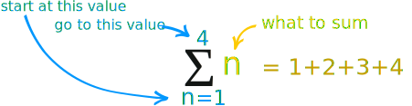

# Sequence vs series

The list of numbers written in a definite order is called a sequence whereas the sum of terms of an  sequence is called a series. Therefore sequence is an ordered list of numbers and series is the sum of a list of numbers.

!!! example
    Sequence is 2, 4, 6, 8, 10...

    Now if we add them up:

    2 + 4 + 8 + 10 +... This is a series.

## Term

The individual element in a sequence is called **term**.

!!! example
    1, 4, 7, 10, 13, 16, 19, 22, 25, ...

    1, 4, 7 ... 25 are terms.

## Summation (sigma)

> It says n goes from 1 to 4 and then add them up together.

### Properties

#### Multiply by constant

If every term we are summing is multiplied by a constant, we can "pull" the constant outside the sigma.

!!! example
    $$\sum_{i=0}^n 6i^2 = 6\sum_{i=0}^n i^2$$

    So instead of summing 6i^2^ we can sum i^2^ and then multiply the whole result by 6.

#### Adding or subtracting

When two terms are added together, and we want to sum them up, we can actually sum them separately and then add the results. This also works for subtraction.

!!! example
    $$\sum_{i=0}^n (a_i + b_i) = \sum_{i=0}^n a_i + \sum_{i=0}^n b_i$$

    $$\sum_{i=0}^n (a_i - b_i) = \sum_{i=0}^n a_i - \sum_{i=0}^n b_i$$

### Handy farmulae

| Farmula                                              | What                                          | Example                       |
|------------------------------------------------------|-----------------------------------------------|-------------------------------|
| $\sum_{i=1}^n c = nc$                                | Summing constant `c` is equal to $c \times n$ | $\sum_{i=1}^5 2 = 5 \times 2$ |
| $\sum_{i=1}^n i = \frac{n(n+1)}{2}$                  | Summing 1 + 2 + 3 ... + n                     |                               |
| $\sum_{i=1}^n i^2 = \frac{n(n+1)(2n+1)}{6}$          | Summing 1^2^ + 2^2^ + 3^2^ ... + n^2^         |                               |
| $\sum_{i=1}^n i^3 = \left(\frac{n(n+1)}{2}\right)^2$ | Summing 1^3^ + 2^3^ + 3^3^ ... + n^3^         |                               |

## Arithmetic progression (sequence)

It is a sequence of numbers which differ from each other by a common difference.

!!! example
    0, 5, 10, 15, 20, 25

    **Common difference:** The value by which consecutive terms increase or decrease in sequence. Pattern is "add 5" to term to get next term.

The first term of the sequence is generally denoted by ‘a’ and the constant difference is denoted by ‘d’. The terms can be wriiten in the form:

$$a, (a + d), (a + 2 \times d), (a + 3 \times d),...$$

### Find the n^th^ term

$$T_n = a + (n − 1) \times d$$

If the first term `a = 23` and common difference `d = 12`. Then 9^th^ term is `23 + (9 − 1) x 12 = 119`

#### Given a sequence and find the expression which represent the sequence

Say, we have sequence 3, 8, 13, 18, 23, 28, 33, 38, ...This sequence has a common difference of 5.

Let's find the expression which represent above sequence.

- First term a = 3
- Common difference d = 5
- We know, to find any term in sequence, we have farmula $T_n = a + (n − 1) \times d$
- $3 + (n − 1) \times 5$
- $3 + 5n − 5$
- $5n - 2$, is a expression which represents sequence 3, 8, 13, 18, 23, 28, 33, 38, ...
- So, if you want to know the 9^th^ term in a sequence, just use the expression $5n - 2$ => $5 \times 9 -2 = 43$
- You can also use the formula directly $a + (n − 1) \times d$ => $3 + (9 − 1) \times 5 = 43$ to find out the 9^th^ term.

### Find the sum

> When we add the terms of arithmetic sequence, then we call it arithmentic series.

$$S = \frac{n(2a + (n - 1)d)}{2}$$

!!! example
    Sequence = 3, 8, 13, 18, 23, 28, 33, 38, ...

    Find the sum of first 10 terms.

    - First term a = 3
    - Common difference d = 5
    - n = 10, number of terms to add

    $$S = \frac{10(2 \times 3 + (10 - 1) \times 5)}{2} = 255$$

!!! example "Another way to find the sum"
    $$S = \frac{n(a + a_n)}{2}$$

    Sequence = 3, 8, 13, 18, 23, 28, 33, 38, ...

    Find the sum of first 10 terms.

    - First term a = 3
    - Common difference d = 5
    - n = 10, number of terms to add, so the 10^th^ term is $a + (n − 1) \times d$ => $3 + (10 - 1) \times 5 = 48$

    $$S = \frac{10(3 + 48)}{2} = 255$$

## Geometric progression (sequence)

It is a sequence of numbers which differ from each other by a common ratio.

!!! example
    10, 30, 90, 270, 810

    **Common ratio:** The ratio between a term in the sequence and the term before. Pattern is "multiply 3" to term to get next term.

The first term of the sequence is generally denoted by ‘a’ and the common ratio is denoted by ‘r’. The terms of sequence are, therefore, as follows:

$$a, (a \times r), (a \times r^2 ), (a \times r^3 ), ...$$

### Find the n^th^ term

$$T_n = a \times r^{n − 1}$$

If first term = 23 and common ratio = 12. Then 9^th^ term is 23 x 12^8^ = 9889579008.

### Find the sum

$$S = a\left(\frac{1 - r^n}{1 - r}\right)$$

!!! example
    Sequence 10, 30, 90, 270, 810, 2430, ...

    Find the sum of first 4 terms

    - First term a = 10
    - Common ratio r = 3
    - Sum 4 terms n = 4

    $$S = 10\left(\frac{1 - 3^4}{1 - 3}\right) = 400$$
