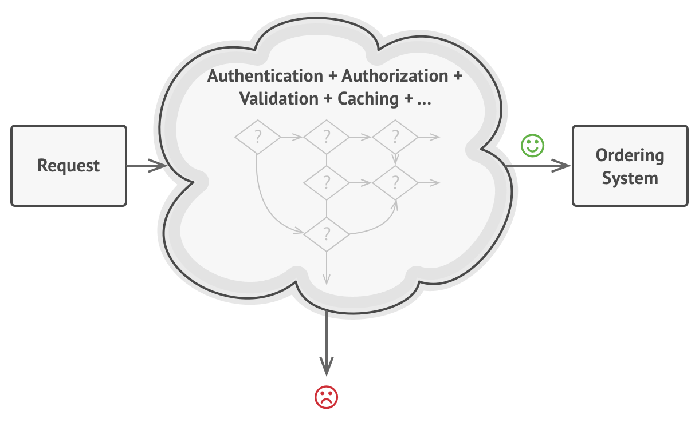
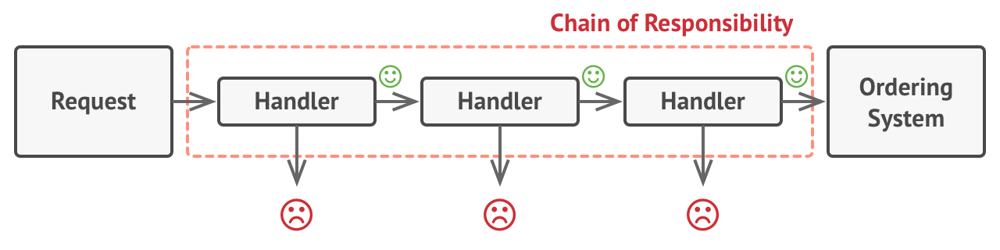

# Chain of responsibility

It lets you **pass requests along a chain of handlers.** Upon receiving a request, each handler decides either to process the request or to pass it to the next handler in the chain.

## Problem

Imagine that you’re working on an online ordering system. You want to restrict access to the system so only authenticated users can create orders. Also, users who have administrative permissions must have full access to all orders.

After a bit of planning, you realized that these checks must be performed sequentially. The application can attempt to authenticate a user to the system whenever it receives a request that contains the user’s credentials. However, if those credentials aren’t correct and authentication fails, there’s no reason to proceed with any other checks.

During the next few months, you implemented several more of those sequential checks.

- One of your colleagues suggested that it’s unsafe to pass raw data straight to the ordering system. So you added an extra validation step to sanitize the data in a request.
- Later, somebody noticed that the system is vulnerable to brute force password cracking. To negate this, you promptly added a check that filters repeated failed requests coming from the same IP address.
- Someone else suggested that you could speed up the system by returning cached results on repeated requests containing the same data. Hence, you added another check which lets the request pass through to the system only if there’s no suitable cached response.



The code of the checks, which had already looked like a mess, became more and more bloated as you added each new feature. Changing one check sometimes affected the others. Worst of all, when you tried to reuse the checks to protect other components of the system, you had to duplicate some of the code since those components required some of the checks, but not all of them.

The system became very hard to comprehend and expensive to maintain. You struggled with the code for a while, until one day you decided to refactor the whole thing.

## Solution

Like many other behavioral design patterns, the Chain of Responsibility relies on transfering particular behaviors into stand-alone objects called **handlers.** In our case, each check should be extracted to its own class with a single method that performs the check. The request, along with its data, is passed to this method as an argument.

The pattern suggests that you link these handlers into a chain. Each linked handler has a field for storing a reference to the next handler in the chain. In addition to processing a request, handlers pass the request further along the chain. The request travels along the chain until all handlers have had a chance to process it.

Here’s the best part: a handler can decide not to pass the request further down the chain and effectively stop any further processing.

In our example with ordering systems, a handler performs the processing and then decides whether to pass the request further down the chain. Assuming the request contains the right data, all the handlers can execute their primary behavior, whether it’s authentication checks or caching.



## Applicability

1. Use the Chain of Responsibility pattern when your program is expected to process different kinds of requests in various ways, but the exact types of requests and their sequences are unknown beforehand.

2. Use the pattern when it’s essential to execute several handlers in a particular order.

3. Use the CoR pattern when the set of handlers and their order are supposed to change at runtime. If you provide setters for a reference field inside the handler classes, you’ll be able to insert, remove or reorder handlers dynamically.

## Code

```ts
/**
 * The Handler interface declares a method for building the chain of handlers.
 * It also declares a method for executing a request.
 */
interface Handler {
    setNext(handler: Handler): Handler;

    handle(request: string): string;
}

/**
 * The default chaining behavior can be implemented inside a base handler class.
 */
abstract class AbstractHandler implements Handler
{
    private nextHandler: Handler;

    public setNext(handler: Handler): Handler {
        this.nextHandler = handler;
        // Returning a handler from here will let us link handlers in a
        // convenient way like this:
        // monkey.setNext(squirrel).setNext(dog);
        return handler;
    }

    public handle(request: string): string {
        if (this.nextHandler) {
            return this.nextHandler.handle(request);
        }

        return null;
    }
}

/**
 * All Concrete Handlers either handle a request or pass it to the next handler
 * in the chain.
 */
class MonkeyHandler extends AbstractHandler {
    public handle(request: string): string {
        if (request === 'Banana') {
            return `Monkey: I'll eat the ${request}.`;
        }
        return super.handle(request);

    }
}

class SquirrelHandler extends AbstractHandler {
    public handle(request: string): string {
        if (request === 'Nut') {
            return `Squirrel: I'll eat the ${request}.`;
        }
        return super.handle(request);
    }
}

class DogHandler extends AbstractHandler {
    public handle(request: string): string {
        if (request === 'MeatBall') {
            return `Dog: I'll eat the ${request}.`;
        }
        return super.handle(request);
    }
}

/**
 * The client code is usually suited to work with a single handler. In most
 * cases, it is not even aware that the handler is part of a chain.
 */
function clientCode(handler: Handler) {
    const foods = ['Nut', 'Banana', 'Cup of coffee'];

    for (const food of foods) {
        console.log(`Client: Who wants a ${food}?`);

        const result = handler.handle(food);
        if (result) {
            console.log(`  ${result}`);
        } else {
            console.log(`  ${food} was left untouched.`);
        }
    }
}

/**
 * The other part of the client code constructs the actual chain.
 */
const monkey = new MonkeyHandler();
const squirrel = new SquirrelHandler();
const dog = new DogHandler();

monkey.setNext(squirrel).setNext(dog);

/**
 * The client should be able to send a request to any handler, not just the
 * first one in the chain.
 */
console.log('Chain: Monkey > Squirrel > Dog\n');
clientCode(monkey);
console.log('');

console.log('Subchain: Squirrel > Dog\n');
clientCode(squirrel);
```

```
Chain: Monkey > Squirrel > Dog

Client: Who wants a Nut?
  Squirrel: I'll eat the Nut.
Client: Who wants a Banana?
  Monkey: I'll eat the Banana.
Client: Who wants a Cup of coffee?
  Cup of coffee was left untouched.

Subchain: Squirrel > Dog

Client: Who wants a Nut?
  Squirrel: I'll eat the Nut.
Client: Who wants a Banana?
  Banana was left untouched.
Client: Who wants a Cup of coffee?
  Cup of coffee was left untouched.
```
