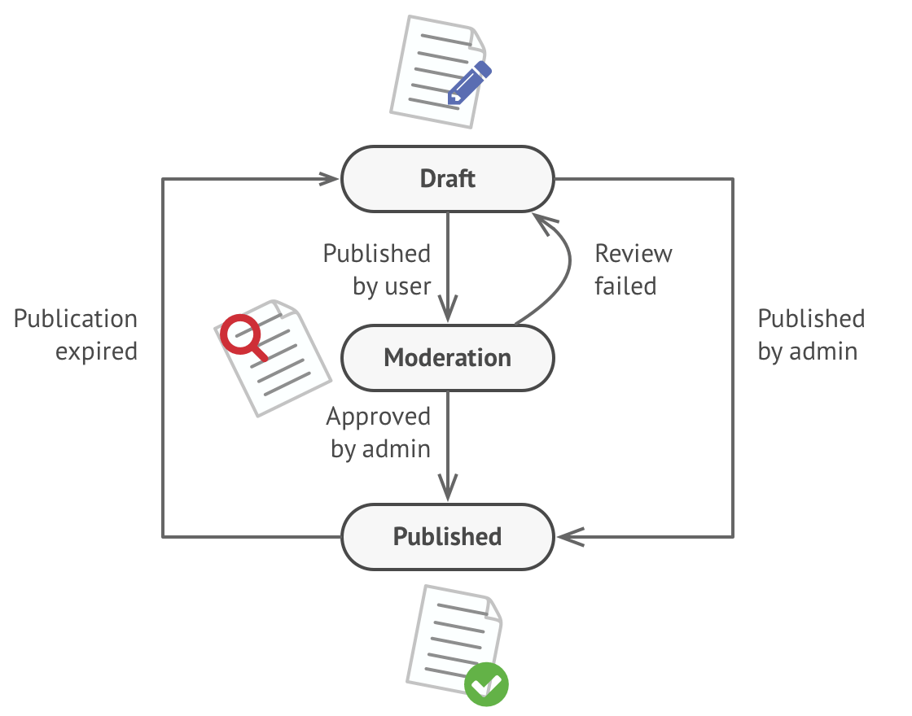

# State

It lets an object alter its behavior when its internal state changes.

## Problem

The State pattern is closely related to the concept of a Finite-State Machine.

The main idea is that, at any given moment, there’s a  _finite_  number of  _states_  which a program can be in. Within any unique state, the program behaves differently, and the program can be switched from one state to another instantaneously. However, depending on a current state, the program may or may not switch to certain other states. These switching rules, called  _transitions_, are also finite and predetermined.

You can also apply this approach to objects. Imagine that we have a  `Document`  class. A document can be in one of three states:  `Draft`,  `Moderation`  and  `Published`. The  `publish`  method of the document works a little bit differently in each state:

- In  `Draft`, it moves the document to moderation.
- In  `Moderation`, it makes the document public, but only if the current user is an administrator.
- In  `Published`, it doesn’t do anything at all.



State machines are usually implemented with lots of conditional operators (`if` or `switch`) that select the appropriate behavior depending on the current state of the object. Usually, this “state” is just a set of values of the object’s fields. Even if you’ve never heard about finite-state machines before, you’ve probably implemented a state at least once. Does the following code structure ring a bell?

```
class Document is
    field state: string
    // ...
    method publish() is
        switch (state)
            "draft":
                state = "moderation"
                break
            "moderation":
                if (currentUser.role == 'admin')
                    state = "published"
                break
            "published":
                // Do nothing.
                break
    // ...
```

The biggest weakness of a state machine based on conditionals reveals itself once we start adding more and more states and state-dependent behaviors to the `Document` class. Most methods will contain monstrous conditionals that pick the proper behavior of a method according to the current state. Code like this is very difficult to maintain because any change to the transition logic may require changing state conditionals in every method.

The problem tends to get bigger as a project evolves. It’s quite difficult to predict all possible states and transitions at the design stage. Hence, a lean state machine built with a limited set of conditionals can grow into a bloated mess over time.

## Solution

The State pattern suggests that you create new classes for all possible states of an object and extract all state-specific behaviors into these classes.

Instead of implementing all behaviors on its own, the original object, called  _context_, stores a reference to one of the state objects that represents its current state, and delegates all the state-related work to that object.

To transition the context into another state, replace the active state object with another object that represents that new state. This is possible only if all state classes follow the same interface and the context itself works with these objects through that interface.

This structure may look similar to the Strategy pattern, but there’s one key difference. In the State pattern, the particular states may be aware of each other and initiate transitions from one state to another, whereas strategies almost never know about each other.

## Applicability

- Use the State pattern when you have an object that behaves differently depending on its current state, the number of states is enormous, and the state-specific code changes frequently.
- Use the pattern when you have a class polluted with massive conditionals that alter how the class behaves according to the current values of the class’s fields.

## Code

```ts
/**
 * The Context defines the interface of interest to clients. It also maintains a
 * reference to an instance of a State subclass, which represents the current
 * state of the Context.
 */
class Context {
    /**
     * @type {State} A reference to the current state of the Context.
     */
    private state: State;

    constructor(state: State) {
        this.transitionTo(state);
    }

    /**
     * The Context allows changing the State object at runtime.
     */
    public transitionTo(state: State): void {
        console.log(`Context: Transition to ${(<any>state).constructor.name}.`);
        this.state = state;
        this.state.setContext(this);
    }

    /**
     * The Context delegates part of its behavior to the current State object.
     */
    public request1(): void {
        this.state.handle1();
    }

    public request2(): void {
        this.state.handle2();
    }
}

/**
 * The base State class declares methods that all Concrete State should
 * implement and also provides a backreference to the Context object, associated
 * with the State. This backreference can be used by States to transition the
 * Context to another State.
 */
abstract class State {
    protected context: Context;

    public setContext(context: Context) {
        this.context = context;
    }

    public abstract handle1(): void;

    public abstract handle2(): void;
}

/**
 * Concrete States implement various behaviors, associated with a state of the
 * Context.
 */
class ConcreteStateA extends State {
    public handle1(): void {
        console.log('ConcreteStateA handles request1.');
        console.log('ConcreteStateA wants to change the state of the context.');
        this.context.transitionTo(new ConcreteStateB());
    }

    public handle2(): void {
        console.log('ConcreteStateA handles request2.');
    }
}

class ConcreteStateB extends State {
    public handle1(): void {
        console.log('ConcreteStateB handles request1.');
    }

    public handle2(): void {
        console.log('ConcreteStateB handles request2.');
        console.log('ConcreteStateB wants to change the state of the context.');
        this.context.transitionTo(new ConcreteStateA());
    }
}

/**
 * The client code.
 */
const context = new Context(new ConcreteStateA());
context.request1();
context.request2();
```

```
Context: Transition to ConcreteStateA.
ConcreteStateA handles request1.
ConcreteStateA wants to change the state of the context.
Context: Transition to ConcreteStateB.
ConcreteStateB handles request2.
ConcreteStateB wants to change the state of the context.
Context: Transition to ConcreteStateA.
```
