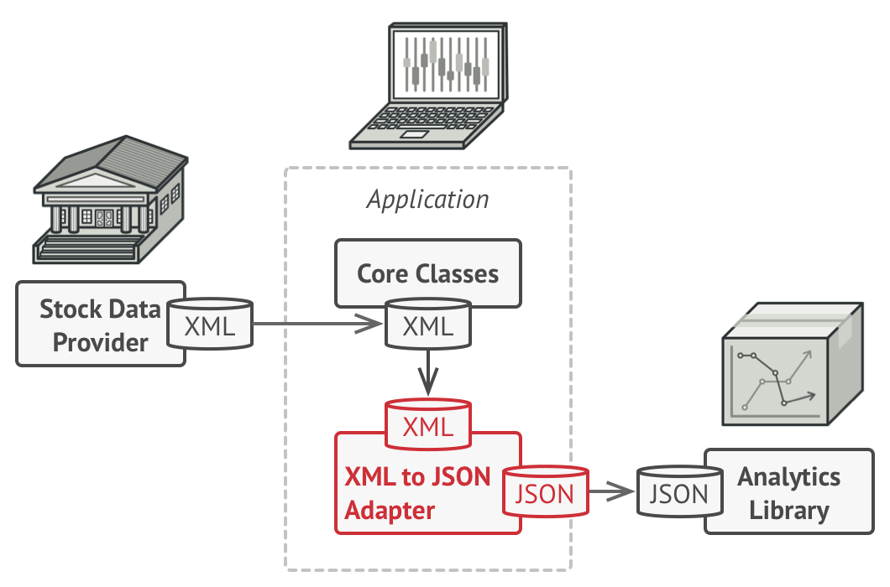

# Adapter

It **allows objects with incompatible interfaces to collaborate**.

Adapter lets classes work together that couldn't otherwise because of incompatible interfaces. The Adapter pattern translates one interface (an object's properties and methods) to another. Adapters allows programming components to work together that otherwise wouldn't because of mismatched interfaces. The Adapter pattern is also referred to as the Wrapper Pattern.

## Problem

Imagine that you’re creating a stock market monitoring app. The app downloads the stock data from multiple sources in XML format and then displays nice-looking charts and diagrams for the user.

At some point, you decide to improve the app by integrating a smart 3rd-party analytics library. But there’s a catch: the analytics library only works with data in JSON format.

You could change the library to work with XML. However, this might break some existing code that relies on the library. And worse, you might not have access to the library’s source code in the first place, making this approach impossible.

## Solution

You can create an adapter. This is a special object that converts the interface of one object so that another object can understand it.

To solve the dilemma of incompatible formats, you can create XML-to-JSON adapters for every class of the analytics library that your code works with directly. Then you adjust your code to communicate with the library only via these adapters. When an adapter receives a call, it translates the incoming XML data into a JSON structure and passes the call to the appropriate methods of a wrapped analytics object.



## Applicability

1. Use the Adapter class when you want to use some existing class, but its interface isn’t compatible with the rest of your code. The Adapter pattern lets you create a middle-layer class that serves as a translator between your code and a legacy class, a 3rd-party class or any other class with a weird interface.

2. Adapters are commonly used is when new components need to be integrated and work together with existing components in the application.

3. Another scenario is refactoring in which parts of the program are rewritten with an improved interface, but the old code still expects the original interface.

## Code

```js
/**
 * 1. Old interface to calculate shipping cost. The client knows
 *    only the request() method and parameters supplied with it.
 *    And this interface is not what you want to change but you
 *    have to use advance shipping class.
 */

function Shipping() {
  this.request = function(zipStart, zipEnd, weight) {
    // .. a few calculations
    return "$49.75";
  };
}

/**
 * 2. This class is a advance class that you have to use in
 *    rather than Shipping class without changing the old way of
 *    how client access shipping class to get shipping cost.
 *
 * ADAPTEE CLASS - WHICH YOU WANT TO ADAPT TO OLD INTERFACE.
 */

function AdvancedShipping() {
  this.login = function(credentials) { /* ... */ };
  this.setStart = function(start) { /* ... */ };
  this.setDestination = function(destination) { /* ... */ };
  this.calculate = function(weight) {
    return "$39.50";
  };
}

/**
 * 3. In order to use AdvancedShipping class without changing
 *    the client you need to write the Adpater class, which in
 *    turns provide same old interface to client but have different
 *     way of calculating shipping cost.
 */

function ShippingAdapter(credentials) {
  var shipping = new AdvancedShipping();

  shipping.login(credentials);

  return {
    // adapt old interface.
    request: function(zipStart, zipEnd, weight) {
      shipping.setStart(zipStart);
      shipping.setDestination(zipEnd);
      return shipping.calculate(weight);
    }
  };
}

/**
 * 4. Old way - client
 */

function oldWay() {

  var shipping = new Shipping();
  var cost = shipping.request("78701", "10010", "2 lbs"); // same interface
  console.log("Old cost: " + cost);
}

oldWay();

/**
 * 5. New way - client
 */

function newWay() {

  var credentials = {
    token: "30a8-6ee1"
  };
  var adapter = new ShippingAdapter(credentials);
  cost = adapter.request("78701", "10010", "2 lbs"); // same interface

  console.log("New cost: " + cost);

}

newWay();
```
