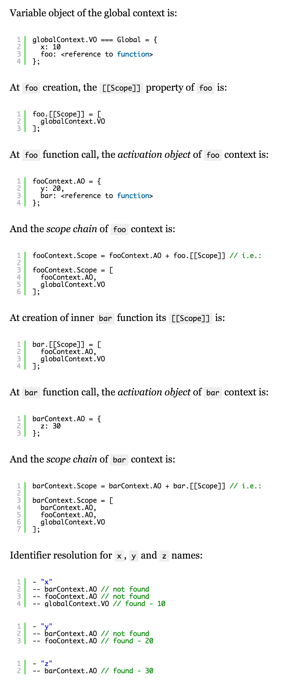

# Scope chain

If to describe briefly and showing the main point, a scope chain is mostly related with inner functions.

As we know, ECMAScript allows creation of inner functions and we can even return these functions from parent functions.

```js
var x = 10;

function foo() {

  var y = 20;

  function bar() {
    alert(x + y);
  }

  return bar;

}

foo()(); // 30
```

Thus, is known that _every context has its own variables object_: for the global context it is _global object_ itself, for functions it is the _activation object_.

And the scope chain is exactly this _list of all (parent) variable objects_ for the inner contexts. This chain is used for variables lookup. I.e. in the example above, scope chain of `bar` context includes `AO(bar)`, `AO(foo)` and `VO(global)`.

_**Scope chain**_ is related with an execution context a _chain of variable objects_ which is used for variables lookup at _identifier resolution_.

**Note:** The scope chain of a function context is created at function _call_ and consists of the _activation object_ and the internal _[[Scope]]_ property of this function. `Scope = AO + [[Scope]]`

```js
activeExecutionContext = {
    VO: {...}, // or AO
    this: thisValue,
    Scope: [ // Scope chain
            // list of all variable objects
           // for identifiers lookup
    ]
};
```

## Function life cycle

Function life cycle is divided into a stage of _creation_ and a stage of _activation (call)_.

### Creation

Function declarations are put into variable/activation object (VO/AO) on entering the context stage. Let’s see on the example a variable and a function declaration in the global context (where variable object is the global object itself, we remember, yes?):

```js
var x = 10;

function foo() {
  var y = 20;
  alert(x + y);
}

foo(); // 30
```

At function activation, we see correct (and expected) result – 30. However, there is one very important feature.

Before this moment we spoke only about variable object of the current context. Here we see that `y` variable is defined in function `foo` (which means it is in the AO of `foo` context), but variable `x` is not defined in context of `foo` and accordingly is not added into the AO of `foo`. At first glance `x` variable does not exist at all for function `foo`; but as we will see below — only “at first glance” that the activation object of `foo` context contains only one property — property `y`:

```js
fooContext.AO = {
  y: undefined // undefined – on entering the context, 20 – at activation
};
```

How does function `foo` have access to `x` variable? It is logical to assume that function should have access to the variable object of a higher context. In effect, it is exactly so and, physically this mechanism is implemented via the internal `[[Scope]]` property of a function.

`[[Scope]]` is a hierarchical chain of all _parent_ variable objects, which are _above_ the current function context; the chain is saved to the function at its _creation_.

> [[Scope]] is saved at function _creation_ — once and forever — until function destruction. I.e. if function is_ never called_, but still [[Scope]] property is _already been written and stored_ in function object.

### Activation

As it has been said in definition, on entering the context and after creation of AO/VO, _Scope_ property of the context (which is a scope chain for variables lookup) is defined as follows:

```js
Scope = AO|VO + [[Scope]]
```

High light here is that the activation object is the _first_ element of the _Scope_ array, i.e. added to the _front of scope chain_. This feature is very important for the process of _identifier resolution_.

On identifier resolution, the preference is given to local variables, if not found then interpreter look for the variable in parent context or scope.

```js
var x = 10;

function foo() {

  var y = 20;

  function bar() {
    var z = 30;
    alert(x +  y + z);
  }

  bar();
}

foo(); // 60
```



## Scope features

### Closures

_Closures_ in ECMAScript are directly related with the `[[Scope]]` property of functions. As it has been noted, `[[Scope]]` is saved at function creation and exists until the function object is destroyed. Actually, a _closure_ is exactly a _combination of a function code and its [[Scope]] property_. Thus, `[[Scope]]` contains that _lexical environment_ (the parent variable object) in which function is _created_. Variables from higher contexts at the further function activation will be searched in this lexical (statically saved at creation) chain of variable objects.

```js
var x = 10;

function foo() {
  alert(x);
}

(function () {
  var x = 20;
  foo(); // 10, but not 20
})();
```

We see that `x` variable is found in the `[[Scope]]` of `foo` function, i.e. for variables lookup the lexical _(closured)_ chain defined at the moment of function _creation_, but not the _dynamic_ chain of the _call_ (at which value of `x` variable would be resolved to `20`) is used.

### [[Scope]] of functions created via Function constructor

In the examples above we see that function at creation gets the `[[Scope]]` property and via this property it accesses variables of all parent contexts. However, in this rule there is one important exception, and it concerns functions created via the _Function_ constructor.

```js
var x = 10;

function foo() {

  var y = 20;

  function barFD() { // FunctionDeclaration
    alert(x);
    alert(y);
  }

  var barFE = function () { // FunctionExpression
    alert(x);
    alert(y);
  };

  var barFn = Function('alert(x); alert(y);');

  barFD(); // 10, 20
  barFE(); // 10, 20
  barFn(); // 10, "y" is not defined

}

foo();
```

As we see, for `barFn` function which is created via the `Function` constructor the variable `y` is not accessible. But it does not mean that function `barFn` has no internal `[[Scope]]` property (else it would not have access to the variable `x`). And the matter is that `[[Scope]]` property of functions created via the `Function` constructor contains _always only the global object_.
