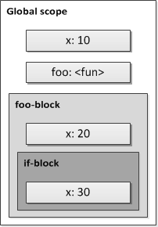
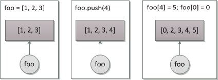
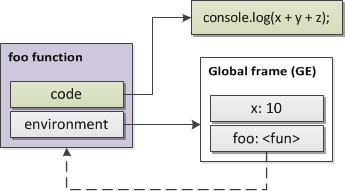
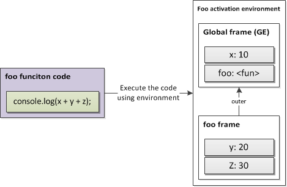

# Execution environment

Several encapsulating abstractions (such as *namespaces*, *modules*, etc) related with a scope, are invented to provide a better modularity of a system and to avoid *naming variables conflicts*. In the same respect, there are *local variables* of *functions*and local variables of *blocks*. Such techniques help to *increase the abstraction* and encapsulate the internal data (not bothering a user of this abstraction with details of the implementation and exact internal variable names).

Concept of a scope helps us to use in one program the same name variables but with possibly different meanings and values. From this perspective:

*Scope* is an enclosing context in which a variable is associated with a value.

We may also say, that this is a *logical boundaries* in which a *variable* (or even an *expression*) has its *meaning*. For example, a *global variable*, a *local variable*, etc, which generally reflects a logical range of a variable *lifetime* (or *extent*).

Block and function concepts lead us to one of the major scope properties — *to nest*other scopes or *to be nested*. Thus, as we’ll see, not all implementations allow nested functions, the same as not all implementations provide block-level scope.

Consider the following C example:

```c
// global "x"
int x = 10;

void foo() {

  // local "x" of "foo" function
  int x = 20;

  if (true) {
    // local "x" of if-block
    int x = 30;
    printf("%d", x); // 30
  }

  printf("%d", x); // 20

}

foo();

printf("%d", x); // 10
```



ECMAScript before version 6 (aka ES6 or ES2015) didn’t support block-level scope:

```js
var x = 10;

if (true) {
  var x = 20;
  console.log(x); // 20
}

console.log(x); // 20
```

ES6 standardized `let` keyword which creates block-scoped variables:

```js
let x = 10;

if (true) {
  let x = 20;
  console.log(x); // 20
}

console.log(x); // 10
```

Previously the “block-scope” could be implemented as an immediately-invoked function expression (IIFE):

```js
var x = 10;

if (true) {
  (function (x) {
    console.log(x); // 20
  })(20);
}

console.log(x); // 10
```

## Static (lexical) scope

In static scoping, an identifier refers to its nearest *lexical environment*. The word “lexical” in this case relates to a property of a *program text*. I.e. where *lexically* in the source text a variable appears (that is, the exact place in the code) — in *that scope* it will be *resolved* later at runtime on referencing this variable. The word “environment” implies again something that lexically *surrounds* the definition.

The word “static” relates to ability to determine the scope of an identifier *during the parsing stage* of a program. That is, if we (by looking at the code) can say *before* the starting the program, in which scope a variable will be resolved — we deal with a *static* scope.

```js
var x = 10;
var y = 20;

function foo() {
  console.log(x, y);
}

foo(); // 10, 20

function bar() {
  var y = 30;
  console.log(x, y); // 10, 30
  foo(); // 10, 20
}

bar();
```

In the example, variable `x` lexically defined in the global scope — that means at runtime it is resolved also in the global scope, i.e. to value `10`.

In case of the `y` name we have two definitions. But as we said, always the *nearest*lexical scope containing the variable is considered. The own scope has the highest priority and is considered the first. Therefore, in case of the `bar` function, `y` variable is resolved as `30`. The local variable `y` of the `bar` function is said to *shadow*the same name variable `y` of the global scope.

However, the same name `y` is resolved as `20` in case of `foo` function — *even if* it is called *inside* the `bar` function, which contains another `y`. I.e. resolution of an identifier is independent from the environment of a *caller* (in this case `bar` is a *caller* of `foo`, and `foo` is a *callee*). And again, this is because at the moment of `foo`function *definition*, the *nearest* lexical context with the `y` name — was the global context.

## Dynamic scope

In contrast with the static scope, *dynamic scope* assumes that we *cannot* determine at *parsing stage*, to which value (in which environment) a variable will be resolved. Usually it means, that the variable is resolved *not* in the *lexical* environment, but rather in the *dynamically* formed *global stack of variables*. Every met variable declaration just puts the name of the variable onto the stack. After the scope (lifetime) of the variable is finished, the variable is removed (popped) from the stack.

That means, that for a *single* function we may have *infinite resolution ways* of the *same* variable name — *depending on the context* from which the function is *called*.

```pascal
// *pseudo* code - with dynamic scope

y = 20;

procedure foo()
  print(y)
end


// on the stack of the "y" name
// currently only one value 20
// {y: [20]}

foo() // 20, OK

procedure bar()

  // and now on the stack there
  // are two "y" values: {y: [20, 30]};
  // the first found (from the top) is taken

  y = 30

  // therefore:
  foo() // 30!, not 20

end

bar()
```

We see that the environment of a *caller* affects on the variables resolution. Since a function (a *callee*) may be called from *many* different locations and with different states, it’s hard to determine the exact environment statically, at parsing stage. That’s why this type of scope is called as *dynamic*.

That is, a *dynamically-scoped* variable is resolved in the environment of *execution*, rather than the environment of *definition* as we have in the static scope.

Obviously, with the dynamic scope it’s *not possible* to create a *closure* for a variable.

Today, most of the modern languages *do not use* dynamic scope. However, in some languages, and notably in Perl (or some variations of Lisp), a programmer may choose how to define a variable — with static or dynamic scope.
<!-- markdownlint-disable MD025 -->
# Name binding
<!-- markdownlint-enable MD025 -->
Having highly-abstracted languages we usually operate not with low-level addresses to refer some data in memory, but rather with convenient variable names (identifiers), which reflect that data.

A *name binding* is the association of an *identifier* with an *object*.

An identifier can be *bound* or *unbound*. If an identifier is bound to an object, it *references* this object. The following use of the identifier results the object it’s bound to.

With bindings concepts two major operations are related (which often cause confusion in discussing *by-reference* or *by-value* strategies of passing arguments and assignment). These operations are *rebinding* and *mutation*.

## Rebinding

A *rebinding* relates to an *identifier*. This operation *unbinds* the identifier (if it was previously bound) from an old object and *binds* it to another one (to another block of memory). Often (and in ECMAScript in particular) rebinding is implemented via a simple operation of *assignment*.

```js
// bind "foo" to {x: 10} object
var foo = {x: 10};

console.log(foo.x); // 10

// bind "bar" to the *same* object
// as "foo" identifier is bound

var bar = foo;

console.log(foo === bar); // true
console.log(bar.x); // OK, also 10

// and now rebind "foo"
// to the new object

foo = {x: 20};

console.log(foo.x); // 20

// and "bar" still points
// to the old object

console.log(bar.x); // 10
console.log(foo === bar); // false
```

Often rebinding is *confused* with assignment *by-reference*. One could thought that after assigning the new object to the `foo` variable in the example above, `bar` variable would also point to the new object. However, as we see, `bar` still refers to the old object, meanwhile `foo` was *rebound* to the new memory block. The next figure shows these two actions:


Think about bindings not as by-reference, but (from C viewpoint) as *by-pointer* (or sometimes — *by-sharing*) operation. Often it’s also called as a special case of *by-value* where value is an address. Assignment just changes (rebinds) the *pointer’s value* (the address) from one memory block to another. And when we assign one variable to another we just *copy* the address of the same object to the second variable. Now two identifiers are said to *share* the one object. From here the name — *by-sharing*.

## Mutation

In contrast with rebinding, the operation of *mutation* already affects the *content* of the object.

```js
// bind an array to the "foo" identifier
var foo = [1, 2, 3];

// and here is a *mutation* of
// the array object contents
foo.push(4);

console.log(foo); // 1,2,3,4

// also mutations
foo[4] = 5;
foo[0] = 0;

console.log(foo); // 0,2,3,4,5
```


<!-- markdownlint-disable MD025 -->
# Environment
<!-- markdownlint-enable MD025 -->
In this section we’ll mention the *techniques* of the lexical scope implementation. Also, since we operate with highly-abstracted entities and talk about lexical scoping, in the further explanation we’ll mainly use the concept of an *environment*, rather than *scope*, since exactly this terminology is used in ES5. E.g. the same — a *global environment*, a *local environment* of a function, etc.

## Activation record model

Until we have no first-class functions (i.e. such functions which may participate as normal data — we’ll talk about them a bit later) or simply do not allow inner functions, the easiest way to store local variables is to use the call-stack itself.

A special data structure of the call-stack which is called an activation record is used as a storage of the environment bindings. Sometimes it’s also called a call-stack frame.

Every time a function is activated, its activation record (with formal parameters and local variables) is pushed onto the call-stack. Thus, if the function calls another function (or itself — recursively) another stack-frame is pushed onto the stack. After the context is finished, the activation record is *removed* (popped) from the stack (which means — all local variables are destroyed). This model is used e.g. in C programming language.

```c
void foo(int x) {
  int y = 20;
  bar(30);
}

void bar(x) {
  int z = 40;
}

foo(10);
```

Then the call-stack has the following modifications:

```js
callStack = [];

// "foo" function activation
// record is pushed onto the stack

callStack.push({
  x: 10,
  y: 20
});

// "bar" function activation
// record is pushed onto the stack

callStack.push({
  x: 30,
  z: 40
});

// callStack at the moment of
// the "bar" activation

console.log(callStack); // [{x: 10, y: 20}, {x: 30, z: 40}]

// "bar" function ends
callStack.pop();

// "foo" function ends
callStack.pop();
```

And *absolutely the same* logical approach of functions execution is used in ECMAScript. However, with some *very important differences*.

First, as we know and said above, for the call-stack concept here stands the *execution contexts stack* and for the activation record stands (in ES3) the *activation object*.

However, the terminology difference is not so essential in this case. The main difference, is that in contrast with C, ECMAScript does *not* remove the activation object from the memory if there is a *closure*. And the most important case is when this closure is some inner function which uses variables of the parent function in which it’s created, and this inner function is returned upwards to the outside.

That means that the activation object should be stored *not* in the *stack* itself, but rather in the *heap* (a *dynamically allocated memory*; sometimes such languages are called *heap-based* languages — in contrast with *stack-based* languages). And it is stored there until there are references from closures which use (free) variables from this activation object. Moreover, not only one activation object is saved, but if needed (in case of several nested levels) — *all* parent activation objects.

```js
var bar = (function foo() {
  var x = 10;
  var y = 20;
  return function bar() {
    return x + y;
  };
})();

bar(); // 30
```


One of the used terminologies in the theory for these activation objects is *environment frames* (analogy with *call-stack frames*). We use this terminology to underline the difference of the implementation — that environment frames continue to exist if there are references to them from closures.

## Environment frames model

As is said, in ECMAScript, in contrast with C, we *do have* inner functions and closures. Moreover, all functions in ES are the *first-class*. Let’s recall the definition of such functions and also other definitions of the *functional programming*. We’ll see that these concepts are closely related with lexical environments model.

We’ll also clarify that the problem of *closures* (or — the “funarg problem” as will be mentioned below) is actually the problem of exactly *lexical environments*. That’s why in this section we’ll mostly speak about basic concepts of functional languages.

### First-class functions

A *first-class function* is one that may participate as a *normal data*, i.e. be *created literally at runtime*, be *passed as an argument*, or *be returned as a value* from another function.

```js
// create a function expression
// dynamically at runtime and
// bind it to "foo" identifier

var foo = function () {
  console.log("foo");
};

// pass it to another function,
// which in turn is also created
// at runtime and called immediately
// right after the creation; result
// of this function is again bound
// to the "foo" identifier

foo = (function (funArg) {

  // activate the "foo" function
  funArg(); // "foo"

  // and return it back as a value
  return funArg;

})(foo);
```

### Funargs and higher-order functions

When a function is passed as an argument, it’s called a *“funarg”* — an abbreviation of the *functional argument* concept.

In turn, a function which accepts the “funarg” is called a *higher-order function (HOF)* or, closely to mathematics, an *operator*.

A function which returns another function is called a *function with a functional value* (or a *function-valued* function).

With these concepts, as we’ll see below, a so-called *“funarg-problem”* is related. And as also we’ll see shortly, the solution of this problem are exactly *closures* and *lexical environments*.

In the example above, `foo` function is a “funarg” which is passed to the *anonymous higher-order function* (it accepts `foo` “funarg” by the formal parameter name `funArg`). This anonymous function in turn returns the *functional value* — and again the `foo` function itself. And all these functions are grouped by the *first-class functions* definition.

### Free variable

Another important concept which is related with first-class functions and which we should recall — is the concept of a *free-variable*.

A *free variable* is a variable which is used by a function, but is neither a parameter, nor a local variable of the function.

In other words, a free variable is one that is placed not in the *own* environment, but probably in some *surrounding* environments. Notice, that a free variable may the same be as *bound* (i.e. found in some parent environment) or *unbound*.

```js
// Global environment (GE)

var x = 10;

function foo(y) {

  // environment of "foo" function (E1)

  var z = 30;

  function bar(q) {
    // environment of "bar" function (E2)
    return x + y + z + q;
  }

  // return "bar" to the outside
  return bar;

}

var bar = foo(20);

bar(40); // 100
```

In this example we have three environments: `GE`, `E1` and `E2`, which correspond respectively to the global object, `foo` function and `bar` function.

Thus, for the `bar` function, `x`, `y` and `z` variables are *free* — they are neither formal parameters, nor local variables of `bar`.

Notice, that `foo` function *does not* use free variables. However, since `x` variable is used inside the `bar` function, and because `bar` function is created during *execution*of the `foo` function, the later one should nevertheless save the bindings of the parent environment — in order to pass the information about the `x` binding further to the deeper nested functions (to the `bar` in our case).

Correct and expected result `100` after the `bar` function activation means, that `bar`function somehow *remembers* the environment of the `foo` function activation (where internal `bar` function is *created*), *even if* the context of the `foo` is finished. Repeat again, this is the difference from the stack-based activation record model used in C.

Obviously, if we allow nested inner functions and want to have the static (lexical) scope, and at the same time — to have all these functions as *first-class*, we should *save all free variables used by a function* at the moment of the function’s *creation*.

### Environment definition

The most straightforward and the easiest way to implement such an algorithm, is to save the *complete* parent environment in which we were created. Later, at our *own*activation (in this case, at activation of the `bar` function), we’ll create our *own* environment, fill it with local variables and parameters, and set as our *outer* environment the saved one — in order to find free variables there.

It is possible to use the term *environment* either for a *single* bindings object, or for the *whole* list of all binding objects corresponding to the deepness of the nested level. In the later case we may call the binding objects as *frames* of the environment. From this viewpoint:

An *environment* is a sequence of *frames*. Each frame is a *record* (possibly empty) of *bindings*, which associate variable names with their corresponding values.

Notice, since this is a generic definition, we use the abstract concept of a *record*without specifying exact implementation structure — it may be a hash-table placed in the heap, or a stack memory, or even registers of the virtual machine, etc.

For example, environment `E2` from the example above has three frames: own — `bar`, `foo` and `global`. Environment `E1` contains two frames: `foo` (own) and the `global` frame. Global environment `GE` in turn consists only from one, `global`, frame.


A single frame may contain *at most one* binding for any variable. Each frame also has a pointer to its *enclosing* (or an *outer*) environment. The outer reference of the *global* frame is `null`. The value of a variable with respect to an environment is the value given by the binding of the variable in the *first* frame in the environment that contains a binding for that variable. If no frame in the sequence specifies a binding for the variable, then the variable is said to be *unbound* in the environment (the case of a `ReferenceError`).

```js
var x = 10;

(function foo(y) {

  // use of free-bound "x" variable
  console.log(x);

  // own-bound "y" variable
  console.log(y); // 20

  // and free-unbound variable "z"
  console.log(z); // ReferenceError: "z" is not defined

})(20);
```

I.e. backing again to the concept of *scopes*, this sequence of environment frames (or in a different view — a *linked (chained) list* of environments) forms something that we may call as a *chain of scopes*. Not surprisingly, ES3 had exactly this terminology for that — a *scope chain*.

Notice, a *one* environment may serve as an *enclosing* environment for *several* inner environments:

```js
// Global environment (GE)

var x = 10;

function foo() {

  // "foo" environment (E1)

  var x = 20;
  var y = 30;

  console.log(x + y);

}

function bar() {

  // "bar" environment (E2)

  var z = 40;

  console.log(x + z);
}
```

Thus in pseudo-code:

```js
// global
GE = {
  x: 10,
  outer: null
};

// foo
E1 = {
  x: 20,
  y: 30,
  outer: GE
};

// bar
E2 = {
  z: 40,
  outer: GE
};
```


### Rules of function creation and application

From all this we have the generic rules for creating and applying (calling) functions:

A function is *created* relatively to a given environment. The resulting function object is a *pair* consisting of the *code* (function body) and a *pointer to the environment* in which the function was *created*.

```js
// global "x"
var x = 10;

// function "foo" is created relatively
// to the global environment

function foo(y) {
  var z = 30;
  console.log(x + y + z);
}
```

Corresponds in the pseudo-code to:

```js
// create "foo" function

foo = functionObject {
  code: "console.log(x + y + z);"
  environment: {x: 10, outer: null}
};
```



Note, the function refers to its environment, and one of the environment bindings — the function — *refers back* to the function object.

A function is *called* with (or *applied* to) a set of arguments by constructing a *new frame*, binding the formal parameters of the function to the arguments of the call, creating bindings for local variables in this frame, and then executing the body of the function in the context of the *new environment* constructed. The *new frame*has as its *enclosing environment* the environment part of the function object being applied.

And the application:

```js
// function "foo" is applied
// to the argument 20

foo(20);
```

Corresponds to the following pseudo-code:

```js
// create a new frame with formal
// parameters and local variables

fooFrame = {
  y: 20,
  z: 30,
  outer: foo.environment
};

// and evaluate the code
// of the "foo" function

execute(foo.code, fooFrame); // 60
```


<!-- markdownlint-disable MD025 -->
# Summary
<!-- markdownlint-enable MD025 -->
- Concept of an *environment* is related with a concept of a *scope*.
- In the theory there are two types of scope: *dynamic* and *static*.
- ECMAScript uses *static* (lexical) scope.
- However, `with` and `eval` instructions may be considered as *bringing a dynamics* to the static scope.
- Concepts of scope, environment, activation object, activation record, call-stack frame, environment frame, environment record and even execution context — are all *the nearest synonyms* and may be used in discussions. Thus, technically in ECMAScript some of them are parts of another — e.g. an environment record is a part of the lexical environment which in turn is a part of the execution context. However, logically in abstract definitions they all may be used nearly equally. It’s normal to say: “a global scope”, “a global environment”, “a global context”, etc.
- ECMAScript uses model of the *chained environment frames*. In ES3 it was called a *scope chain*. In ES5 as we’ll see an *environment frame* is called an *environment record*.
- An environment may enclose *several* inner environments.
- Lexical environment are used to implement *closures* and to solve the *funarg problem*.
- *All* functions in ECMAScript are *first-class* and *closures*.
