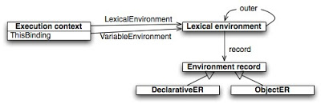

# Environment record and outer

```js
var x = 10;

function foo() {
  var y = 20;
}
```

Then we have two abstract environments corresponding to the global context and the context of the `foo` function:

```js
// environment of the global context

globalEnvironment = {

  environmentRecord: {

    // built-ins:
    Object: function,
    Array: function,
    // etc ...

    // our bindings:
    x: 10

  },

  outer: null // no parent environment

};

// environment of the "foo" function

fooEnvironment = {
  environmentRecord: {
    y: 20
  },
  outer: globalEnvironment
};
```

The *outer* reference as we can see is used to chain the current environment with the parent one. The parent environment of course may have its own *outer* link. And the *outer* link of the *global environment* is set to `null`.

The global environment is the final link of this *chain of scopes*. This reminds how the prototypal inheritance works in ES: if a property isn’t found in the object itself, it’s searched in its prototype, then in the prototype of the prototype and so on, until it’s found, either the final link of the prototype chain is considered. The same with environments: the variables (or identifiers) appear in the context stand for the properties, and the *outer* link stands for the reference to the prototype.

A lexical environment as we mentioned may surrounds multiple inner lexical environments. E.g., if a function contains two nested functions then the lexical environments of each of the nested functions will have as their outer environment the environment of the surrounding function.

```js
function foo() {

  var x = 10;

  function bar() {
    var y = 20;
    console.log(x + y); // 30
  }

  function baz() {
    var z = 30;
    console.log(x + y); // 40
  }

}

// ----- Environments -----

// "foo" environmnet

fooEnvironment = {
  environmentRecord: {x: 10},
  outer: globalEnvironment
};

// both "bar" and "baz" have the same outer
// environment -- the environment of "foo"

barEnvironment = {
  environmentRecord: {y: 20},
  outer: fooEnvironment
};

bazEnvironment = {
  environmentRecord: {z: 30},
  outer: fooEnvironment
};
```

**ECMAScript defines two types of environment records:**  *declarative* environment records and *object* environment records.

## Declarative environment record

Declarative environment records are used to handle variables, functions, formal parameters, etc. appeared in function scopes (in this case this is very **activation object** which we know from ES3 series) and catch clauses.

```js
// all: "a", "b" and "c"
// bindings are bindings of
// a declarative record

function foo(a) {
  var b = 10;
  function c() {}
}
```

In case of the `catch` clause the binding is the exception argument:

```js
try {
  ...
} catch (e) { // "e" is a binding of a declarative record
  ...
}
```

In general case the bindings of declarative records are assumed to be stored *directly at low level of the implementation* (for example, in registers of a virtual machine, thus providing fast access). This is the main difference from the old *activation object* concept used in ES3.

That is, the specification doesn’t require (and even indirectly doesn’t recommend) to implement declarative records as simple objects which are *inefficient* in this case. The consequence from this fact is that declarative environment records are not assumed to be exposed directly to the user-level, which means we cannot access these bindings as e.g. properties of the record. Actually, we couldn’t also before, even in ES3 — there *activation object* also was *inaccessible* directly to a user (except though Rhino implementation which nevertheless exposed it via `__parent__` property).

Potentially, declarative records allow to use complete lexical addressing technique, that is to get the direct access to needed variables without any scope chain lookup — regardless the depth of the nested scope (if the storage is fixed and unchangeable, all variable addresses can be known even at compile time). However, ES5 spec doesn’t mention this fact directly.

So once again, the main thing which we should understand why it was needed to replace old *activation object* concept with the *declarative environment record* is first of all the *efficiency of the implementation*.

Abstractly, an environment with the declarative record, can be presented in this way (thus, property `type` is not from the spec, but my explanatory convention):

```js
environment = {
  // storage
  environmentRecord: {
    type: "declarative",
    // storage
  },
  // reference to the parent environment
  outer: <...>
};
```

## Object environment record

In contrast, an *object environment record* is used to define association of variables and functions appeared in the *global context* and inside the `with`-statements. These are exactly those inefficient variable storage implemented as *simple objects* which we’ve just mentioned above. In this case bindings are the *properties of the objects*.

The object which stores the bindings of such a context is called the *binding object*.

In case of the global context, the variables are associated with the global object itself. Exactly because of this we have the ability to refer them as properties of the global object:

```js
var a = 10;
console.log(a); // 10

// "this" in the global context
// is the global object itself
console.log(this.a); // 10

// "window" is the reference to the
// global object in the browser environment
console.log(window.a); // 10
```

In case of the `with` statement, variables can be associated with the properties of the `with`-object:

```js
with ({a: 10}) {
  console.log(a); // 10
}
```

Every time when `with` statement is executed a new lexical environment with object environment record is created. Thus, the environment of the running context is set as the *outer* environment. Then the environment of the running context is *replaced* with this newly created environment. After the `with` execution is completed the environment of the context is restored to the previous state:

```js
var a = 10;
var b = 20;

with ({a: 30}) {
  console.log(a + b); // 50
}

console.log(a + b); // 30, restored
```

In pseudo-code:

```js
// initial state
context.lexicalEnvironment = {
  environmentRecord: {a: 10, b: 20},
  outer: null
};

// "with" executed
previousEnvironment = context.lexicalEnvironment;

withEnvironment = {
  environmentRecord: {a: 30},
  outer: context.lexicalEnvironment
};

// replace current environment
context.lexicalEnvironment = withEnvironment;

// "with" completed, restore the environment back
context.lexicalEnvironment = previousEnvironment;
```

Absolutely the same effect has a `catch` clause — it also replaces the running context’s lexical environment with the newly created one, though in contrast with `with`statement, `catch` clause as we said uses *declarative record* but not the *object*:

```js
var e = 10;

try {
  throw 20;
} catch (e) { // replace the environment
  console.log(e); // 20
}

// and now it's restored back
console.log(e); // 10
```

with statements often may cause confusions (because of the effect of variables and function declarations hoisting) and some of them are really confusing cases. This is also the reason why the **`with` statement was removed from ES5-strict.**

Abstractly, an environment with the object environment record, can be presented in this way:

```js
environment = {
  // storage
  environmentRecord: {
    type: "object",
    bindingObject: {
      // storage
    }
  },
  // reference to the parent environment
  outer: <...>
};
```
<!-- markdownlint-disable MD025 -->
# Structure of execution context
<!-- markdownlint-enbale MD025 -->

It’s a little bit different than in ES3 and has the following properties:

```js
ExecutionContextES5 = {
  ThisBinding: <this value>,
  VariableEnvironment: { ... },
  LexicalEnvironment: { ... },
}
```

## This binding

This value is now called *this binding* (though, “this value” combination of words is still in ES5 spec). However, beside the terminology change, there are no big changes in semantics (except the *strict mode*, where `this` value can be `undefined`). In the global context, `this` binding is still the global object itself:

```js
(function (global) {
  global.a = 10;
})(this);

console.log(a); // 10
```

And inside a function context `this` value is still determined by the form of how the function is *called*. If it’s called with a reference, then the *base value* of the reference is used as `this` value, in all other cases — either global object or `undefined` in strict mode is used for `this`.

```js
var foo = {
  bar: function () {
    console.log(this);
  };
};

// --- Reference cases ---

// with a reference
foo.bar(); // "this" is "foo" - the base

var bar = foo.bar;

// with the reference
bar(); // "this" is the global, implicit base
this.bar(); // the same, explicit base, the global

// with also but another reference
bar.prototype.constructor(); // "this" is "bar.prototype"

// --- non-Reference cases ---

(foo.bar = foo.bar)(); // "this" is "global" or "undefined"
(foo.bar || foo.bar)(); // "this" is "global" or "undefined"
(function () { this; })(); // "this" is "global" or "undefined"
```

Notice again, in strict mode, it’s not possible anymore to get the global object with such a trick:

```js
(function () {
  "use strict";
  var global = (function () { return this; })();
  console.log(global); // undefined!
})();
```

## Variable environment

Variable environment component is exactly the initial storage of variables and functions of the context. Exactly its environment record is used as the data storage and is filled on entering the context stage. This is very **variable object** from ES3.

When entering the context of a function, recall also that a special `arguments` object is created which stores the values of formal parameters. In the *strict mode*, the `arguments` object has undergone several changes among which are that the `arguments`does *not* share anymore values of its properties and real argument variables. Property `callee` (the reference to the function itself) was also deprecated in strict mode.

```js
function foo(a) {
  var b = 20;
}

foo(10);
```

abstractly we have the following `VariableEnvironment` component of the `foo` function context:

```js
fooContext.VariableEnvironment = {
  environmentRecord: {
    arguments: {0: 10, length: 1, callee: foo},
    a: 10,
    b: 20
  },
  outer: globalEnvironment
};
```

So what is `LexicalEnvironment` component then? The funny thing is that *initially* it’s just a *copy* of the `VariableEnvironment`.

## Lexical environment

Both `VariableEnvironment` and `LexicalEnvironment` by their nature are *lexical environments* (regardless possible confusion in their naming), i.e. both statically *(lexically)* captures the outer bindings for inner functions created in the context.

As we’ve just mentioned, initially (when the context is activated) the `LexicalEnvironment` component is just the blue-print *copy* of the `VariableEnvironment`. Considering the example from above, we have:

`fooContext.LexicalEnvironment = copy(fooContext.VariableEnvironment);`

However what happens next, at **code execution stage**, is already related with the augmenting of the lexical environment by the with statements and catch clauses (though, as we said, in ES5 it’s already replacement of the context’s environment, but not augmentation as it was in ES3).

The `with` statement and `catch` clause as was shown above *replace* the context’s environment for the time of their execution. And this case is related with *function expressions*.

From discussed rules of function creation, we know that a *closure* saves the lexical environment of the context in which it is created.

If a function expression (FE) is created inside a `with` statement (or a `catch` clause), it *should* save exactly *this current (replaced)* lexical environment.

Had we replaced the `VariableEnvironment` itself (instead of copied `LexicalEnvironment`), then we should have been *restore* it back after the `with` is completed. However this would mean, that FE would not be able to refer bindings which were created *during* the `with` statement execution, but the FE is needed these `with`-bindings.

Moreover, we can’t replace `VariableEnvironment` itself, because a FD can be also *called* inside the `with` statement, but in contrast with FE, FD should continue use binding values from initial state, and not from the `with`-object (we’ll see it on example below).

This is why, closures formed as *function declarations* (FD) save the `VariableEnvironment` component as their `[[Scope]]` property, and function expressions (FE) save exactly `LexicalEnvironment` component in this case. This is the main (and actually the only) reason of separation of these two, at first glance the same, components.

This fact becomes even more funny if to take into account that `with` statement is going to disappear completely from ES (in ES.next) as it did in ES5-strict. Once it’s happened, ES spec will be less confusing in this respect.

So let’s show again what we’ve just analyzed: FE saves `LexicalEnvironment`, since it’s needed the dynamic bindings created during the `with` execution, and FD saves `VariableEnvironment` since, by the spec cannot be created inside a block at all and is hoisted to the top.

```js
var a = 10;

// FD
function foo() {
  console.log(a);
}

with ({a: 20}) {

  // FE
  var bar = function () {
    console.log(a);
  };

  foo(); // 10!, from VariableEnvrionment
  bar(); // 20,  from LexicalEnvrionment

}

foo(); // 10
bar(); // still 20
```

Schematically it looks like:

```js
// "foo" is created
foo.[[Scope]] = globalContext.[[VariableEnvironment]];

// "with" is executed
previousEnvironment = globalContext.[[LexicalEnvironment]];

globalContext.[[LexicalEnvironment]] = {
  environmentRecord: {a: 20},
  outer: previousEnvironment
};

// "bar" is created
bar.[[Scope]] = globalContext.[[LexicalEnvironment]];

// "with" is completed, restore the environment
globalContext.[[LexicalEnvironment]] = previousEnvironment;
```

# Difference between Variable environment and Lexical environment

Those are just different names used to refer to the same type of entity (Lexical Environment). They have different names due to different purposes.

The LexicalEnvironment and VariableEnvironment components of an execution context are always Lexical Environments. When an execution context is created its LexicalEnvironment and VariableEnvironment components initially have the same value. The value of the VariableEnvironment component never changes while the value of the LexicalEnvironment component may change during execution of code within an execution context.

Concept that is important to understand is *hoisting*: In JavaScript, any variable declaration var x=v; is split into two parts:The declaration is moved to the beginning of the surrounding function as var x;.The initializer becomes a simple assignment x=v; that replaces the declaration. This dominance of the function scope is the main motivation for keeping two current environments, as we shall see below.

## Data structure



**A (lexical) environment is the following data structure:**

- A reference to the outer environment (null in the global environment).
- An *environment record* maps identifiers to values. There are two kinds of environment records:
    - declarative environment records: store the effects of variable declarations, and function declarations.
    - object environment records: are used by the with statement and for the global environment. They turn an object into an environment. For with, that is the argument of the statement. For the global environment, that is the global object.

**An execution context has the following fields:**

- Environments: two references to environments.

    - ThisBinding: the current value of this.
    - LexicalEnvironment (lookup and change existing): resolve identifiers.
    - VariableEnvironment (add new): hold bindings made by variable declarations and function declarations.

  Both are usually the same. The next sections explain situations where they diverge.

## Handling temporary scopes via LexicalEnvironment and VariableEnvironment


LexicalEnvironment and VariableEnvironment are always the same, except in one case: When there is a dominant outer scope and one temporarily wants to enter an inner scope. In the inner scope, a few new bindings should be accessible, but all new bindings made inside of it should be added to the outer scope. This is done as follows:

- LexicalEnvironment temporarily points to a new environment that has been put in front of the old LexicalEnvironment. The new environment holds the temporary bindings of the inner scope.
- VariableEnvironment does not change its value and is thus still the same as the old LexicalEnvironment, denoting the outer scope. New bindings are added here and will also be found when doing a lookup via LexicalEnvironment, because the latter comes before the former in the environment chain.
- After leaving the temporary scope, LexicalEnvironment’s old value is restored and it is again the same as VariableEnvironment.

These differences matter for with statements and catch clauses, which create temporary scopes. In both cases, the dominant scope is the surrounding function.

1. with statement: the object that is the argument of the statement becomes a temporary environment.
2. catch clause: the exception that is the argument of this clause is made available via a temporary environment.

## Functions and their scope: declarations versus expressions

Another area where the difference between LexicalEnvironment and VariableEnvironment can be observed are function definitions: function declarations use the VariableEnvironment as scope, while function expressions use the LexicalEnvironment. For function declarations, the motivation is to move the declaration to the (dominant) function scope. They should thus only see what exists at that level. The following code example illustrates how that works.

```js
var foo = "abc";
    with({ foo: "bar" }) {
       function f() {
           console.log(foo);
       }
       f();
    }
```

Console output is “bar” on Firefox and Rhino, “abc” on V8 (Chrome, node.js). The latter more closely mirrors the specification, the former is probably what most programmers would expect. If you instead use a function expression, the output is “bar” on all platforms.

```js
var foo = "abc";
    with({ foo: "bar" }) {
        (function() { console.log(foo); }());
    }
```

# Identifier resolution

Identifier resolution is the process of determining the binding of an identifier appeared in the context using the `LexicalEnvironment` component of the running execution context.

In other words, it’s the very scope chain lookup of variables. As we have said above, it’s similar to the prototype chain look up, just instead of prototype link, the `outer` link of an environment is considered.

```js
var a = 10;

(function foo() {

  var b = 20;

  (function bar() {

    var c = 30;
    console.log(a + b + c); // 60

  })();

})();
```

the identifier resolution for e.g. `a` binding is recursively managed with the following algorithm:

```js
function resolveIdentifier(lexicalEnvironment, identifier) {

  // if it's the final link, and we didn't find
  // anything, we have a case of a reference error
  if (lexicalEnvironment == null) {
    throw ReferenceError(identifier + " is not defined");
  }

  // return the binding (reference) if it exists;
  // later we'll be able to get the value from the reference
  if (lexicalEnvironment.hasBinding(identifier)) {
    return new Reference(lexicalEnvironment, identifier);
  }

  // else try to find in the parent scope,
  // recursively analyzing the outer environment
  return resolveIdentifier(lexicalEnvironment.outer, identifier);

}

resolveIdentifier(bar.[[LexicalEnvironment]], "a") ->

-- bar.[[LexicalEnvironment]] - not found,
-- bar.[[LexicalEnvironment]].outer (i.e. foo.[[LexicalEnvironment]]) -> not found
-- bar.[[LexicalEnvironment]].outer.outer -> found reference, value 10
```
