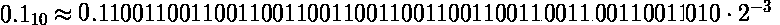

# Javascript number

Most statically typed languages like Java or C have different data types for numbers. For example, if you need to store an integer that is in the range [-128;127] you can use ‘byte’ in Java and ‘char’ in C, which both take up only 1 byte. If you need to store a larger integer, you can use ‘int’ or ‘long’ data types which take up 4 and 8 bytes respectively. There are also separate data types that you can use to store numbers with fractional part — ‘float’ which takes up 4 bytes and ‘double’ with 8 bytes. These are usually referred to as floating point format and we’ll see later where this name comes from.

But we don’t have such a variety of number types in JavaScript. According to the ECMAScript standard, there is only one type for numbers and it is the ‘double-precision 64-bit binary format IEEE 754 value’. This type is used to store both integers and fractions and is the equivalent of `double` data type in Java and C. Some new developers to JavaScript do not realize that and believe that if they use  **1**  it is stored in 64 bits as:


while in fact it’s stored as:


This misunderstanding may cause a great deal of confusion. Let’s for example, take this loop written in Java:

```java
for (int i=1; 1/i > 0; i++) {
    System.out.println("Count is: " + i);
}
```

How long will it run? It’s not difficult to see that it will stop after the first iteration. On the second iteration the counter `i` will be increased to `2`, `1/2` will produce `0.5` which will be truncated to `0` since the counter `i` is an integer and the condition `1/2 > 0`  will evaluate to false.
Now what do you think will happen if we write the same loop in JavaScript:

```js
for (var i=1; 1/i > 0; i++) {
    console.log("Count is: " + i);
}
```

As it turns out this loop will never stop because the result of 1/i is not evaluated as integer, but as a floating point and that leads to very interesting behavior.

Those that are unfamiliar with the way JavaScript works usually mention another unexpected behavior that is easy to explain once you understand the language. Adding `0.1` to `0.2` produces `0.30000000000000004`, which means that `0.1+0.2`  is not equal to `0.3`.

It’s interesting that this behavior is often attributed to JavaScript, while it’s pertaining to any language the uses floating point format for numbers. This means that if you use ‘float’ or ‘double’ data types in Java or C you’ll see the same result. Another interesting point is that the result of  `0.1+0.2`  is not  `0.30000000000000004`  as seen in a browser’s console, but is actually  `0.3000000000000000444089209850062616169452667236328125`.

In this article I’d like to explain how floating point numbers work and take a close look at the  _for loop_  and  _0.1+0.2_  examples alluded earlier.

> It’s worth mentioning BigInt, a new numeric primitive in JavaScript that can represent integers with arbitrary precision. With `_BigInt_`s, you can safely store and operate on large integers even beyond the safe integer limit for `_Number_`s. It was introduced [in V8](https://v8.dev/blog/bigint) this year and is supported in [Chrome 67+](https://developers.google.com/web/updates/2018/05/bigint) and [Node v10.4.0+](http://thecodebarbarian.com/an-overview-of-bigint-in-node-js.html). You can read more about it [here](https://developers.google.com/web/updates/2018/05/bigint).

## Representing numbers in the scientific notation

Before we start talking about floating point and the IEEE754 standard, we need to first look into what it means to represent a number in the scientific notation. In the general form the number in scientific notation can be represented like this:


_Significand_ shows the number of significant digits. It’s also often referred to as  _Mantissa_ or  _Precision_. Zeros are not considered significant; they just hold a place.  _Base_ specifies the numeric system base, i.e.  `10`  for decimal system and  `2`  for binary.  _Exponent_  defines by how many places a radix point must be moved to the left or right to obtain an original number.

Any number can be represented in the scientific notation. For example, the number  `2`  in decimal and binary systems can be represented like this:


An exponent of zero simply shows us that no additional operations should be done to obtain the original number. Let’s see another example — the number `0.00000022`. The significant numbers here are `22`, so let’s remove zeros:


The calculation above demonstrates why the exponent of the base is decreased if the radix point moved to the right. So, by performing multiplication we refined our original number to have only significand digits:


Since we used multiplication by `8`, we had to compensate it by division and this is where negative exponent of `8` comes from. The same process, only this time the division is used to obtain significand digits, can be performed on the number `22300000`:


This time the radix point was moved to the left and hence the exponent increased. As you can see, the scientific notation is a way to work easily with very large or small numbers. Depending on the exponent, the  _significant_  may represent an integer or a number with fractional part. When converting to the original number a negative exponent requires shifting the radix point to the left. The positive exponent requires shifting to the right and usually denotes large integers.

It’s also important to understand what a normalized form of a number is. A number is normalized when it is written in scientific notation with one nonzero decimal digit before the radix point. So, if we take our original numbers and represent them in the normalized form they will have the following representations:


As you may have guessed that the binary numbers will always have  `1`  before the radix point. Having numbers represented in the normalized form enables easy comparison of numbers by order of magnitude.

Scientific notation can be thought of as a floating point representation of a number. The term  _floating point_  refers to the fact that a number’s radix point can “float” — it can be put anywhere relative to the significant digits of the number. And as we’ve learnt, the original position is indicated by the exponent.

## Floating point according to the IEEE754

The IEEE Standard for Floating-Point Arithmetic (IEEE 754)  defines many things related to floating point arithmetic, but for the purposes of our exploration we’re interested only in how numbers are stored, rounded and added. I’ve written a very detailed article explaining [how to round binary numbers](https://medium.com/@maximus.koretskyi/how-to-round-binary-fractions-625c8fa3a1af#.e9nykp8sj). Rounding is a frequent operation and occurs when a selected format doesn’t allow enough bits to store a number. It is an important topic so get a good grasp of its mechanics. Now, let’s take a look at how numbers are stored. All examples onward are going to be mostly for numbers in binary system.

## Understanding how numbers are stored

There are two formats defined by the standard that are used most often — single and double precision. They differ in the number of bits each takes up and consequently in the range of numbers each format can store. The approach to translating a number in scientific notation into IEEE754 form is the same for all formats, only the number of bits allocated for mantissa (significand digits) and the exponent differ.
IEEE754 floating point allocates bits to store a number sign, its mantissa (significant digits) and exponent. Here is the how it distributes those bits in the double-precision format (64 bit for each number) used by JavaScript’s Number type:


The sign bit gets 1 bit, exponent — 11 bits and 52 bits are allocated for mantissa (significant). Here is the table that shows the number of bits allocated for each format:


The exponent is stored in the offset binary format. I’ve written [a detailed article explaining this format](https://medium.com/@maximus.koretskyi/the-mechanics-behind-exponent-bias-in-floating-point-9b3185083528#.zacphtue3) and it’s differences against two’s complement. Please take some time to understand this topic as I’ll be using it when translating numbers into floating point format.

## Examples of how integers are stored

To see the bits distribution scheme I outlined above let’s see how the integers `1` and `3` are stored. Number `1` is represented in all numeric systems as `1` so no conversion is required. It can be represented in scientific form as:


Here we have a mantissa of 1 and the exponent of 0. Using this information you may assume that the number is represented in floating point like this:


Let’s see if it’s really the case. Unfortunately, there are no built-in functions in JavaScript that allow you to see the bits pattern of a stored number. But I’ve written a simple JavaScript function that allows taking a look at how numbers are stored regardless of the your computer’s [endianess](https://www.cs.umd.edu/class/sum2003/cmsc311/Notes/Data/endian.html). Here it is:

```js
function to64bitFloat(number) {
    var i, result = "";
    var dv = new DataView(new ArrayBuffer(8));

    dv.setFloat64(0, number, false);

    for (i = 0; i < 8; i++) {
        var bits = dv.getUint8(i).toString(2);
        if (bits.length < 8) {
            bits = new Array(8 - bits.length).fill('0').join("") + bits;
        }
        result += bits;
    }
    return result;
}
```

So, using it you can see that the number `1` is stored like this:


It’s completely different from the assumptions set above. We have no digits in mantissa and there are `1`’s in the exponent. Now let’s see why it is so.
The first thing we need to understand is that every number is translated from the _normalized_ scientific form. What is the advantage of this? If the first digit before the radix point is always `1`, then there is no need to store it which gives one extra bit for mantissa digits. When performing mathematical operations this first digit `1` is prepended back by hardware. Since number `1` has no digits after the radix point in the normalized form and the first digit before the radix point is not stored, we have nothing to put into mantissa and so it’s all zeros.
Now, let’s see where `1`’s come from in the exponent. I mentioned earlier that exponent is stored as offset binary. If we calculate the offset:


we can see that this is exactly what we have in the representation. So under offset binary the value stored there is really `0`. If it’s unclear how the offset gives us `0` read my article on [offset binary](https://medium.com/@maximus.koretskyi/the-mechanics-behind-exponent-bias-in-floating-point-9b3185083528#.2q5qxmdn3).

Let’s use the information we’ve learnt above and try to represent the number `3` in the floating point form. In binary it is represented as `11`.  If you don’t remember why, check out my very detailed article on [decimal-binary conversion algorithms](https://medium.com/@maximus.koretskyi/the-simple-math-behind-decimal-binary-conversion-algorithms-d30c967c9724#.vkz0k3jon). And upon normalization the number `3` has this form (numbers in binary):


After the radix point we have only one digit of `1` that will be stored in mantissa. As explained earlier the first digit before the radix point is not stored. Also, normalization also gave us the exponent of `1`. Let’s calculate how it’s represented in offset binary and then we have all the information required:


One thing to remember about mantissa is that digits are stored in the exact order they are placed in the scientific form — left to right from radix point. With that in mind, let’s put all numbers in the floating point representation:


If you use the function I showed above you’ll see that we came up with the correct representation.

## Why 0.1+0.2 is not 0.3

Now that we know how numbers are stored, let’s see what happens in this often-cited example. The quick explanation goes like this:

> Only fractions with a denominator which is a power of two can be finitely represented in a binary form. Since denominators of 0.1 (1 / 10) and 0.2 (1 / 5) are not powers of two, these numbers can’t be finitely represented in a binary format. In order to store them as a IEEE-754 floating point they have to be rounded to the number of available bits for mantissa — 10 bits for half-precision, 23 bits for single-precision or 52 bits for double-precision. Depending on how many bits of precision are available, the floating-point approximations of 0.1 and 0.2 could be slightly less or greater than there corresponding decimal representations, but never equal. Because of that fact, you’re never going to have 0.1+0.2 == 0.3.

This explanation maybe sufficient for some developers, but the best way to see what is going on under the hood is perform all the calculations that the computer is doing yourself. That’s what I’m about to do now.

### Representing 0.1 and 0.2 in the floating point format

Let’s see the bits pattern for `0.1` in floating point form. The first thing we need to do is to convert `0.1` to binary. This can be done using the algorithm of multiplication by `2`. I explain its mechanics in my article on [decimal-binary conversion algorithm](https://medium.com/@maximus.koretskyi/the-simple-math-behind-decimal-binary-conversion-algorithms-d30c967c9724#.vkz0k3jon). If we convert `0.1` to binary we get an infinite fraction:


The next step is to represent this number in the normalized scientific notation:


Since mantissa can only have 52 bits, we need to round our infinite number to 52 bits after the radix point.


Using the rounding rules defined by IEEE-754 standard and explained in my article on binary numbers rounding we need to round the number up to:


The last thing left is to calculate the exponent representation in offset binary:


And when put into floating point format representation the number `0.1` has the following bits pattern:


I encourage you to calculate the floating representation of `0.2` on your own. You should end up with the following representations in the scientific notation and binary:


### Calculating the result of 0.1 + 0.2

If we assemble the numbers back from their representation as floating point into scientific form, here is what we have:


To add numbers, they need to have equal exponents. The rule says that we need to adjust the number with the smaller exponent to that of the larger. So, let’s adjust the exponent of `-4` of the first number to have the exponent `-3` like the second number:



Now we can add the numbers:


Now, the result of the calculation is stored in a floating point format, so we need to normalize the result, round if necessary and calculate the exponent in offset binary.


The normalized number falls right in the middle between the rounding options, so we apply tie-breaking rule and round up to the even. This gives the following resulting number in the normalized scientific form:


And when converted to the floating point format for storing, it has the following bits pattern:


**This is exactly the bits pattern that is stored when you execute the statement** `0.1+0.2`.** To get it, the computer has to round three times — one for each number and third time for their sum. When simply 0.3 is stored, the computer performs rounding only once. **This rounding operations lead to different bits pattern stored for** `0.1+0.2` **and for standalone** `0.3`.** When JavaScript executes comparison statement  `0.1+0.2 === 0.3`, its these bits pattern that are compared, and since they are different the returned result is  _false_.  **If such formats existed than even with rounding the bits pattern would be equal, the** `0.1+0.2 === 0.3` **would evaluate to** `true` **regardless of the fact that** `0.1` **and** `0.2` **are not finitely representable in binary.**

Try checking the bits for the number  `0.3`  using the function I showed above  _to64bitFloat(0.3)._  The pattern will be different than the one we calculated above for the result of  `0.1+0.2`.
If you want to know what decimal number the stored bits represent, assemble the bits into the scientific form with zero exponent and convert them into decimal numeric system. The actual decimal number stored for  `0.1+0.2`  is  `0.3000000000000000444089209850062616169452667236328125`
and for  `0.3`  it is  `0.299999999999999988897769753748434595763683319091796875.`

## Why the `for` loop never stops

The key to understanding why the _for_ loop never stops is the number `9007199254740991`. Let’s see what is special about that number.

### Number.MAX_SAFE_INTEGER

If you type Number.MAX_SAFE_INTEGER into console, it outputs our key number `9007199254740991`. What is so special about that number that it got its own constant? Here is what [ECMAScript Language Specification](http://people.mozilla.org/~jorendorff/es6-draft.html#sec-number.max_safe_integer) has to say about it:

> The value of Number.MAX_SAFE_INTEGER is the largest integer **n** such that n and **n + 1** are both exactly representable as a Number value. The value of Number.MAX_SAFE_INTEGER is **9007199254740991** (2⁵³−1).

And [MDN](https://developer.mozilla.org/en/docs/Web/JavaScript/Reference/Global_Objects/Number/MAX_SAFE_INTEGER) also adds some explanation:

Safe in the constant name refers to the ability to represent integers exactly and to correctly compare them. For example, `Number.MAX_SAFE_INTEGER + 1 === Number.MAX_SAFE_INTEGER + 2` will evaluate to true, which is mathematically incorrect.

The first thing to understand is that this is not the largest integer that can be represented. For example, the number `9007199254740994` which is `MAX_SAFE_INTEGER + 3` can be safely represented. The maximum number that can be represented can be seen using the constant `Number.MAX_VALUE` and it’s equal to `1.7976931348623157e+308`. What may come to you as surprise is that there are some integers that can’t be represented between `MAX_SAFE_INTEGER` and `MAX_VALUE`. In fact, there’s an integer that can’t be represented between `MAX_SAFE_INTEGER` and `MAX_SAFE_INTEGER+ 3`. This number is `9007199254740993`. If you type it into console, you will see that it evaluates to `9007199254740992`. So, instead of working with the original number, JavaScript transformed it into the number less than the original by 1.

To understand why that happens, let’s first look at the bits representation of `9007199254740991 (MAX_SAFE_INTEGER)` in the floating point:


which when converted to scientific form has the following representation:


Now, to get the binary resulting number with zero exponent we just move the radix point 52 places to the right and get:


So, to store the  `MAX_SAFE_INTEGER`  number we used all places in the mantissa with the exponent of 52. Since all places are used, to be able to store the next number the only option we have is to increase the exponent by  `1`  to  `53`. For the exponent of  `53`, we move the radix point  `53`  places to the right. But since we have only  `52`  digits in the mantissa, we append  `0`  at the end. For the exponent of  `54`  two zeros will be appended. For  `55`  — three. And so on.

What implications does it have? You might have guessed already yourself.  **Since we’re going to have all numbers larger than** `MAX_SAFE_INTEGER` **end with** `0`, no odd integer larger than** `MAX_SAFE_INTEGER` **can be represented in 64 bit floating point.** To be able to store some of them, the mantissa should be allocated more than 52 bits. Let’s see this in action:


You can see that the numbers `9007199254740993`, `9007199254740995` can’t be represented in `64 bit` floating point. As exponent increases, the range of numbers that can’t be stored starts increasing dramatically.

### The never ending loop

Let me bring up the example with `for` loop here again:

```js
for (var i=1; 1/i > 0; i++) {
    console.log("Count is: " + i);
}
```

It never stops. I mentioned in the beginning that it happens because the the result of  `1/i`  is not evaluated as integer, but as a floating point. Now that you know how floating point works and what  `Number.MAX_SAFE_INTEGER`  it’s easy to understand why it never stops.

For the loop to stop, the counter  `i`  would have to reach  `Infinity`, since  `1/Infinity > 0`  evaluates to  `false`. Yet it never happens. In the previous paragraph I explained why some integers can’t be stored and that they are rounded to the nearest even. So in our example JavaScript keeps increasing the counter  `i`  by  `1`  until it reaches  `9007199254740993`, which is  `MAX_SAFE_INTEGER+2`. And this is the first integer that can’t be stored, thus it gets rounded to the nearest even integer  `9007199254740992`. So the loop is stuck at this number. The loop won’t be able to get over it and we’ve got an infinite loop here.
