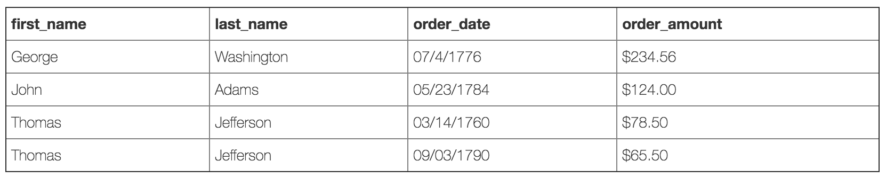
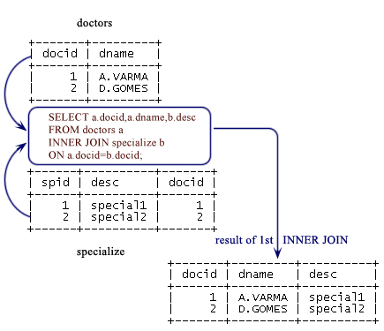

# Inner join

---

Selects all rows from both participating tables to appear in the result if and only if both tables meet the conditions specified in the ON clause.

> Returns only those records that have matching values in both tables.


Let’s say we wanted to get a list of those customers who placed an order and the details of the order they placed. This would be a perfect fit for an inner join, since an inner join returns records at the intersection of the two tables.

```sql
SELECT first_name, last_name, order_date, order_amount
FROM customers c
INNER JOIN orders o
ON c.customer_id = o.customer_id
```



## Multiple inner joins

```
doctors
+-------+---------+
| docid | dname   |
+-------+---------+
|     1 | A.VARMA |
|     2 | D.GOMES |
+-------+---------+


specialize
+------+----------+-------+
| spid | desc     | docid |
+------+----------+-------+
|    1 | special1 |     1 |
|    2 | special2 |     2 |
+------+----------+-------+


timeschedule
+-----+------+----------+-------+
| tid | tday | sit_time | docid |
+-----+------+----------+-------+
|   1 | MON  | 17:00:00 |     1 |
|   2 | WED  | 08:00:00 |     1 |
|   3 | TUE  | 16:00:00 |     2 |
|   4 | FRI  | 09:00:00 |     2 |
+-----+------+----------+-------+
```

If we want all records for a doctor who are specialized in `special1` and seat in his chamber on `WED` in his schedule time.

```sql
SELECT a.docid,a.dname,
       b.desc,c.tday,c.sit_time
  FROM doctors a
    INNER JOIN specialize b
     ON a.docid=b.docid
    INNER JOIN timeschedule c
     ON a.docid=c.docid
        WHERE a.docid=1 AND c.tday='WED';
```

```
 +-------+---------+----------+------+----------+
| docid | dname   | desc     | tday | sit_time |
+-------+---------+----------+------+----------+
|     1 | A.VARMA | special1 | WED  | 08:00:00 |
+-------+---------+----------+------+----------+
```

### How multiple inner joins works

[1] MySQL engine, runs first inner join

```sql
SELECT a.docid,a.dname,
       b.desc,c.tday,c.sit_time
  FROM doctors a
    INNER JOIN specialize b
     ON a.docid=b.docid
```



[2] Result of first inner join is then join to second inner join

```sql
 /* Result from first inner join */
 INNER JOIN timeschedule c
  ON a.docid=c.docid
```


[3] Engines takes, result from second inner join and apply `where` condition

```sql
 /* Result from second inner join */
 WHERE a.docid=1 AND c.tday='WED';
```


