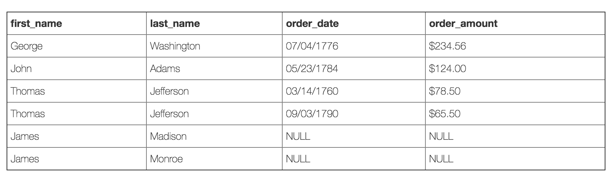

# Left join

It fetches rows based on a condition, which is matching in both the tables and the unmatched rows will also be available from the left table.

Left table gives you matched as well as unmatched rows but right table only gives matched rows.

You can also use this query to find out, if left table has unmatched rows. MySQL engine, assign `NULL` value to unmatched entries.


```sql
SELECT first_name, last_name, order_date, order_amount
FROM customers c
LEFT JOIN orders o
ON c.customer_id = o.customer_id
```



Note that since there were no matching records for James Madison and James Monroe in our orders table, the `order_date` and `order_amount` are `NULL`, which simply means there is no data for these fields.

**So why would this be useful?** By simply adding a `where order_date is NULL` line to our query, it returns a list of all customers who have not placed an order.

```sql
SELECT first_name, last_name, order_date, order_amount
FROM customers c
LEFT JOIN orders o
ON c.customer_id = o.customer_id
WHERE order_date IS NULL
```
