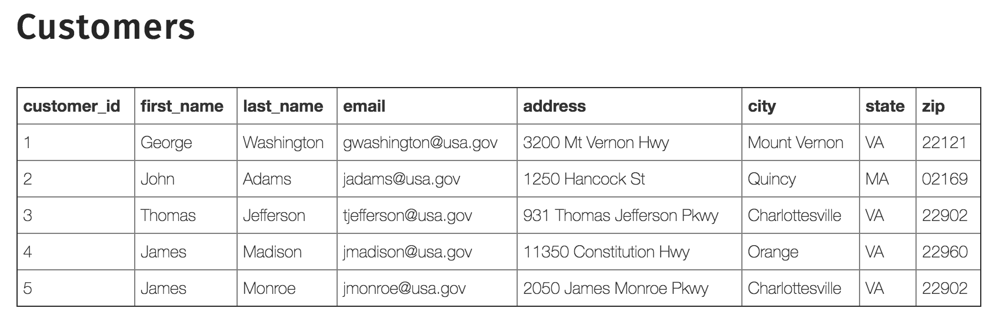
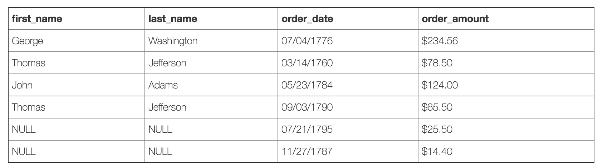

# Right join

It fetches rows based on a condition, which is matching in both the tables and the unmatched rows will also be available from the right table.

Right table gives you matched as well as unmatched rows but left table only gives matched rows.

You can also use this query to find out, if right table has any unmatched rows. MySQL engine, assign `NULL` value to unmatched entries.




```sql
SELECT first_name, last_name, order_date, order_amount
FROM customers c
RIGHT JOIN orders o
ON c.customer_id = o.customer_id
```



Note that since there were no matching customer records for orders placed in 1795 and 1787, the `first_name` and `last_name` fields are `NULL` in the resulting set.

**Why is this useful?** Simply adding a `where first_name IS NULL` line to query returns a list of all orders for which we failed to record information about the customers who placed them.

```sql
SELECT first_name, last_name, order_date, order_amount
FROM customers c
RIGHT JOIN orders o
ON c.customer_id = o.customer_id
WHERE first_name IS NULL
```
