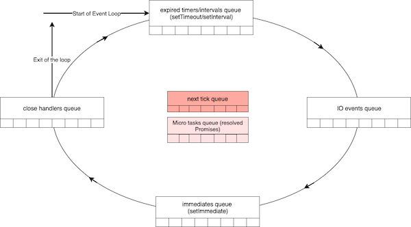
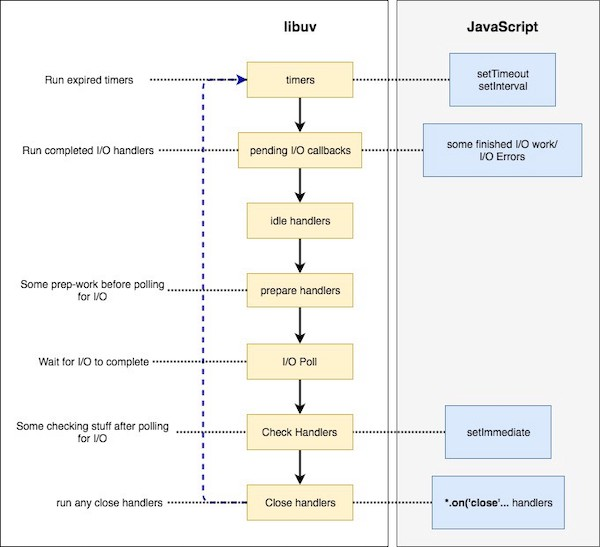
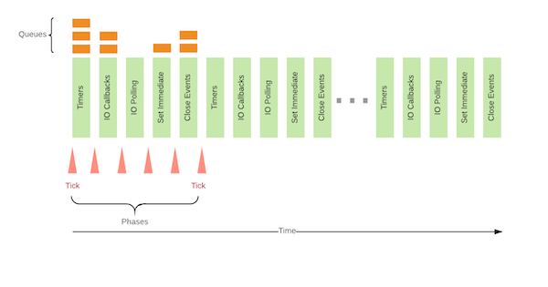

# Event loop explained

## Single or multiple threaded

Node.js uses **libuv** behind the scenes. libuv has a thread pool (of size 4 by default). Therefore Node.js does use multiple threads to achieve concurrency.

However, your code runs on a single thread (i.e., all of the callbacks of Node.js functions will be called on the same thread, the so called loop-thread or event-loop). When people say _"Node.js runs on a single thread"_ they are really saying _"the callbacks of Node.js run on a single thread"_.

## Reactor pattern

NodeJS works in an event-driven model which involves an  **Event Demultiplexer**  and an  **Event Queue**. All I/O requests will eventually generate an event of completion/failure or any other trigger, which is called an  **Event**. These events are processed according to the following algorithm.

1. Event demultiplexer receives I/O requests and delegates these requests to the appropriate hardware.
2. Once the I/O request is processed (e.g, data from a file is available to be read, data from a socket is available to be read etc.), event demultiplexer will then add the registered callback handler for the particular action in a queue to be processed. These callbacks are called events and the queue where events are added is called the  **Event Queue**.
3. When events are available to be processed in the event queue, they are executed sequentially in the order they were received until the queue is empty.
4. If there are no events in the event queue or the Event Demultiplexer has no any pending requests, the program will complete. Otherwise, the process will continue from the first step.

The program which orchestrates this entire mechanism is called the  **Event Loop**.


Event Loop is a single threaded and semi-infinite loop. The reason why this is called a semi-infinite loop is because this actually quits at some point when there is no more work to be done. In the developer’s perspective, this is where the program exits.

> Note: Don’t get yourself confused with the event loop and the NodeJS Event Emitter. Event Emitter is totally a different concept than this mechanism. In a later post, I’ll explain how Event Emitter affects the event handling process by the event loop.

Above diagram is a high-level overview of how NodeJS work and displays the main components of a design pattern called the  **Reactor Pattern.** But this is much more complex than this. So how complex is this?

> Event demultiplexer is not a single component which does all the types of I/O in all the OS platforms.

> The Event queue is not a single queue as displayed here where all the types of events are queued in and dequeued from. And I/O is not the only event type that is getting queued.

So let’s dig deep.

## Event demultiplexer

Event Demultiplexer is not a component which exists in the real world, but an abstract concept in the reactor pattern. In the real world, event demultiplexer has been implemented in different systems in different names such as  **epoll**  in Linux,  **kqueue** in BSD systems (MacOS),  **event ports** in Solaris,  **IOCP (Input Output Completion Port)**  in Windows etc. NodeJS consumes the low-level non-blocking, asynchronous hardware I/O functionalities provided by these implementations.

### Complexities in File I/O

But the confusing fact is, not all the types of I/O can be performed using these implementations. Even on the same OS platform, there are complexities in supporting different types of I/O. Typically, network I/O can be performed in a non-blocking way using these epoll, kqueue, event ports and IOCP, but file I/O is much more complex. Certain systems, such as Linux does not support complete asynchrony for file system access. And there are limitations in file system event notifications/signaling with kqueue in MacOS systems (you can read more about these complications  [here](http://blog.libtorrent.org/2012/10/asynchronous-disk-io/)). It is very complex/nearly impossible to address all these file system complexities in order to provide complete asynchrony.

### Complexities in DNS

Similar to the file I/O, certain DNS functions provided by Node API also have certain  [complexities](https://nodejs.org/api/dns.html#dns_implementation_considerations). Since NodeJS DNS functions such as  `dns.lookup`accesses system configuration files such as  `nsswitch.conf`,`resolv.conf`  and  `/etc/hosts` , file system complexities described above are also applicable to  `dns.resolve`  function.

### The solution?

Therefore, a  **thread pool**  has been introduced to support I/O functions which cannot be directly addressed by hardware asynchronous I/O utils such as epoll/kqueue/event ports or IOCP. Now we know that not all the I/O functions happen in the thread pool. NodeJS has done its best to do most of the I/O using non-blocking and asynchronous hardware I/O, but for the I/O types which blocks or are complex to address, it uses the thread pool.

### Gathering All Together

As we saw, in the real world it is really difficult to support all the different types of I/O (file I/O, network I/O, DNS etc.) in all the different types of OS platforms. Some I/O can be performed using native hardware implementations while preserving complete asynchrony, and there are certain I/O types which should be performed in the thread pool so that the asynchronous nature can be guaranteed.

> A common misconception among the developers about Node is that Node performs all the I/O in the thread pool.

To govern this entire process while supporting cross-platform I/O, there should be an abstraction layer which encapsulates these inter-platform and intra-platform complexities and expose a generalized API for the upper layers of Node.

So who does that? Ladies and Gentlemen, please welcome….


> libuv is cross-platform support library which was originally written for NodeJS. It’s designed around the event-driven asynchronous I/O model.

> The library provides much more than a simple abstraction over different I/O polling mechanisms: ‘handles’ and ‘streams’ provide a high level abstraction for sockets and other entities; cross-platform file I/O and threading functionality is also provided, amongst other things.

Now let’s see how libuv is composed. The following diagram is from the official libuv docs and describes how different types of I/O have been handled while exposing a generalized API.


Now we know that the  **Event Demultiplexer**, is not an atomic entity, but a collection of a I/O processing APIs abstracted by the Libuv and exposed to the upper layers of NodeJS. It’s not only the event demultiplexer that libuv provides for Node. Libuv provides the entire event loop functionality to NodeJS including the event queuing mechanism.

Now let’s look at the  **Event Queue**.

## Event queue

Event queue is supposed to be a data structure where all the events are getting enqueued and processed by the event loop sequentially until the queue is empty. But how this happens in Node is entirely different from how the abstract reactor pattern describes it. So how it differs?

> There are more than one queues in NodeJS where different types of events getting queued in their own queue.

> After processing one phase and before moving to the next phase, event loop will process two intermediate queues until no items are remaining in the intermediate queues.

So how many queues are there? what are the intermediate queues?

There are 4 main types of queues which are processed by native libuv event loop.

- **Expired timers and intervals queue** — consists of callbacks of expired timers added using  `setTimeout` or interval functions added using `setInterval`.
- **IO Events Queue** — Completed IO events
- **Immediates Queue** — Callbacks added using `setImmediate` function
- **Close Handlers Queue**— Any `close` event handlers.

> Please note that although I mention all these to be “**Queues**” for simplicity, some of them are actually different types of data structures (e.g, timers are stored in a min-heap)

Besides these 4 main queues, there are additionally 2 interesting queues which I previously mentioned as ‘intermediate queues’ and are processed by Node. Although these queues are not part of libuv itself, but are parts NodeJS. They are,

- **Next Ticks Queue** — Callbacks added using `process.nextTick` function
- **Other Microtasks Queue** — Includes other microtasks such as resolved promise callbacks

### How does it work?

As you can see in the following diagram, Node starts the event loop by checking for any expired timers in the timers queue, and go through each queue in each step while maintaining a reference counter of total items to be processed. After processing the close handlers queue, if there are no items to be processed in any queue, the loop will exit. Processing of each queue in the event loop can be considered as a phase of the event loop.


What’s interesting about the intermediate queues depicted in red is that, as soon as one phase is complete event loop will check these two intermediate queues for any available items. If there are any items available in the intermediate queues, event loop will immediately start processing them until the two immediate queues are emptied. Once they are empty, event loop will continue to the next phase.

> E.g, The event loop is currently processing the immediates queue which has 5 handlers to be processed. Meanwhile, two handlers are added to the next tick queue. Once the event loop completes 5 handlers in the immediates queue, event loop will detect that there are two items to be processed in the next tick queue before moving to the close handlers queue. It will then execute all the handlers in the next tick queue and then will move to process the close handlers queue.

### Next tick queue vs Other Microtasks

Next tick queue has even higher priority over the Other Micro tasks queue. Although, they both are processed in between two phases of the event loop, when libuv communicates back to higher layers of Node at the end of a phase. You’ll notice that I have shown the next tick queue in dark red which implies that the next tick queue is emptied before starting to process resolved promises in the microtasks queue.

> Priority for next tick queue over resolved promises is only applicable for the native JS promises provided by v8. If you are using a library such as  `q`  or  `bluebird`, you will observe an entirely different result because they predate native promises and has different semantics.

> `q`  and  `bluebird`  also differ in their own way of handling resolved promises which I will explain in a later blog post.

The convention of these so called ‘intermediate’ queues introduces a new problem, IO starvation. Extensively filling up next tick queue using  `process.nextTick`  function will force the event loop to keep processing next tick queue indefinitely without moving forward. This will cause IO starvation because event loop cannot continue without emptying the next tick queue.

> To prevent this, there used to be a maximum limit for the next tick queue which can be set using  `process.maxTickDepth`  parameter, but  [it has been removed since NodeJS v0.12](https://strongloop.com/strongblog/node-js-v0-12-apis-breaking/#process_maxtickdepth_removed)  for some reason.

I will describe each of these queues in depth in later posts with examples.

Finally, now you know what event loop is, how it is implemented and how Node handles asynchronous I/O. Let’s now look at where Libuv is in the NodeJS architecture.


## Next Tick Queue

Let’s look at the event loop diagram that we saw in the previous post.



Next tick queue is displayed separately from the other four main queues because it is  **not natively provided by the libuv**, but implemented in Node.

Before each phase of the event loop (timers queue, IO events queue, immediates queue, close handlers queue are the four main phases), before moving to the phase, Node checks for the  `nextTick`  queue for any queued events. If the queue is not empty, Node will start processing the queue immediately  **until the queue is empty**, before moving to the main event loop phase.

**This introduces a new problem**. Recursively/Repeatedly adding events to the  `nextTick`  queue using  `process.nextTick`  function can cause I/O and other queues to starve forever. We can simulate this scenario using the following simple script.

```js
const fs = require('fs');

function addNextTickRecurs(count) {
    let self = this;
    if (self.id === undefined) {
        self.id = 0;
    }

    if (self.id === count) return;

    process.nextTick(() => {
        console.log(`process.nextTick call ${++self.id}`);
        addNextTickRecurs.call(self, count);
    });
}

addNextTickRecurs(Infinity);
setTimeout(console.log.bind(console, 'omg! setTimeout was called'), 10);
setImmediate(console.log.bind(console, 'omg! setImmediate also was called'));
fs.readFile(__filename, () => {
    console.log('omg! file read complete callback was called!');
});

console.log('started');
```

You can see the output is an infinite loop of `nextTick` callback calls, and the `setTimeout`, `setImmediate` and `fs.readFile` callbacks were never called because any of the ‘**omg!…’** messages were printed in the console.

```
started
process.nextTick call 1
process.nextTick call 2
process.nextTick call 3
process.nextTick call 4
process.nextTick call 5
process.nextTick call 6
process.nextTick call 7
process.nextTick call 8
process.nextTick call 9
process.nextTick call 10
process.nextTick call 11
process.nextTick call 12
....
```

You can try setting a finite value as the parameter to  `addNextTickRecurs`  and see that  `setTimeout`,  `setImmediate`  and  `fs.readFile`  callbacks will be called at the end of the  **process.nextTick call** log messages.

> Before Node v0.12, there has been a property called  `_process.maxTickDepth_`which is used as a threshold to the  `process.nextTick`  queue length. This could be manually set by the developers so that Node will process no more than  `_maxTickDepth_`  callbacks from the next tick queue at a given point.  [But this has been removed since Node v0.12](https://strongloop.com/strongblog/node-js-v0-12-apis-breaking/#process_maxtickdepth_removed)  for some reason. Therefore, for newer Node versions, repeatedly adding events to next tick queue is only discouraged.

## Timers queue

When you add a timer using  `setTimeout`  or an interval using  `setInterval`, Node will add the timer to the timers heap, which is a data structure accessed through libuv. At the timers phase of the event loop, Node will check the timers heap for expired timers/intervals and will call their callbacks respectively. If there are more than one timer which were expired (set with the same expiration period), they will be executed in the order they were set.

When a timer/interval is set with a specific expiration period, it  **does not** guarantee that the callback will be called exactly after the expiration period. When the timer callback is called depends on the performance of the system (Node has to check the timer for expiration once before executing the callback, which takes some CPU time) as well as currently running processes in the event loop. Rather, expiration period will guarantee that the timer callback will not be triggered at least for the given expiration time period. We can simulate this using the following simple program.

```js

const start = process.hrtime();

setTimeout(() => {
    const end = process.hrtime(start);
    console.log(`timeout callback executed after ${end[0]}s and ${end[1]/Math.pow(10,9)}ms`);
}, 1000);
view rawsettimeout-guarantee.js hosted with ❤ by GitHub
```

Above program will start a timer for 1000ms when the program starts and will log how much time it took to execute the callback. If you run this program multiple times, you will notice that it will print a different result each time and it will never print `timeout callback executed after 1s and 0ms`. You will get something like this instead,

```
timeout callback executed after 1s and 0.006058353ms
timeout callback executed after 1s and 0.004489878ms
timeout callback executed after 1s and 0.004307132ms
...
```

This nature of the timeouts can cause unexpected and unpredictable results when  `setTimeout`  used along with  `setImmediate`  which I’ll explain in the next section.

## Immediates Queue

Although immediates queue is somewhat similar to timeouts on how it behaves, it has some of its own unique characteristics. Unlike timers which we cannot guarantee when its callback gets executed even though the timer expiration period is zero, immediates queue is guaranteed to be processed immediately after the I/O phase of the event loop. Adding an event(function) to the immediates queue can be done using  `setImmediate`  function as follows:

```js
setImmediate(() => {
   console.log('Hi, this is an immediate');
});
```

### setTimeout vs setImmediate?

Now, when we look at the event loop diagram at the top of this post, you can see that when the program starts its execution, Node starts processing the timers. And later after processing the I/O, it goes for the immediates queue. Looking at this diagram, we can easily deduce the output of the following program.

```js
setTimeout(function() {
    console.log('setTimeout')
}, 0);
setImmediate(function() {
    console.log('setImmediate')
});
```

As you might guess, this program will always print  `setTimeout`  before  `setImmediate`  because the expired timer callbacks are processed before immediates.  **But the output of this program can never be guaranteed!**  If you run this program multiple times, you will get different outputs.

This is because setting a timer with zero expiration time can never assure that the timer callback will be called exactly after zero seconds. Due to this reason, when the event loop starts it might not see the expired timer immediately. Then the event loop will move to the I/O phase and then to the immediates queue. Then it will see that there is an event in the immediates queue and it will process it.

But if we look at the following program, we can  **guarantee**  that the immediate callback will be definitely called before the timer callback.

```js
const fs = require('fs');

fs.readFile(__filename, () => {
    setTimeout(() => {
        console.log('timeout')
    }, 0);
    setImmediate(() => {
        console.log('immediate')
    })
});
```

Let’s see the execution flow of this program.

- At the start, this program reads the current file asynchronously using  `fs.readFile`  function, and it provides a callback to be triggered after the file is read.
- Then the event loop starts.
- Once the file is read, it will add the event (callback to be executed) in the I/O queue in the event loop.
- Since there are no other events to be processed, Node is waiting for any I/O event. It will then see the file read event in the I/O queue and will execute it.
- During the execution of the callback, a timer is added to the timers heap and an immediate is added to the immediates queue.
- Now we know that the event loop is in I/O phase. Since there are no any I/O events to be processed, event loop will move to the immediates phase where it will see the immediate callback added during the execution of file read callback.Then the immediate callback will be executed.
- In the next turn of the event loop, it will see the expired timer and it will execute the timer callback.

## Native Promises

In the context of native promises, a promise callback is considered as a microtask and queued in a microtask queue which will be processed right after the next tick queue.


Consider the following example.

```js
Promise.resolve().then(() => console.log('promise1 resolved'));
Promise.resolve().then(() => console.log('promise2 resolved'));
Promise.resolve().then(() => {
    console.log('promise3 resolved');
    process.nextTick(() => console.log('next tick inside promise resolve handler'));
});
Promise.resolve().then(() => console.log('promise4 resolved'));
Promise.resolve().then(() => console.log('promise5 resolved'));
setImmediate(() => console.log('set immediate1'));
setImmediate(() => console.log('set immediate2'));

process.nextTick(() => console.log('next tick1'));
process.nextTick(() => console.log('next tick2'));
process.nextTick(() => console.log('next tick3'));

setTimeout(() => console.log('set timeout'), 0);
setImmediate(() => console.log('set immediate3'));
setImmediate(() => console.log('set immediate4'));
```

In the above example, following actions will happen.

1. **Five**  handlers will be added to the resolved promises microtask queue. (Note that I add 5 resolve handlers to 5 promises which are already resolved)
2. **Two**  handlers will be added to the  `setImmediate`  queue.
3. **Three**  items will be added to the  `process.nextTick`  queue.
4. **One** timer is created with expiration time as zero, which will be immediately expired and the callback is added to the timers queue
5. **Two** items will be added again to the  `setImmediate`  queue.

Then the event loop will start checking the  `process.nextTick`  queue.

1. Loop will identify that there are three items in the  `process.nextTick`queue and Node will start processing the nextTick queue until it is exhausted.
2. Then the loop will check the promises microtask queue and identify there are five items in the promises microtask queue and will start processing the queue.
3. During the process of promises microtask queue,  **one** item is again added to the  `process.nextTick`  queue (‘next tick inside promise resolve handler’).
4. After promises microtask queue is finished, event loop will again detect that there is  **one** item is in the  `process.nextTick`  queue which was added during promises microtask processing. Then node will process the remaining 1 item in the nextTick queue.
5. Enough of promises and nextTicks. There are no more microtasks left. Then the event loop moves to the first phase, which is the  **timers** phase. At this moment it will see there is an expired timer callback in the timers queue and it will process the callback.
6. Now that there are no more timer callbacks left, loop will wait for I/O. Since we do not have any pending I/O, the loop will then move on to process  `setImmediate`  queue. It will see that there are  **four** items in the immediates queue and will process them until the immediate queue is exhausted.
7. At last, loop is done with everything…Then the program gracefully exits.

> **Enough of seeing the two words “promises microtask” everywhere instead of just “microtask”?**

> I know it’s a pain to see it everywhere, but you know that resolved/rejected promises and  `_process.nextTick_`  are both microtasks. Therefore, trust me, I can’t just say nextTick queue and microtask queue.

So let’s see how the output will look like for the above example.

```
next tick1
next tick2
next tick3
promise1 resolved
promise2 resolved
promise3 resolved
promise4 resolved
promise5 resolved
next tick inside promise resolve handler
set timeout
set immediate1
set immediate2
set immediate3
set immediate4
```

## Async I/O

I/O is never meant to be synchronized.

In all OS implementations, they provide event notification interfaces for asynchronous I/O (epoll in linux/kqueue in macOS/event ports in solaris/IOCP in Windows etc.). NodeJS leverages these platform level event notification systems in order to provide non-blocking, asynchronous I/O.

As we saw, NodeJS is a collection of utilities which eventually are aggregated into the high performant NodeJS framework. These utilities include,

- **Chrome v8 engine **— For high-performance JavaScript evaluation
- [**Libuv**](http://docs.libuv.org/) — For Event Loop with Asynchronous I/O
- **c-ares** — For DNS Operations
- other add-ons such as (**http-parser**,  **crypto**  and  **zlib**)


In this article, we’ll talk about Libuv and how it provides asynchronous I/O to Node. Let’s look at the event loop diagram again.


Let’s recap what we learned so far about the event loop:

- Event loop is started with executing handlers of all expired timers
- Then it will process any pending I/O operations, and will optionally wait for any pending I/O to complete.
- Then it will move on to consume setImmediate callbacks
- Finally, it will process any I/O close handlers.
- Between each phase, libuv needs to communicate the results of the phase to the higher layers of Node architecture (which means JavaScript). Each time this happens, any  `process.nextTick`  callbacks and other microtask callbacks will be executed.

Now, let’s try to understand how NodeJS performs I/O in its event loop.

> **What is I/O?**

> Generally, any work which involves external devices except the CPU is called I/O. The most common abstract I/O types are File Operations and TCP/UDP network operations.

### Libuv and NodeJS I/O

JavaScript itself has no facility to perform asynchronous I/O operations. During the development of NodeJS,  [libuv](http://docs.libuv.org/)  was initially started to provide async I/O to Node, although currently, libuv resides as a standalone library which can even be used individually. Libuv’s role in NodeJS architecture is to abstract internal I/O complexities and provide a generalized interface to upper layers of Node, so that Node can perform platform independent asynchronous I/O without worrying about what platform it is run on.

> **Warning!**

> I recommend you to read the previous articles of this series if you do not have the basic understanding of the event loop. I might omit certain details here for brevity because, I’d like to focus more on I/O in this article

> I might use some code snippets from libuv itself, and I’ll only use Unix-specific snippets and examples only to make things simpler. Windows-specific code might differ a bit, but there shouldn’t be a much difference.

> I would assume you can understand a small snippet of C code. No expertise needed, but a basic understanding of the flow would be adequate.

As we saw in the previous NodeJS architecture diagram, libuv resides in a lower layer of the layered architecture. Now let’s look at the relationship between the upper layers of NodeJS and the phases of libuv event loop.



As we saw in diagram 2 (Event loop in a nutshell) previously, there were 4 distinguishable phases of the event loop. But, when it comes to libuv, there are 7 distinguishable phases. They are,

1. Timers — Expired timer and interval callbacks scheduled by  `setTimeout`and  `setInterval`  will be invoked.
2. Pending I/O callbacks — Pending Callbacks of any completed/errored I/O operation to be executed here.
3. Idle handlers — Perform some libuv internal stuff.
4. Prepare Handlers — Perform some prep-work before polling for I/O.
5. I/O Poll — Optionally wait for any I/O to complete.
6. Check handlers — Perform some post-mortem work after polling for I/O. Usually, callbacks scheduled by  `setImmediate`  will be invoked here.
7. Close handlers — Execute close handlers of any closed I/O operations (closed socket connection etc.)

Now, if you remember the first article in this series, you may be wondering…

1. What are Check handlers? It was also not there in the event loop diagram.
2. What is I/O Polling? Why do we block for I/O after executing any completed I/O callbacks? Shouldn’t  **Node**  be non-blocking?

Let’s answer the above questions.

### Check Handlers

When NodeJS is initialized, it sets all  `setImmediate`  callbacks to be registered as Check handlers in libuv. This essentially means that any callback you set using  `setImmediate`  will eventually land in Libuv check handles queue which is guaranteed to be executed after I/O operations during its event loop.

### I/O Polling

Now, you may be wondering what I/O polling is. Although I merged I/O callbacks queue and I/O polling into a single phase in the event loop diagram (diagram1), I/O Polling happens after consuming the completed/errored I/O callbacks.

But, the most important fact in I/O Polling is,  **it’s optional**. I/O poling will or will not happen due to certain situations. To understand this thoroughly, let’s have a look at how this is implemented in libuv.

```c
r = uv__loop_alive(loop);
  if (!r)
    uv__update_time(loop);

while (r != 0 && loop->stop_flag == 0) {
    uv__update_time(loop);
    uv__run_timers(loop);
    ran_pending = uv__run_pending(loop);
    uv__run_idle(loop);
    uv__run_prepare(loop);

    timeout = 0;
    if ((mode == UV_RUN_ONCE && !ran_pending) || mode == UV_RUN_DEFAULT)
      timeout = uv_backend_timeout(loop);

    uv__io_poll(loop, timeout);
    uv__run_check(loop);
    uv__run_closing_handles(loop);

    if (mode == UV_RUN_ONCE) {
      uv__update_time(loop);
      uv__run_timers(loop);
    }

    r = uv__loop_alive(loop);
    if (mode == UV_RUN_ONCE || mode == UV_RUN_NOWAIT)
      break;
}
```

Ouch! It may seem a bit eye-twisting for those who are not familiar with C. But let’s try to get the glimpse of it without worrying too much about it. The above code is a section of  `uv_run`  method of which resides in  `core.c`  file of libuv source. But the most importantly, this is the  **Heart of the NodeJS event loop**.

If you have a look at diagram 3 again, the above code will make more sense. Let’s try to read the code line by line now.

1. `uv__loop_alive` — Check whether there are any referenced handlers to be invoked, or any active operations pending
2. `uv__update_time` — This will send a system call to get the current time and update the loop time (This is used to identify expired timers).
3. `uv__run_timers` — Run all expired timers
4. `uv__run_pending` — Run all completed/errored I/O callbacks
5. `uv__io_poll` — Poll for I/O
6. `uv__run_check` — Run all check handlers (`setImmediate`  callbacks will run here)
7. `uv__run_closing_handles` — Run all close handlers

At first, event loop checks whether the event loop is alive, this is checked by invoking  `uv__loop_alive`  function. This function is really simple.

```c
static int uv__loop_alive(const uv_loop_t* loop) {
  return uv__has_active_handles(loop) ||
         uv__has_active_reqs(loop) ||
         loop->closing_handles != NULL;
}
```

`uv__loop_alive`  function simply returns a boolean value. This value is  `true`if:

- There are active handles to be invoked,
- There are active requests (active operations) pending
- There are any closing handlers to be invoked

Event loop will keep spinning as long as  `uv__loop_alive`  function returns true.

After running callbacks of all expired timers,  `uv__run_pending`  function will be invoked. This function will go through the completed I/O operations stored in  `pending_queue`  in libuv event. If the  `pending_queue`  is empty, this function will return  `0` . Otherwise, all callbacks in  `pending_queue`  will be executed, and the function will return  `1`.

```c
static int uv__run_pending(uv_loop_t* loop) {
  QUEUE* q;
  QUEUE pq;
  uv__io_t* w;

  if (QUEUE_EMPTY(&loop->pending_queue))
    return 0;

  QUEUE_MOVE(&loop->pending_queue, &pq);

  while (!QUEUE_EMPTY(&pq)) {
    q = QUEUE_HEAD(&pq);
    QUEUE_REMOVE(q);
    QUEUE_INIT(q);
    w = QUEUE_DATA(q, uv__io_t, pending_queue);
    w->cb(loop, w, POLLOUT);
  }

  return 1;
}
```

Now let’s look at I/O Polling which is performed by invoking  `uv__io_poll`function in libuv.

You should see that  `uv__io_poll`  function accepts a second  `timeout`parameter which is calculated by  `uv_backend_timeout`  function.  `uv__io_poll`uses the timeout to determine how long it should block for I/O. If the timeout value is zero, I/O polling will be skipped and the event loop with move onto check handlers (`setImmediate`) phase. What determines the value of the  `timeout`  is an interesting part. Based on the above code of  `uv_run`, we can deduce the follows:

- If the event loop runs on  `UV_RUN_DEFAULT`  mode,  `timeout`  is calculated using  `uv_backend_timeout`  method.
- If the event loop runs on  `UV_RUN_ONCE`  and if  `uv_run_pending`  returns  `0`(i.e,  `pending_queue`  is empty),  `timeout`  is calculated using  `uv_backend_timeout`  method.
- Otherwise,  `timeout`  is  `0`.

> Let’s not try to worry about different modes of the event loop such as  `UV_RUN_DEFAULT`  and  `UV_RUN_ONCE`  at this point. But if you are really interested in knowing what they are, check them out  [**here**](http://docs.libuv.org/en/v1.x/loop.html).

Let’s now have a peek at  `uv_backend_timeout`  method to understand how  `timeout`  is determined.

```c
int uv_backend_timeout(const uv_loop_t* loop) {
  if (loop->stop_flag != 0)
    return 0;

  if (!uv__has_active_handles(loop) && !uv__has_active_reqs(loop))
    return 0;

  if (!QUEUE_EMPTY(&loop->idle_handles))
    return 0;

  if (!QUEUE_EMPTY(&loop->pending_queue))
    return 0;

  if (loop->closing_handles)
    return 0;

  return uv__next_timeout(loop);
}
```

- If the loop’s  `stop_flag`  is set which determines the loop is about to exit, timeout is  `0`.
- If there are no active handles or active operations pending, there’s no point of waiting, therefore the timeout is  `0`.
- If there are pending idle handles to be executed, waiting for I/O should not be done. Therefore, the timeout is  `0`.
- If there are completed I/O handlers in  `pending_queue`, waiting for I/O should not be done. Therefore the timeout is  `0`.
- If there are any close handlers pending to be executed, should not wait for I/O. Therefore, the timeout is  `0`.

If none of the above criteria is met,  `uv__next_timeout`  method is called to determine how long libuv should wait for I/O.

```c
int uv__next_timeout(const uv_loop_t* loop) {
  const struct heap_node* heap_node;
  const uv_timer_t* handle;
  uint64_t diff;

  heap_node = heap_min((const struct heap*) &loop->timer_heap);
  if (heap_node == NULL)
    return -1; /* block indefinitely */

  handle = container_of(heap_node, uv_timer_t, heap_node);
  if (handle->timeout <= loop->time)
    return 0;

  diff = handle->timeout - loop->time;
  if (diff > INT_MAX)
    diff = INT_MAX;

  return diff;
}
```

What  `uv__next_timeout`  does is, it will return the value of the closest timer’s value. And if there are no timers, it will return  `-1`  indicating infinity.

Now you should have the answer to the question “**Why do we block for I/O after executing any completed I/O callbacks? Shouldn’t Node be non-blocking?**”……

The event loop  **will not be blocked**  if there are any pending tasks to be executed. If there are no pending tasks to be executed, it will only be blocked  _until the next timer goes off,_  which re-activates the loop.

> I hope you are still following me !!! I know this might be too much detail for you. But to understand this clearly, it is necessary to have a clear idea of what’s happening underneath.

Now we know how long the loop should wait for any I/O to complete. This  `timeout`  value is then passed to  `uv__io_poll`  function. This function will watch for any incoming I/O operations until this  `timeout`  expires or system-specified maximum safe timeout reaches. After the timeout, event loop will again become active and move on to the “check handlers” phase.

I/O Polling happens differently on different OS platforms. In Linux, this is performed by  `epoll_wait`  kernel system calls, on macOS using  `kqueue`. In Windows, it’s performed using  `GetQueuedCompletionStatus`  in IOCP(Input Output Completion Port). I wouldn’t dig deep into how I/O polling works because it’s really complex and deserves another series of posts (which I don’t think I would write).

### Some words about Threadpool

So far, we didn’t talk about the thread pool in this articles.  [As we saw in the first article in this series](https://jsblog.insiderattack.net/event-loop-and-the-big-picture-nodejs-event-loop-part-1-1cb67a182810), threadpool is mostly used to perform all File I/O operations,  `getaddrinfo`  and  `getnameinfo`  calls during DNS operations merely due to the complexities of File I/O in different platforms (for a solid idea of these complexities,  [please read this post](http://blog.libtorrent.org/2012/10/asynchronous-disk-io/)). Since the size of thread pool is limited (default size is 4), multiple requests to file system operations can still be blocked until a thread becomes available to work. However, size of the thread pool can be increased up to  **128**  (at the time of this writing) using the environment variable  `UV_THREADPOOL_SIZE`, to increase the performance of the application.

Still, this fixed-size thread pool has identified to be a bottleneck for NodeJS applications because, File I/O,  `getaddrinfo`,  `getnameinfo`  are not the only operations carried out by the thread pool. Certain CPU intensive Crypto operations such as  `randomBytes`,  `randomFill`  and  `pbkdf2`  are also run on the libuv thread pool to prevent any adverse effects on the application’s performance but, by which also makes available threads an even scarce resource for I/O operations.

As of a previous libuv enhancement proposal, it was suggested to make thread pool scalable based on the load, but  [this proposal has eventually been withdrawn](https://github.com/libuv/leps/blob/master/004-threadpool-handle.md)  in order to replace it with a pluggable API for threading which might be introduced in the future.

## What you should know to really understand the Node.js Event Loop

Node.js is an event-based platform. This means that everything that happens in Node is the reaction to an event. A transaction passing through Node traverses a cascade of callbacks.
Abstracted away from the developer, this is all handled by a library called libuv which provides a mechanism called an event loop.

### Misconception 1: The event loop runs in a separate thread than the user code

#### Misconception

There is a main thread where the JavaScript code of the user (userland code) runs in and another one that runs the event loop. Every time an asynchronous operation takes place, the main thread will hand over the work to the event loop thread and once it is done, the event loop thread will ping the main thread to execute a callback.

#### Reality

There is only one thread that executes JavaScript code and this is the thread where the event loop is running. The execution of callbacks (know that every userland code in a running Node.js application is a callback) is done by the event loop. We will cover that in depth a bit later.

### Misconception 2: Everything that’s asynchronous is handled by a thread pool

#### Misconception

Asynchronous operations, like working with the filesystems, doing outbound HTTP requests or talking to databases are always loaded off to a thread pool provided by libuv.

#### Reality

Libuv by default creates a thread pool with four threads to offload asynchronous work to. Today’s operating systems already provide asynchronous interfaces for many I/O tasks ([e.g. AIO on Linux](http://man7.org/linux/man-pages/man7/aio.7.html)).
Whenever possible, libuv will use those asynchronous interfaces, avoiding usage of the thread pool. The same applies to third party subsystems like databases. Here the authors of the driver will rather use the asynchronous interface than utilizing a thread pool.
In short: Only if there is no other way, the thread pool will be used for asynchronous I/O.

### Misconception 3: The event loop is something like a stack or queue

#### Misconception

The event loop continuously traverses a FIFO of asynchronous tasks and executes the callback when a task is completed.

#### Reality

While there are queue-like structures involved, the event loop does not run through and process a stack. The event loop as a process is a set of phases with specific tasks that are processed in a round-robin manner.

### Understanding the phases of an event loop cycle

To really understand the event loop we have to understand which work is done in which phase. Hoping that Bert Belder would approve it, my approach to show how the event loop works would be as follows:



#### Timers

Everything that was scheduled via setTimeout() or setInterval() will be processed here.

#### IO Callbacks

Here most of the callbacks will be processed. As all userland code in Node.js is basically in callbacks (e.g a callback to an incoming http request triggers a cascade of callbacks), this is the userland code.

#### IO Polling

Polls for new events to be processed on the next run.

#### Set Immediate

Runs all callbacks registered via setImmediate().

#### Close

Here all on(‘close’) event callbacks are processed.
