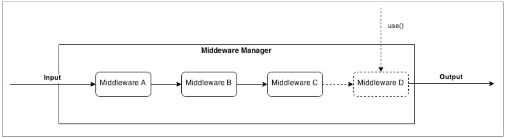

# Middleware

> Inspired from chain of responsibilty pattern.



The essential component of the pattern is the **Middleware Manager**, which is responsible for organizing and executing the middleware functions. The most important implementation details of the pattern are as follows:

- New middleware can be registered by invoking the use() function (the name of this function is a common convention in many implementations of this pattern, but we can choose any name). Usually, new middleware can only be appended at the end of the pipeline, but this is not a strict rule.
- When new data to process is received, the registered middleware is invoked in an asynchronous sequential execution flow. Each unit in the pipeline receives in input the result of the execution of the previous unit.
- Each middleware can decide to stop further processing of the data by simply not invoking its callback or by passing an error to the callback. An error situation usually triggers the execution of another sequence of middleware that is specifically dedicated to handling errors.

```js
// Middleware Manager.
class MiddlewareManager {
  constructor() {
    this.req = {}
    this.cb = null
    this.index = 0
    this.stack = []
  }

  use(middleware) {
    if (typeof middleware !== 'function') {
      throw new Error('Middleware must be a function!')
    }
    this.stack.push(middleware)
  }

  next(error = null) {
    if (error !== null) {
      return this.cb(error)
    }

    if (this.index >= this.stack.length) {
      return this.cb(null, this.req)
    }

    const middleware = this.stack[this.index++]
    try {
      middleware(this.req, this.next.bind(this))
    } catch (error) {
      this.next.bind(this, error)
    }
  }

  run(cb) {
    this.cb = cb
    this.next()
  }

}
```

```js
// Usage
const middleware = new MiddlewareManager();

middleware.use((req, next) => {
  req.data = 'Hello';
  next();
});

middleware.use((req, next) => {
  req.data += ' World';
  next();
});

middleware.use((req, next) => {
  req.data += ' !!!';
  next();
});

// Run the middlewares.
middleware.run((error, result) => {
  if (error !== null) {
    console.error(error);
  }
  console.log(result)
});
```
