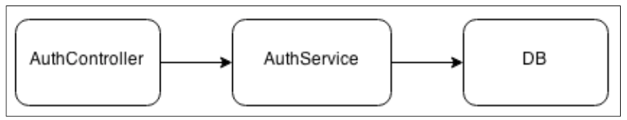

# Wiring modules

## A note about modules and dependencies

Every modern application is the result of the aggregation of several components and, as the application grows, the way we connect these components becomes a win or lose factor. It's not only a problem related to technical aspects such as extensibility, but it's also a concern with the way we perceive the system. A tangled dependency graph is a liability and it adds to the technical debt of the project; in such a situation, any change in the code aimed to either modify or extend its functionality can result in a tremendous effort.

In the worst case, the components are so tightly connected together that it becomes impossible to add or change anything without refactoring or even completely rewriting entire parts of the application. This, of course, does not mean that we have to over-engineer our design starting from the very first module, but surely finding a good balance from the very beginning can make a huge difference.

Node.js provides a great tool for organizing and wiring the components of an application together: it's the CommonJS module system. However, the module system alone is not a guarantee for success; if on one side, it adds a convenient level of indirection between the client module and the dependency, then on the other, it might introduce a tighter coupling if not used properly.

## Module _[basic unit]_

Module is the fundamental unit to organize and structure our code; it's unreasonable to build a large application without relying on the module system at all. If used properly to group the various elements of an application, it can bring a lot of advantages.

- A module is more readable and understandable because (ideally) it's more focused on doing one thing only.
- Being represented as a separate file, a module is easier to identify.
- A module can be more easily reused across different applications.
- A module represents the perfect level information hiding and gives an effective mechanism to expose only the public interface of a component (using `module.exports`).

!!! note
    Simply spreading the functionality of an application or a library across different modules is not enough for a successful design; it has to be done right.

## What is stateful module

Modules such as `db` connector, an `HTTP` server instance, the instance of a `service`, or in general any object which is not `stateless` are stateful module.

## Hardcoded dependency

In Node.js, this is obtained when a client module explicitly loads another module using `require()`.



It describes the structure of a simple authentication system. `AuthController` accepts the input from the client, extracts the login information from the request, and performs some preliminary validation. It then relies on `AuthService` to check whether the provided credentials match with the information stored in the database; this is done by executing some specific queries using a `DB` handle as a means to communicate with the database.

The way these three components are connected together will determine their level of reusability, testability, and maintainability. The most natural way to wire these components together is requiring the `DB` module from `AuthService` and then requiring `AuthService` from `AuthController`. This is the hardcoded dependency that we are talking about.

```js
// db module
var level = require('level');
var sublevel = require('level-sublevel');

module.exports = sublevel(level('my-example-db', {valueEncoding: 'json'});
```

```js
// authService module
var db = require('./db');
var users = db.sublevel('users');

module.exports.login = function(username, password, callback) {
   users.get(username, function(err, user) {
    // [...]
  });
};
```

```js
// authController module
var authService = require('./authService');

exports.login = function (req, res, next) {
  authService.login(req.body.username, req.body.password, function(err, result) {
     // [...]
  });
};
```

Hardcoding the dependency on a stateful instance limits the possibility of wiring the module against other instances, which makes it less reusable and harder to unit test. For example, reusing `authService` in combination with another `database` instance would be close to impossible, as its dependency is hardcoded with one particular instance. Similarly, testing `authService` in isolation can be a difficult task, because we cannot easily mock the `database` used by the module.

## Dependency injection

> The main idea behind the dependency injection pattern is the dependencies of a component being provided as input (not by `require()`) by an external entity.

Such an entity can be a global container. The main advantage of this approach is an improved decoupling, especially for modules depending on stateful instances. Using DI, each dependency, instead of being hardcoded into the module, is received from the outside. This means that the module can be configured to use any dependency and therefore can be reused in different contexts.

Let's refactor the authentication system that we built in the previous section to use DI.

```js
// db module
var level = require('level');
var sublevel = require('level-sublevel');

module.exports = function(dbName) {
 return sublevel(level(dbName, {valueEncoding: 'json'})
);
```

The first step in our refactoring process is to transform the `db` module into a factory. The result is that we can now use it to create as many database instances as we want; this means that the entire module is now reusable and stateless.

```js
// authService module
module.exports = function(db) {
  var users = db.sublevel('users');
  var authService = {};

  authService.login = function(username, password, callback) {
    //...same as in the previous version
  };

  return authService;
};
```

Also, the `authService` module is now stateless; it doesn't export any particular instance anymore, just a simple factory. The most important detail though is that we made the `db` dependency injectable as an argument of the factory function, removing what previously was a hardcoded dependency. This simple change enables us to create a new `authService` module by wiring it to any database instance.

```js
// authController module
module.exports = function(authService) {
  var authController = {};
  authController.login = function (req, res, next) {
    //...same as in the previous version
  };
  return authController;
};
```

The `authController` module does not have any hardcoded dependency at all, not even stateless! The only dependency, the `authService` module, is provided as input to the factory at the moment of its invocation.

Okay, now it's time to see where all these modules are actually created and wired together; the answer lies in the `app.js` file or `router.js` file.

```js
//[1] - require modules
var dbFactory = require('./lib/db');
var authServiceFactory = require('./lib/authService');
var authControllerFactory = require('./lib/authController');

//[2] - create instances
// IMPORTANT: Order matters.
// db must be aailable before authService
// instance is created.
var db = dbFactory('example-db');
var authService = authServiceFactory(db);
var authController = authControllerFactory(authService);

//[3] - register route
app.post('/login', authController.login);
```

### Types of dependency injection

- **Constructor injection:** In this type of DI, the dependencies are passed to a constructor.

```js
var authController = new AuthController(dependencyA, dependencyB);
```

- **Property injection:** In this type of DI, the dependencies are attached to an object after its creation.

```js
var authController = new AuthController();
authController.dependencyA = anInstanceOfDependencyA;
```

Using dependency injection we were able to decouple our modules from a particular dependency instance. The result is that we can now reuse each module with minimal effort and without any change in their code. Testing a module that uses the dependency injection pattern is also greatly simplified; we can easily provide mocked dependencies and test our modules in isolation from the state of the rest of the system.

All these advantages in terms of decoupling and reusability, though, come with a price to pay. If we look at the way we instantiated all the dependencies in the `app` file, we can see that we had to follow a specific order; we practically had to manually build the dependency graph of the entire application. This can become unmanageable when the number of modules to wire becomes high.

A viable solution to this problem is to split the dependency ownership between multiple components, instead of having it centralized all in one place. As each component would be responsible only for its particular dependency subgraph.

## Service locator


Another pattern with a very similar intent is Service Locator. Its core principle is to have a **central registry** in order to manage the components of the system and to act as a mediator whenever a module needs to load a dependency. The idea is to ask the service locator for the dependency.

Let's convert the authentication system to use an injected service locator.

To do this, the first step is to implement the service locator itself; we will use a new module.

```js
// serviceLocator.js
module.exports = function() {
 var dependencies = {};
 var factories = {};
 var serviceLocator = {};

 serviceLocator.factory = function(name, factory) {
  factories[name] = factory;
 };

 serviceLocator.register = function(name, instance) {
  dependencies[name] = instance;
 };

 serviceLocator.get = function(name) {
  if(!dependencies[name]) {
    var factory = factories[name];
    dependencies[name] = factory && factory(serviceLocator);
    if (!dependencies[name]) {
    throw new Error('Cannot find module: ' + name);
    }
  }
  return dependencies[name];
};

return serviceLocator;
};
```

- factory() is used to associate a component name against a factory.
- register() is used to associate a component name directly with an instance.
- get() retrieves a component by its name. If an instance is already available, it simply returns it; otherwise, it tries to invoke the registered factory to obtain a new instance. It is very important to observe that the module factories are invoked by injecting the current instance of the service locator (serviceLocator). This is the core mechanism of the pattern that allows the dependency graph for our system to be built automatically and on-demand.

```js
// db module
var level = require('level');
var sublevel = require('level-sublevel');

module.exports = function(serviceLocator) {
  var dbName = serviceLocator.get('dbName');
  return sublevel(level(dbName, {valueEncoding: 'json'})
);
```

The `db` module uses the service locator received in input to retrieve the name of the database to instantiate. This is an interesting point to highlight; a service locator can be used not only to return component instances but also to provide configuration parameters that define the behavior of the entire dependency graph that we want to create.

```js
// authService module
module.exports = function(serviceLocator) {
  var db = serviceLocator.get('db');
  var authService = {};

  authService.login = function(username, password, callback) {
    //...same as in the previous version
  };

  return authService;
};
```

```js
// authController module
module.exports = function(serviceLocator) {
  var authService = serviceLocator.get('authService');
  var authController = {};
  authController.login = function (req, res, next) {
    //...same as in the previous version
  };
  return authController;
};
```

Now we are ready to see how the service locator is instantiated and configured. This happens of course, in the `app.js` file:

```js
// [1]
var svcLoc = require('./lib/serviceLocator')();

// [2]
// Advantage: Order is not important.
svcLoc.register('dbName', 'example-db');
svcLoc.factory('db', require('./lib/db'));
svcLoc.factory('authService', require('./lib/authService'));
svcLoc.factory('authController', require('./lib/authController'));

//[3]
var authController = svcLoc.get('authController');

app.post('/login', authController.login);
```

It's interesting to see the **lazy** nature of the service locator; each instance is created only when needed. But there is another important advantage; we can see, in fact, that every dependency is automatically wired without the need to manually do it in advance. The advantage is that we don't have to know in advance what the right order for instantiating and wiring the modules is, it all happens automatically and on-demand. This is much more convenient compared to the simple dependency injection pattern.

A component relying on a service locator is less reusable because it requires that a service locator is available in the system.

## Dependency injection container

The step to transform a service locator into a Dependency Injection container is not big, but it makes a huge difference in terms of decoupling.

!!! note "Difference"
    With a service locator, each component loads its dependencies explicitly from the service locator itself, when using a DI container instead, the component has no knowledge of the container.

With this pattern, in fact, each module doesn't have to depend on the service locator anymore, but it can simply express its need in terms of dependencies and the DI container will do the rest seamlessly. The big leap forward of this mechanism is that every module can be reused even without the container.

A DI container is essentially a service locator with the addition of one feature: it identifies the dependency requirements of a module before instantiating it. For this to be possible, a module has to declare its dependencies in some way, and as we will see, we have multiple options for doing this.

```js
// diContainer.js

// Use to extract the names of the
// arguments of a function.
var argsList = require('args-list');

module.exports = function() {
 var dependencies = {};
 var factories = {};
 var diContainer = {};

 diContainer.factory = function(name, factory) {
  factories[name] = factory;
 };

 diContainer.register = function(name, dep) {
  dependencies[name] = dep;
 };

 diContainer.get = function(name) {
  if (!dependencies[name]) {
   var factory = factories[name];
   dependencies[name] = factory && diContainer.inject(factory);
   if (!dependencies[name]) {
    throw new Error('Cannot find module: ' + name);
   }
  }
  return dependencies[name];
 };

 // This time, instead of directly invoking the module
 // factory, we rely on another method of the diContainer
 // module called inject(), which will resolve the
 // dependencies of a module, and use them to invoke
 // the factory.
 diContainer.inject = function(factory) {
  var args = argsList(factory)
   .map(function(dependency) {
    return diContainer.get(dependency);
   });
  return factory.apply(null, args);
 };

};
```

That's really it for our `diContainer`. As we saw it's not that much different from a service locator, but the simple step of instantiating a module by injecting its dependencies makes a dramatic difference (as compared to injecting the entire service locator).

To complete the refactoring of the authentication system, we also need to tweak the 'app.js' file:

```js
var diContainer = require('./lib/diContainer')();

diContainer.register('dbName', 'example-db');
diContainer.factory('db', require('./lib/db'));
diContainer.factory('authService', require('./lib/authService'));
diContainer.factory('authController', require('./lib/ authController'));

var authController = diContainer.get('authController');

app.post('/login', authController.login);
```

### Some considerations

- **Consideration #1:** You might notice, that this approach relies heavily on the convention that the names of arguments in modules' factory functions should be exactly the same as the names of dependencies and factories we use configuring our Dependency Injection Container. Otherwise, it just won't work.
- **Consideration #2:** Since we rely on names, it may not work out if the minification is used. It's not that relevant for server-side, but please note that a lot of Node modules are used both on back-end and front-end. So if you see your module is going to be used on front-end, consider other techniques (see the consideration #3).

#### Minification solution

**[1]** attaching a special property to the factory function:

```js
module.exports = (a, b) => {};
module.exports._inject = ['db', 'another/dependency'];
```

**[2]** specifying a module as an array of dependency names followed by the factory function:

```js
module.exports = ['db', 'another/dependency', (a, b) => {}];
```

**[3]** using a comment annotation that is appended to each argument of a function (works poorly with minification):

```js
module.exports = function (a /*db*/, b /*another/dependency*/);
```
