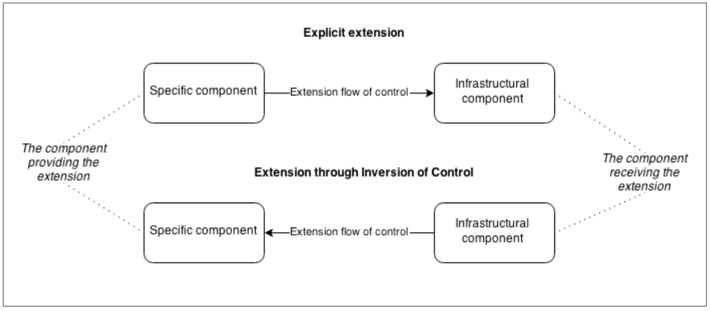

# Wiring plugin

The dream architecture of a software engineer is the one having a small, minimal core, extensible as needed through the use of plugins. Unfortunately, this is not always easy to obtain, since most of the time it has a cost in terms of time, resources, and complexity. Nonetheless, it's always desirable to support some kind of external extensibility, even if limited to just some parts of the system.

## Extension points

There are literally infinite ways to make an application extensible. For example, some of the design patterns are meant exactly for this: using Proxy or Decorator we are able to change or augment the functionality of a service; with Strategy we can swap parts of an algorithm; with Middleware we can insert processing units in an existing pipeline. Also, Streams can provide great extensibility thanks to their composable nature.

On the other hand, EventEmitters allow us to decouple our components using events and the publish/subscribe pattern. Another important technique is to explicitly define in the application some points where new functionalities can be attached or the existing ones modified; these points in an application are commonly known as **hooks**.

But also the way we wire our components plays a decisive role because it can affect the way we expose the services of the application to the plugin.

## Plugin-controlled vs Application-controlled extension

Before we go ahead and present some examples, it is important to understand the background of the technique we are going to use. There are mainly two approaches for extending the components of an application:

- Explicit extension
- Extension through Inversion of Control (IoC)

In the first case, we have a more specific component (the one providing the new functionality) explicitly extending the infrastructure, while in the second case, it is the infrastructure to control the extension by loading, installing, or executing the new specific component. In this second scenario, the flow of control is inverted, as shown in the following image:



Inversion of Control is a very broad principle that can be applied not only to the problem of application extensibility. In fact, in more general terms it can be said that by implementing some form of IoC, instead of the custom code controlling the infrastructure, the infrastructure controls the custom code. With IoC, the various components of an application trade off their power of controlling the flow in exchange for an improved level of decoupling. This is also known as the Hollywood principle or "don't call us, we'll call you".

For example, a dependency injection container is a demonstration of the Inversion of Control principle applied to the specific case of dependency management. The observer pattern is another example of IoC applied to state management. Strategy and Middleware are also more localized manifestations of the same principle. The browser implements the IoC principle when dispatching UI events to the JavaScript code (it's not the JavaScript code actively polling the browser for events). And guess what, Node.js itself follows the IoC principle when controlling the execution of the various callbacks for us.

Applying this concept to the specific case of plugins we can then identify two forms of extension:

- Plugin-controlled extension
- Application-controlled extension (IoC)

In the first case, it is the plugin that taps into the components of the application to extend them as needed, while in the second case, the control is in the hands of the application, which integrates the plugin into one of its extension points.

To make a quick example, let's consider a plugin that extends the express application with a new route. By using a plugin-controlled extension this would look like the following:

```js
//in the application:
var app = express(); require('thePlugin')(app);

//in the plugin:
module.exports = function plugin(app) {
  app.get('/newRoute', function(req, res) {
    //[...]
  })
};
```

If instead, we want to use an application-controlled extension (IoC), the same preceding example would look like the following:

```js
//in the application:
var app = express();
var plugin = require('thePlugin')();
app[plugin.method](plugin.route, plugin.handler);

//in the plugin:
module.exports = function plugin() {
 return {
  method: 'get',
  route: '/newRoute',
  handler: function(req, res) {
   // [...]
  }
 }
}
```

In the last code fragment, we saw how the plugin is only a passive player in the extension process; the control is in the hands of the application, which implements the framework to receive the plugin.

Based on the preceding example, we can immediately identify a few important differences between the two approaches:

- Plugin-controlled extension is more powerful and flexible, as often we have access to the internals of the application and we can move freely as if the plugin was actually a part of the application itself. However, this sometimes can be more a liability than an advantage. In fact, any change in the application would more easily have repercussions on the plugins, requiring constant updates as the main application evolves.
- Application-controlled extension requires a plugin infrastructure in the main application. With a plugin-controlled extension, the only requirement is that the components of the application are extensible in some way.
- With a plugin-controlled extension, it becomes essential to share the internal services of the application with the plugin (in the preceding small example, the service to share was the app instance), otherwise we would not be able to extend them. With an application-controlled extension, it might still be necessary to access some of the services of the application, not to extend but rather to use them. For example, we might want to query the db instance in our plugin, or leverage the logger of the main application, just to name a few scenarios.
