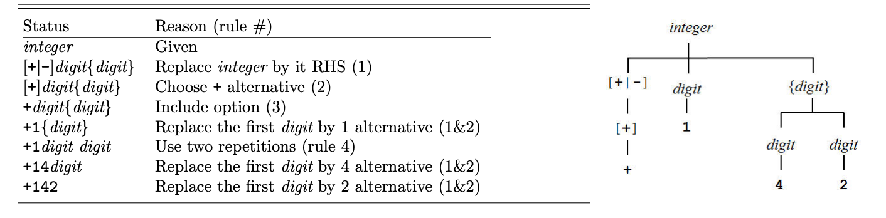

# EBNF grammar

EBNF is a way to specify a formal language grammar. It can be considered a metalanguage because it is a language to describe other languages

A formal language is a language with a precise structure, like programming languages, data languages, or Domain Specific Languages (DSLs). Java, XML, and CSS are all examples of formal languages.

You can look into the a few examples in [github](https://github.com/antlr/grammars-v4)

Example: TinyC grammar

```
program
   : statement+
   ;
statement
   : 'if' paren_expr statement
   | 'if' paren_expr statement 'else' statement
   | 'while' paren_expr statement
   | 'do' statement 'while' paren_expr ';'
   | '{' statement* '}'
   | expr ';'
   | ';'
   ;
paren_expr
   : '(' expr ')'
   ;
expr
   : test
   | id '=' expr
   ;
test
   : sum
   | sum '<' sum
   ;
sum
   : term
   | sum '+' term
   | sum '-' term
   ;
term
   : id
   | integer
   | paren_expr
   ;
id
   : STRING
   ;
integer
   : INT
   ;
STRING
   : [a-z]+
   ;
INT
   : [0-9]+
   ;
WS
   : [ \r\n\t] -> skip
   ;
```

> To build grammar for programming languages, we use **Context free grammar** rules (restrictions).

## Terminal symbols in programming language

* identifiers: these are the names used for variables, classes, functions, methods and so on.
* keywords: for example, (public, private, static, final, etc.) or control flow structures (while, for, until, etc).
* literals: We can have string literals, numeric literal, char literals, boolean literals etc.
* separators and delimiters: like colons, semicolons, commas, parenthesis, brackets, braces.
* whitespaces: spaces, tabs, newlines.
* comments: most languages have one or more ways to define comments.

### How terminals are defined


## What non-terminals look like

Non-terminals are obtained by grouping terminals and other non-terminals in a hierarchy. After all,our goal is to obtain an Abstract Syntax Tree, which is a tree. Our tree will have a root: one non-terminal representing our entire document. The root will contain other non-terminals that will contain other non-terminals and so on.


> In the grammar, we will define the parser rules that determine how the AST is built.

Examples of non-terminals are:

* _program/document_: represent the entire file.
* _module/classes:_ group several declarations together.
* _functions/methods:_ group statements together.
* _statements:_ these are the single instructions. Some of them can contain other statements. For example, the loops have a body which is a list of other statements.
* _expressions:_ are typically used within statements and can be composed in various ways.

## Writing production rules

### Sequence

A sequence is simply represented by specifying two elements one after the other.

```
// an htmlAttribute can be created in two ways. The first one requires
// a sequence. First we need to find an htmlAttributeName, then the
// TAG_EQUALS and finally an htmlAttributeValue
htmlAttribute
    : htmlAttributeName TAG_EQUALS htmlAttributeValue
    | htmlAttributeName
    ;
```

### Alternative - `|`

There are some constructs, or portions of constructs, that can be defined in different ways. To represent this case we use alternatives. The different alternatives are separated by the pipe sign (“|“)

```
// There are different ways to create a statement
statement
   : 'if' paren_expr statement                  // 1st alternative
   | 'if' paren_expr statement 'else' statement // 2nd alternative
   | 'while' paren_expr statement               // 3rd alternative
   | 'do' statement 'while' paren_expr ';'      // 4th alternative
   | '{' statement* '}'                         // 5th alternative
   | expr ';'                                   // 6th alternative
   | ';'                                        // 7th alternative
   ;
```

### Optional (Zero or One Time) - `[]` or `?`

An element can appear zero or one time. In other words, it can be optional.

```
// both occurences of htmlChardata are optional
htmlContent
    : htmlChardata? ((htmlElement | xhtmlCDATA | htmlComment) htmlChardata?)*
    ;
```

* **Standard EBNF** - `[]` optional symbols inside square brackets.
* **Alternatively** - `?`

### Zero or More Times - `{}` or `*`

An element can appear zero or more times (no upper limit).

```
// In three of these alternatives the htmlAttribute can appear
// as many times as we want.
htmlElement
    : TAG_OPEN htmlTagName htmlAttribute* TAG_CLOSE htmlContent TAG_OPEN TAG_SLASH htmlTagName TAG_CLOSE
    | TAG_OPEN htmlTagName htmlAttribute* TAG_SLASH_CLOSE
    | TAG_OPEN htmlTagName htmlAttribute* TAG_CLOSE
    | scriptlet
    | script
    | style
    ;
```

* **Standard EBNF** - `[]` optional symbols inside curly brackets.
* **Alternatively** - `*`

### One or More Time - `+`

An element can appear one or more times (no upper limit).

```
// We need at least one statement. We could have just one, or more
program
   : statement+
   ;

// OR

program
   : statement|statement*
   ;
```

* **Standard EBNF** - This is not present. However, this is equivalent to a sequence in which the same element is present twice, and the second time, it is followed by an asterisk. See example above.
* **Alternatively** - `+`

### Grouping - `()`

We can group multiple elements together by using round parenthesis. This is typically used because a modifier (optional, zero-or-more, one-or-more) must be applied to a set of elements.

```
// script is defined as a sequence of the terminal SCRIPT_OPEN
// and the group ( SCRIPT_BODY | SCRIPT_SHORT_BODY)
script
    : SCRIPT_OPEN ( SCRIPT_BODY | SCRIPT_SHORT_BODY)
    ;
```

## Example

EBNF production rule for **integer**

* `digit` ⇐ 0 | 1 | 2 | 3 | 4 | 5 | 6 | 7 | 8 | 9
* `integer` ⇐ [+|-]digit{digit}

* A digit is defined as one of the ten alternative characters 0 through 9.
* An integer is defined as a sequence of three items: an optional sign (if it is included, it must be one of the alternatives + or -), followed by any digit, followed by a repetition of zero or more digits, where each digit is independently chosen from the list of alternatives in the digit rule.

### Derivation tree

> proving `+142` is an integer.



## Recursion in Grammars: Left or Right?

EBNF lets us define recurring grammars. Recurring grammars are grammars that have recurring production rules, i.e., production rules that refer to themselves and they do so at the beginning of the production rule (**left recurring** grammars) or at the end (**right recurring grammars**).

> Right recursion is recommended because they do not fall in infinite loop scenario. Whereas left recursion grammar may fall into infinite loop scenario.

```
// Left recurring grammar rule
Expression -> Expression + Term

// Parser method to parse Expression rule
void Expression() {
  Expression();
  match('+');
  Term();
}

// A left-to-right recursive descent parser for this rule might look above,
//and such code would fall into infinite recursion when executed calling
// `Expression()` over and over again having no break condition.
```

The fact is that many tools that process EBNF grammars cannot deal with that because they risk entering infinite loops. There are ways to refactor left recurring rules, however, they lead to less clear grammars.

> There are two types of left recursion which need to identify: One is **Direct left recursion** and second is **Indirect left recursion**. See example below:

```
// Direct
S -> Sd

// Indirect
S -> Aa | b
A -> Ac | Sd

//Can be derived into:
S -> Aa -> Sda
```

## List of parsers that generate tokens as well as AST based on the grammar rules

[Comparison of parser generators](https://en.wikipedia.org/wiki/Comparison_of_parser_generators)
