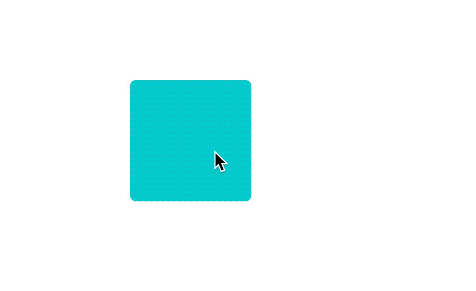
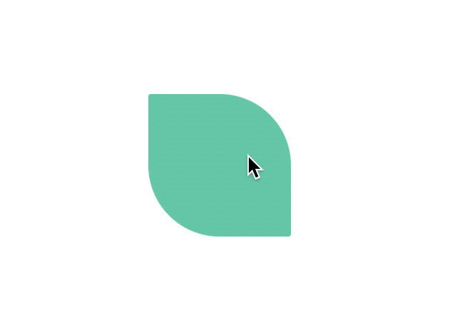

# Animation

[https://browniefed.com/react-native-animation-book/](https://browniefed.com/react-native-animation-book/ "Ebook")

> Used CSS animation to explain basic concepts but most of them are applicable to RN animation too. I am using CSS in order to just understand basic concept involve in animation realm.

## Duration

Specifies the length of time an animation should take to complete one cycle. This can be specified in seconds or milliseconds. Default value is 0, which means that no animation will occur

## Delay

Defines the number of seconds (s) or milliseconds (ms) to wait before the animation will start. Default value is 0. Negative values are allowed. If you use negative values, the animation will start as if it had already been playing for N seconds/milliseconds.

## Iteration

Specifies how many times an animation should be played.

## Direction

The animation-direction property defines whether an animation should be played forwards, backwards or in alternate cycles.

* `normal` - The animation is played as normal (forwards). This is default
* `reverse` - The animation is played in reverse direction (backwards)
* `alternate` - The animation is played forwards first, then backwards
* `alternate-reverse` - The animation is played backwards first, then forwards

## Timing function

Speed of the animation.

* `ease` - Specifies an animation with a slow start, then fast, then end slowly (this is default)
* `linear` - Specifies an animation with the same speed from start to end
* `ease-in` - Specifies an animation with a slow start
* `ease-out` - Specifies an animation with a slow end
* `ease-in-out` - Specifies an animation with a slow start and end
* `cubic-bezier(n,n,n,n)` - Lets you define your own values in a cubic-bezier function

## Transition

CSS transitions provide a way to control animation speed when changing CSS properties. Instead of having property changes take effect immediately, you can cause the changes in a property to take place over a period of time. For example, if you change the color of an element from white to black, usually the change is instantaneous. With CSS transitions enabled, changes occur at time intervals that follow an acceleration curve, all of which can be customized.

_Example:_ Changing height and width properties.


## Transform

The transform allow you to change the shape and position of content without affecting the normal document flow. These transformations include rotation, skewing, scaling, and translation in both 3D, and a 2D plane.

### skew

With the skew value, the element skews (or tilts) one direction or the other based on the values given for the X and Y axes. A positive X value tilts the element left, while a negative X value tilts it right. A positive Y value tilts the element down, and a negative Y value tilts is up.

```css
transform: skewX(25deg);
transform: skewY(10deg);
transform: skew(25deg, 10deg);
```


### Scale

Increase or decrease the size of an element

```css
transform: scaleX(2) // increase width only by 2 times
transform: scaleY(2) // increase height only by 2 times
transform: scale(2, 2) // increase width and height both by 2 times
```



### Rotate

With the rotate value, the element rotates clockwise or counterclockwise by a specified number of degrees. A positive value, such as 90deg, rotates the element clockwise, while a negative value, such as -90deg, rotates it counterclockwise.

```css
transform: rotate(1080deg);
```



### Translate

The translate value moves an element left/right and up/down. The movement is based on the parameters given for the X (horizontal) Y (vertical) axes.

A positive X value moves the element to the right, while a negative X moves the element to the left. A positive Y value moves the element downwards and a negative Y value, upwards.

In this example, the element will move 20 pixels to the right and 20 pixels down.

```css
transform: translate(20px, 20px);
```


You can apply all or one or more than one to an element to have sequence of transformation effects.

```css
#rotate-skew-scale-translate {
  transform:skew(30deg) scale(1.1,1.1) rotate(40deg) translate(10px, 20px);
}
```
