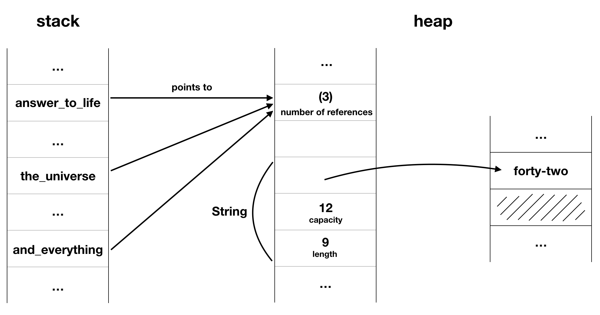

# `Rc<T>`

> Multiple ownership.

`Rc` is another smart pointer. It's short for "reference-counting". It keeps track of the number of references to a data structure. As soon as the number of references is down to zero, it cleans up after itself. Choose `Rc` if you need to have multiple owners of the same data in one thread. For multithreading, there's also `Arc` (atomic reference count).

In the majority of cases, ownership is clear: you know exactly which variable owns a given value. However, there are cases when a single value might have multiple owners. For example, in graph data structures, multiple edges might point to the same node, and that node is conceptually owned by all of the edges that point to it. A node shouldn’t be cleaned up unless it doesn’t have any edges pointing to it.

To enable multiple ownership, Rust has a type called `Rc<T>`, which is an abbreviation for reference counting. The `Rc<T>` type keeps track of the number of references to a value which determines whether or not a value is still in use. If there are zero references to a value, the value can be cleaned up without any references becoming invalid.

We use the `Rc<T>` type when we want to allocate some data on the heap for multiple parts of our program to read and we can’t determine at compile time which part will finish using the data last. If we knew which part would finish last, we could just make that part the data’s owner, and the normal ownership rules enforced at compile time would take effect.

Note that `Rc<T>` is only for use in single-threaded scenarios.
