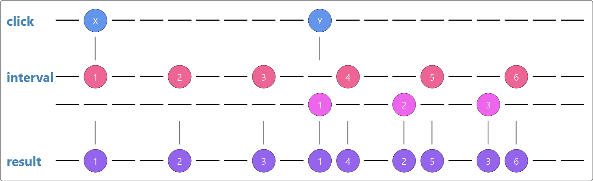

# Operators

**Important:** An Operator is a function which creates a new Observable based on the current Observable. This is a pure operation: the previous Observable stays unmodified.

When called, they do not change the existing Observable instance. Instead, they return a new Observable, whose subscription logic is based on the first Observable.

## concat

Concat combines two or more observables into one combined sequence, but the second observable will not start emitting until the first one has completed and third one will not start until second is completed.

Useful when want multiple observables to emit values in order in which you combine them and receive the values in one by one in `subscribe` function.

## mergeMap

To handle dependencies among multiple observables. Use it when result of one observable used in another observable. For example in multiple HTTP calls where result from one HTTP call is used in another HTTP call.

```js
const startButton = document.getElementById('start');

const startObs = Rx.Observable.fromEvent(startButton, 'click');
const intervalObs = Rx.Observable.interval(1000);

startObs
  .mergeMap((evt) => intervalObs)
  .subscribe((x) => console.log(x));

//sample output
//0....1....2....3..0.4..1.5..2.6..
```



## switchMap

It just like `mergeMap` with the difference of cancelling effect.

```js
const startButton = document.getElementById('start');

const startObs = Rx.Observable.fromEvent(startButton, 'click');
const intervalObs = Rx.Observable.interval(1000);

startObs
  .switchMap((evt) => intervalObs)
  .subscribe((x) => console.log(x));

//sample output
//0....1....2....3..0....1....2....3....4
```


## forkJoin

To execute observables in parallel and subscriber won't receive any values until all observables have completed. For example multiple HTTP calls and receive the result in array when all of them completed.
