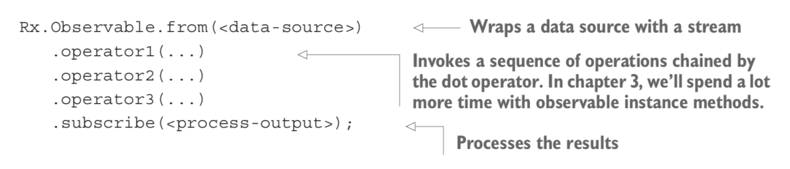
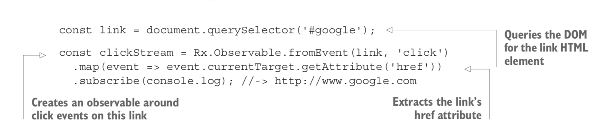
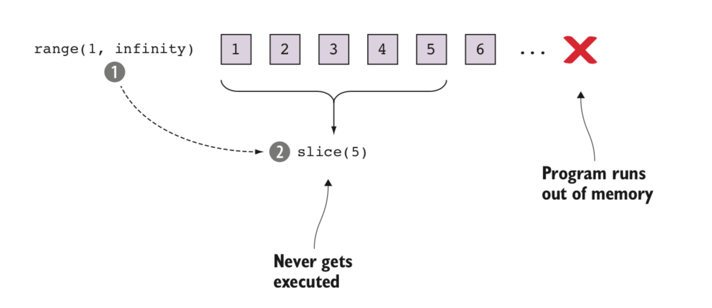

# RXJS

Everything is stream in rxjs and a stream is nothing more than a sequence of events over time. The concept of a stream can be applied to any data point that holds a value; this ranges from a single integer to bytes of data received from a remote HTTP call.

## Components of stream

### Producer \| Subject \| Observables

Producers are the sources of your data. A stream must always have a producer of data, which will be the starting point for any logic that you’ll perform in RxJS. In practice, a producer is created from something that generates events independently (anything from a single value, an array, mouse clicks, to a stream of bytes read from a file). The observer pattern defines producers as the subject; in RxJS, we call them observables, as in something that’s able to be observed.

> Observables are like fire and forget. They emit event and do not process it.

### Consumer \| Observer \| Subscriber

You must also have a consumer to accept events from the producer and process them in some specific way. When the consumer begins listening to the producer for events to consume, you now have a stream, and it’s at this point that the stream begins to push events; we’ll refer to a consumer as an observer.
Streams travel only from the producer to the consumer, not the other way around.

### Data pipeline \| Operators

One advantage of RxJS is that you can manipulate or edit the data as it passes from the producer to the consumer. This is where the list of methods (known as observable operators) comes into play.


## Rx.Observable

Wrap data source either array, integer, object or result from HTTP request and create a stream for you. It’s simply a data type that wraps a given data source, present in memory like an array or eventually in the future from HTTP request, and allows you to chain operations onto it by invoking observable instance methods sequentially.



## When to use

### Different type of data sources.


#### SINGLE-VALUE, SYNCHRONOUS

The simplest case is that you have only a single piece of data. In programming, you know there are operations that return a single value for each invocation. This is the category of any function that returns a single object. You can use the `Rx.Observable .of()` function to wrap a single, synchronous value. **As soon as the subscriber is attached, the value is emitted.**

```js
Rx.Observable.of(42).subscribe(console.log); //-> 42
```

#### MULTI-VALUE, SYNCHRONOUS

You can also group single items together to form collections of data, mainly for arrays. In order to apply the same operation that you used on the single item on all of the items, you would traditionally iterate over the collection and repeatedly apply the same operation to each item in the collection. **As soon as the subscriber is attached, the value is emitted.**

```js
Rx.Observable.from([1, 2, 3]).subscribe(console.log);
// -> 1 2 3
```

#### SINGLE-VALUE, ASYNCHRONOUS

This kind of operation is usually used to load some remote resource via an AJAX call or wait on the result of some non-local calculation wrapped in a Promise, without blocking the application. In either case, after the operation is initiated, it will expect a single return value or an error. In JavaScript this case is often handled using Promises. A Promise is similar to the single-value data case in that it resolves or errors only once. RxJS has methods to seamlessly integrate with Promises.

```js
const fortyTwo = new Promise((resolve, reject) => {
   setTimeout(() => {
      resolve(42);
   }, 5000);
});

Rx.Observable.fromPromise(fortyTwo)
   .map(increment)
   .subscribe(console.log); //-> 43

console.log('Program terminated');

// # output
'Program terminated'
43 //-> after 5 seconds elapse
```

#### MULTI-VALUE, ASYNCHRONOUS

The tasks in the fourth group are those that will produce multiple values over time, yet do so asynchronously. You create this category especially for the DOM events, which are all asynchronous and can occur infinitely many times.



### To push or not to push


> Notice the positions of the consumer and the direction of the data. In pull-based semantics, the consumer requests data (iterators work this way), whereas in pushed-based semantics, data is sent from the source to the consumer without it requesting it. Observables work this way.

Iterators use a pull-based semantic. This means that the consumer of the iterator is responsible for requesting the next item from the iterator. A pull-based paradigm is useful in cases where you know that a value can be returned immediately from a computation. But in scenarios like listening for a mouse click, where the consumer has no way of knowing when the next piece of data will become available, this paradigm breaks down.

In a push paradigm, the producer is responsible for creating the next item, whereas the consumer only listens for new events. As an example of this, consider your phone’s email client. A pull-based mechanism that checks for new email every second can drain the resources of your mobile device quickly, whereas with push email, or any push notifications for that matter, your email client needs to react to any incoming messages only once.

RxJS observables use push-based notifications, which means they don’t request data; rather, data is pushed onto them so that they can react to it.

## Consuming data with observer \| subscriber

Every piece of data that’s emitted and processed through an observable needs a destination. In other words, what was the purpose of capturing and processing a certain event?

The result of calling `subscribe()` on an observable source is a Subscription object.

An observable becomes aware of an observer during the subscription process, which you’ve seen a lot of so far. The subscription process is a way for you to pass an observer reference into an observable, creating a managed, one-way relationship.

> **An important point** to remember when dealing with RxJS is that the lifetime of a stream doesn’t start with the creation of an observable. It begins when it’s subscribed to.

## Lazy allocation

In computing terms, an object that creates data only when needed is known as a lazy data source. This is in sharp contrast to JavaScript, which has strict eager evaluation. The terms lazy and eager refer to when an application requests memory from the system and how much it requests up front. Lazy allocation is always done when the space is actually needed (or on demand), whereas eager allocation is performed up front as soon as the object is scoped. In the eager scheme, there’s an up-front cost to allocation and there exists the possibility that you’ll overallocate because you don’t know how much space will be used. Lazy allocation, on the other hand, waits until the space is needed and pays the penalty for allocation at runtime. This allows frameworks to be really smart and avoid overallocating space in certain situations. To illustrate the difference, we’ll show you how a popular JavaScript array method, slice(), would work under eager and lazy evaluation. Consider a function called range(start, end), which generates an array of numbers from start to end. Generating an infinite number of elements and taking the first five would look like:



In an eager allocation scheme, the program halts before it can execute the slice(5) function because it runs out of memory.

```js
range(1, Number.POSITIVE_INFINITY).slice(0, 5); //-> Browser halts
```

In other words, eager evaluation means executing each portion of an expression fully before moving on to the next. On the other hand, if JavaScript functions were lazy, then this code would only need to generate the first five elements. In a lazy allocation scheme, the runtime waits until the result of this expression is needed and only then runs it through the program, allocating only the resources it needs to request.

**In RxJS, the strategy is precisely this: wait until a subscriber subscribes to the observable expression, and then begin to initialize any required data structures.**

RxJS avoids premature allocation of data in two ways. The first, is the use of a lazy subscription mechanism. The second is that an observable pushes data  or drop or remove from memory as soon as the event is emitted instead of holding it statically in memory.

```js
// This interval will keep on emitting events every 500 milliseconds until something stops it.
const source$ = Rx.Observable.create(observer => {
  let i = 0;
  setInterval(() => {
    observer.next(i++);
}, 500); });
```

First memory is allocated for observable instance. To activate `source$`, an observer must first subscribe to it via`subscribe()`. A call to subscribe will take the observable out of its dormant state and inform it that it can begin producing.

The advantage to a lazy subscription is that the observable doesn’t hold onto data by default. In the previous example, each event generated by the interval will be processed and then dropped. This is what we mean when we say that the observable is streaming in nature rather than pooled. This discard-by-default semantic means that you never have to worry about unbounded memory growth sneaking up on you, causing memory leaks.

## Hot vs Cold observables

### Cold

Cold observables start running upon subscription, i.e., the observable sequence only starts pushing values to the observers when Subscribe is called. In other words each subscriber receive their own independent copy of all the events pushed through them.

```js
const obsv = new Observable(observer => {

  setTimeout(() => {
    observer.next(1);
  }, 1000);

  setTimeout(() => {
    observer.next(2);
  }, 2000);

  setTimeout(() => {
    observer.next(3);
  }, 3000);

  setTimeout(() => {
    observer.next(4);
  }, 4000);

});

// Subscription A
setTimeout(() => {
  obsv.subscribe(value => console.log(value));
}, 0);

// Subscription B
setTimeout(() => {
  obsv.subscribe(value => console.log(`>>>> ${value}`));
}, 2500);

// output

 A     B(after 2500ms)
 1
 2
 3
 4      1
        2
        3
        4
```

In the above case subscriber B subscribes 2000ms after subscriber A. Yet subscriber B is starting to get values like subscriber A.

## Hot

Hot observables such as mouse move events which are already producing values even before a subscription is active. No matter if you call subscribe, hot observables start running.

When we subscribe to such a hot Observable, subscribers do not see past values but only new ones that were generated after our subscription.

A typical example of a hot observable are mousemove events. The mouse moves happen regardless if someone is listening or not. When we start listening for them, we only get future events.

```js
const obsv = new Observable(observer => {

  setTimeout(() => {
    observer.next(1);
  }, 1000);

  setTimeout(() => {
    observer.next(2);
  }, 2000);

  setTimeout(() => {
    observer.next(3);
  }, 3000);

  setTimeout(() => {
    observer.next(4);
  }, 4000);

}).publish();

obsv.connect();

// Subscription A
setTimeout(() => {
  obsv.subscribe(value => console.log(value));
}, 0);

// Subscription B
setTimeout(() => {
  obsv.subscribe(value => console.log(`      ${value}`));
}, 2500);

// output

A      B
1
2
3
       3
4
       4
```

In the case above, the live performance starts at 1000ms, subscriber A arrived to the concert hall at 0s to get a good seat and our subscriber B arrived at the performance at 2500ms and missed a bunch of songs.
